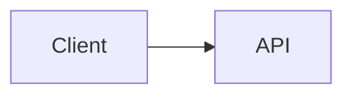

# How to Write Project Docs — Beginner to Professional

> Read this guide repeatedly. Whenever someone asks you to "write requirements" or "write a design doc", follow this guide.
> No need to apologize: nobody is born knowing how to write documentation. It is a skill developed through practice.

---

## 1. Why write documentation?

1. **Clarifies your own thinking.** Wherever you get stuck while writing is an area you don't fully understand yet. That is a great signal because you caught it before writing code.
2. **Helps others understand.** Recruiters, teammates, or even yourself 3 months from now.
3. **Catches mistakes cheaply.** Fixing a requirement mistake in documentation takes 5 minutes. Fixing it after writing code takes 5 days.

**In interviews:** "I first defined the problem, gathered the requirements, and then designed the architecture." This demonstrates senior engineering maturity.

---

## 2. Requirements vs. Design (the most common confusion)

| | Requirements (Step 1) | Design (Step 2) |
|---|---|---|
| Question | **What** needs to be done? **Why**? | **How** will we build it? |
| Example | "User can upload a PDF" | "PDF is uploaded to S3, parsed by a Celery worker" |
| Language | User-focused language, no technology names | Components, databases, APIs, specific technologies |
| Status | Focus on the problem and capabilities | Architecture diagrams, component flow, tech stack |

**The Litmus Test:** If a line mentions specific tools like FastAPI, Postgres, Redis, etc., it is design, not a requirement. Do not put technology names in requirements documents.

---

## 3. 7 Golden Rules

1. **One file = one responsibility.** Separate problems, requirements, and design into distinct files.
2. **Be specific; avoid vague words like "good/fast/secure".**
   - Bad: "System should be fast."
   - Good: "First token appears within 2 seconds for 95% of chat requests."
3. **Think about the reader.** Who is reading? What do they need to know? A recruiter wants to understand it in 30 seconds.
4. **Use short sentences, bullet points, and tables.** One sentence = one idea. Long paragraphs rarely get read.
5. **Single source of truth.** Writing the same information in two places leads to outdated docs. Use links instead.
6. **Use concrete numbers.** Instead of "many users", specify "100 concurrent users". If unknown, state it as an "assumption" to be calibrated later.
7. **Drafts will be rough—start anyway.** Commit to Git, iterate, and improve. Documentation is a living document.

---

## 4. How to write: 5-step process

1. **Brain dump (10 min):** Write down whatever is in your head without worrying about structure. Just get all thoughts out on paper.
2. **Group:** Categorize ideas by themes (problem, users, pain points, proposed solution).
3. **Structure:** Map content into standard template headings (using the files in this folder).
4. **Rewrite:** Polish with clear, concise sentences in simple English. (Professional English docs ensure recruiters and open-source contributors can easily read your repository on GitHub.)
5. **Review:** Evaluate your document against the checklist in Section 9.

---

## 5. Key terms (glossary)

| Term | Meaning | Example |
|---|---|---|
| **Actor / Persona** | Who uses the system (a user role) | Admin, Employee |
| **Functional Requirement (FR)** | **What** the system must do | "User can upload a PDF" |
| **Non-Functional Requirement (NFR)** | **How** the system performs (speed, security, cost) | "p95 latency < 2s" |
| **MoSCoW** | Prioritization: **M**ust, **S**hould, **C**ould, **W**on't (this version) | Login = Must, Voice = Won't |
| **User Story** | A feature described from the user's perspective | "As an Employee, I want..., so that..." |
| **Acceptance Criteria (AC)** | Conditions that verify a feature is "done" | Given / When / Then |
| **Scope** | What is included and what is excluded | In scope / Out of scope |
| **Assumption** | Presumed facts that haven't been validated yet | "Company has fewer than 500 documents" |
| **Constraint** | Non-negotiable boundaries or limitations | Solo developer, limited budget |
| **Risk** | Potential failure modes and their mitigations | Hallucinations, prompt injection |
| **ADR** | Architecture Decision Record: what was decided and why | "pgvector instead of Qdrant" |

---

## 6. Copy-ready sentence patterns

| Doc | Pattern |
|---|---|
| Problem | `[Who] cannot [do what] because [why], which causes [impact].` |
| Functional Req | `The user can [action] [object] [condition].` |
| Non-Functional Req | `[Quality]: [metric] [target] under [condition].` |
| User Story | `As a [role], I want [action], so that [benefit].` |
| Acceptance Criteria | `Given [context], When [action], Then [result].` |
| ADR | `Context (situation) > Decision (action taken) > Consequences (trade-offs).` |

---

## 7. Bad vs Good examples

| Bad | Why it's bad | Good |
|---|---|---|
| "System should be secure." | Cannot be objectively verified | "A user from Company A can never retrieve Company B's documents (verified by automated test)." |
| "Chat will work fast." | What does "fast" mean? | "First token within 2s for 95% of requests." |
| "AI answers questions." | Under what conditions? What if it's wrong? | "The system answers only from uploaded documents and shows citations. If no source found, it says 'I don't know'." |
| "Use FastAPI and pgvector." (in requirements) | This is an implementation detail (design) | "Answers are retrieved based on semantic meaning, not exact keywords." |
| "Admin can manage everything." | Too broad | "Admin can upload, delete, and tag documents." |
| A long paragraph containing 5 disparate ideas | Hard to read and digest | 5 focused bullet points |

---

## 8. Recommended document writing order

```
01 Problem Statement   -> Why are we building this?
04 User Stories        -> Who wants what?
02 Functional Req      -> What will the system do? (Derived from stories)
03 Non-Functional Req  -> How well must it perform?
05 Scope/Risks         -> What is in/out of scope, and what could go wrong?
ADR                    -> Architecture decisions and trade-offs (Step 2)
README                 -> Written last; serves as the repository storefront
```

*Note:* While the numeric naming is 01 through 05, drafting **04 (User Stories) before 02 (Functional Requirements)** often makes writing requirements much easier, since FRs naturally derive from user stories.

---

## 9. Self-review checklist (upon finishing a doc)

- [ ] Can a newcomer understand what the doc is about in 1 minute?
- [ ] Are vague adjectives ("fast, easy, good, secure") backed by quantitative metrics?
- [ ] Are technology names excluded from requirements files?
- [ ] Does every requirement have an ID (e.g. FR-001) and priority?
- [ ] Does every "Must" requirement have clear acceptance criteria?
- [ ] Is duplicate information avoided (linked rather than repeated)?
- [ ] Are non-goals / out-of-scope boundaries clearly defined?
- [ ] Are Status and Last Updated date specified at the top?
- [ ] Are formatting and spelling validated in Markdown preview?

---

## 10. Markdown cheatsheet

````markdown
# Heading 1
## Heading 2
**bold**   *italic*   `inline code`
- bullet
1. numbered
- [ ] checkbox  /  - [x] done
[link text](https://example.com)

| Col A | Col B |
|---|---|
| a | b |

> Quote / note

```python
code block
```


````
(In VS Code, press `Ctrl+Shift+V` to open preview. GitHub renders Mermaid diagrams natively.)

---

## 11. Common beginner mistakes

1. **Writing design into requirements** (e.g., specifying "Use FastAPI").
2. **Overscoping:** Marking every feature as "Must". Keep "Must" to 30-40% maximum.
3. **NFRs without numbers:** Writing "fast" or "secure" without measurable targets.
4. **Perfectionism blocking progress:** An ugly draft is infinitely better than a blank page.
5. **Abandoning docs after writing:** Keep docs updated whenever architecture or code changes.
6. **Omitting non-goals:** Without explicit non-goals, scope creep prevents the project from ever finishing.

---

## Folder structure (your repository)

```
opspilot/
├── README.md
└── docs/
    ├── 00-how-to-write-docs.md
    ├── 01-problem-statement.md
    ├── 02-functional-requirements.md
    ├── 03-non-functional-requirements.md
    ├── 04-user-stories.md
    ├── 05-scope-assumptions-risks.md
    └── adr/
        ├── 0000-template.md
        └── 0001-....md
```
