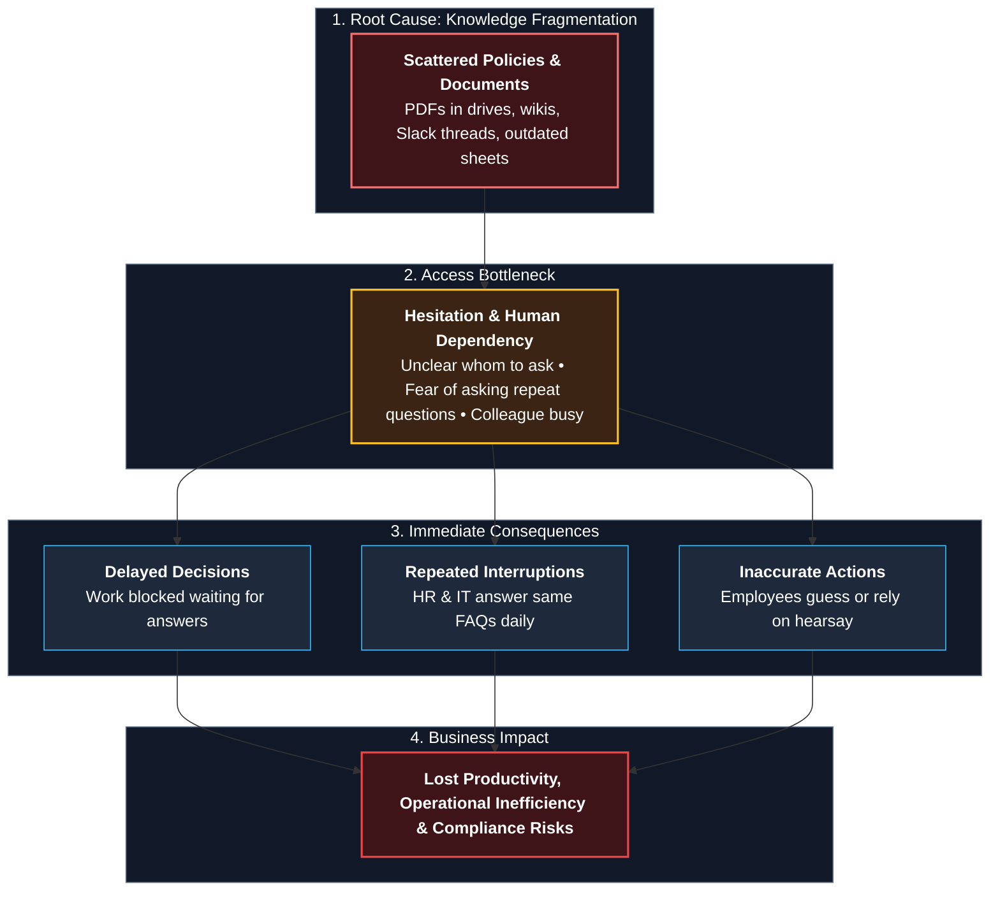
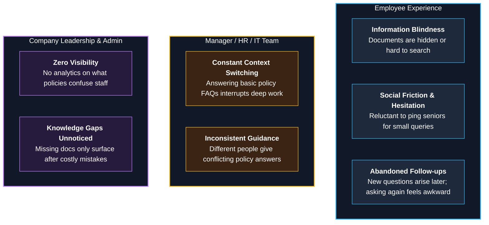
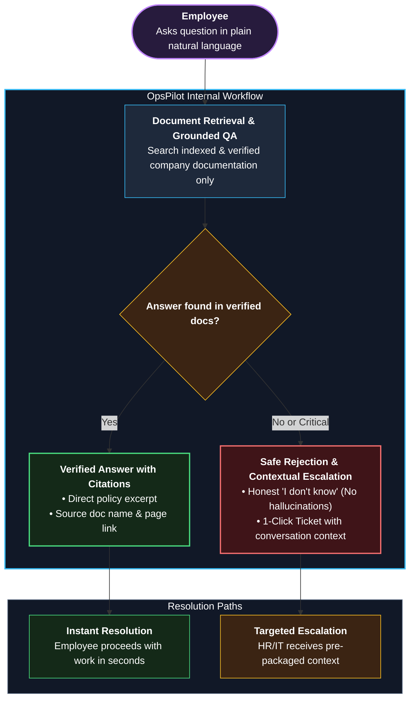
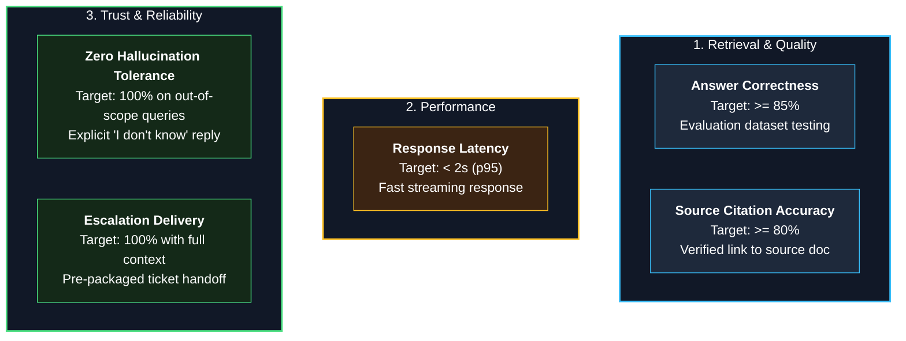

# 01 — Problem Statement

**Status:** Draft v1 | **Owner:** Awolad | **Last updated:** 2026-09-30

> **How to write:** In this file, write only the *problem*, not the solution. Pattern:
> `[Who] cannot [do what] because [why], which causes [impact].`
> The ideas from your draft (hesitation, forgetting follow-ups, reaching out to someone else when critical) were good. They have been organized into sections here.
> Rewrite in your own words; this file is just an example.

---

## 1. Background

Every company has rules, policies, and process information: leave policy, IT rules, expense process, onboarding steps. This information is usually spread across PDFs, shared drives, wikis, and chat messages.

## 2. Problem Statement

Employees cannot quickly and confidently find the right company rule or information, because it is scattered and the only alternative is to ask a colleague, which causes wasted time, repeated questions, wrong decisions, and delayed work.

### Problem Breakdown Flow

---

## 3. Who is Affected

| Who | Pain |
|---|---|
| **Employee** | Does not know whom to ask, hesitates to ask, or finds nobody available |
| **Manager / HR / IT** | Answers the same questions again and again, gets interrupted |
| **Company admin** | Has no idea what employees are confused about |

---

## 4. Pain Points

1. **Hesitation:** Employee feels uncomfortable asking small or repeated questions.
2. **No time / no person:** The right person is busy, absent, or unknown.
3. **Forgotten follow-ups:** A new question comes to mind later, and asking again is awkward.
4. **Scattered information:** Documents exist but nobody knows where.
5. **No path for critical issues:** When a question is important or the answer is missing, there is no clear way to reach the right person with context.

### Stakeholder Pain Point Architecture

---

## 5. Current Workarounds and Why They Fail

| Workaround | Why it fails |
|---|---|
| Ask a colleague | Interrupts them, inconsistent answers, depends on availability |
| Search shared drive / Ctrl+F in PDF | Slow, keyword-only, easy to miss the right document |
| Read the full handbook | Nobody does |

### Workaround Failure Modes

```mermaid
flowchart TD
    subgraph W1 ["Workaround 1: Ask a Colleague"]
        A1["<b>Attempt:</b> Ping teammate or HR via Slack/Teams"]
        A2["<b>Breakdown:</b> Distracts colleague, answers are delayed or inconsistent"]
        A1 --> A2
    end

    subgraph W2 ["Workaround 2: Search Shared Drive / Ctrl+F"]
        B1["<b>Attempt:</b> Search keywords in nested drive folders"]
        B2["<b>Breakdown:</b> Keyword mismatch, outdated versions found"]
        B1 --> B2
    end

    subgraph W3 ["Workaround 3: Read Full Handbook"]
        C1["<b>Attempt:</b> Skim 80-page company manual"]
        C2["<b>Breakdown:</b> High cognitive load, ignored by almost everyone"]
        C1 --> C2
    end

    style W1 fill:#111827,stroke:#f87171,stroke-width:1px,color:#ffffff
    style W2 fill:#111827,stroke:#f87171,stroke-width:1px,color:#ffffff
    style W3 fill:#111827,stroke:#f87171,stroke-width:1px,color:#ffffff

    style A1 fill:#1e293b,stroke:#94a3b8,stroke-width:1px,color:#ffffff
    style A2 fill:#3f1418,stroke:#f87171,stroke-width:1px,color:#ffffff
    style B1 fill:#1e293b,stroke:#94a3b8,stroke-width:1px,color:#ffffff
    style B2 fill:#3f1418,stroke:#f87171,stroke-width:1px,color:#ffffff
    style C1 fill:#1e293b,stroke:#94a3b8,stroke-width:1px,color:#ffffff
    style C2 fill:#3f1418,stroke:#f87171,stroke-width:1px,color:#ffffff
```

---

## 6. Proposed Solution (High-Level Conceptual Flow)

OpsPilot is a SaaS application where a company uploads its rules and documents, and employees ask questions in natural language. The system answers **only from the company's documents**, shows **where the answer came from**, and if the answer is missing or the issue is critical, lets the employee **escalate to a responsible person** with the full context.

### Proposed User Journey & Resolution Logic

---

## 7. Goals

- Employees get correct, sourced answers in seconds without asking a person.
- Employees can escalate critical or unanswered questions with one action.
- Admins can see what employees are asking and which questions have no answer.

## 8. Non-Goals (v1)

- Not a general-purpose chatbot (does not answer outside company documents).
- Not a replacement for HR or legal decisions.
- No mobile app, no voice.

---

## 9. Success Metrics

> Numbers below are **initial targets (assumptions)**. Revise after testing.

| Metric | Target | How to measure |
|---|---|---|
| Answer correctness on test questions | >= 85% | Evaluation dataset |
| Answers with correct citation | >= 80% | Evaluation dataset |
| Time to first response | < 2 s (p95) | Metrics dashboard |
| "I don't know" instead of a wrong answer | 100% on out-of-scope test questions | Evaluation dataset |
| Escalation delivered with context | 100% | Automated test |

### Success Metrics & Target Thresholds

---

## 10. Open Questions

- Which document types are needed first (PDF only, or DOCX and web pages too)?
- Who receives an escalation: one contact per company or per category (HR, IT, Finance)?
- Should employees be allowed to see every document, or only some?
