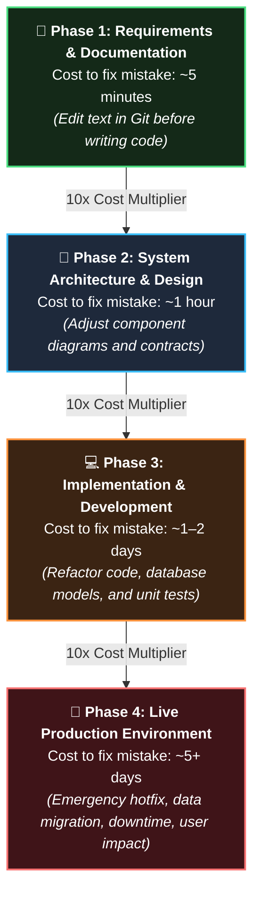
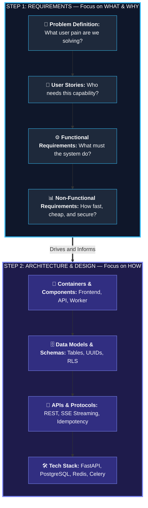
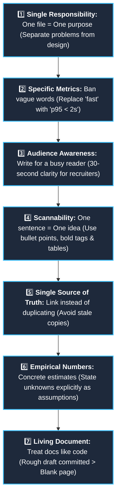
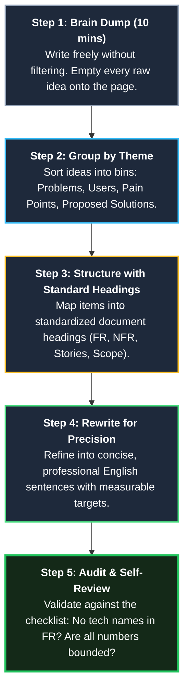
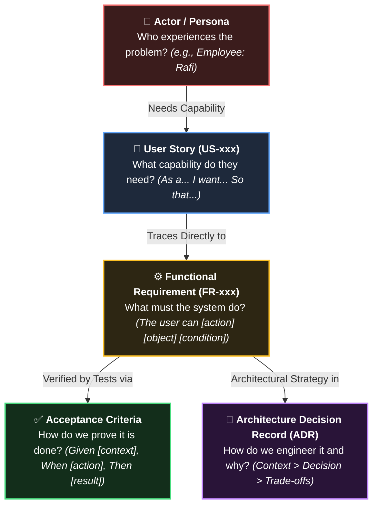
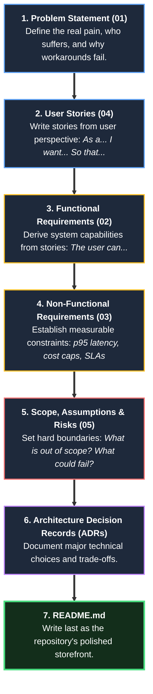
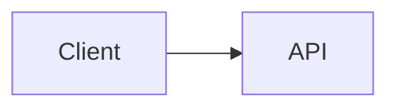

# How to Write Project Docs — Beginner to Professional

> Read this guide repeatedly. Whenever someone asks you to "write requirements" or "write a design doc", follow this guide.
> No need to apologize: nobody is born knowing how to write documentation. It is an engineering discipline developed through deliberate practice.

---

## 1. Why Write Documentation?



1. **Clarifies your own thinking.** Wherever you get stuck while writing is an area you don't fully understand yet. That is a great signal because you caught it before writing code.
2. **Helps others understand.** Recruiters, teammates, or even yourself 3 months from now.
3. **Catches mistakes cheaply.** Fixing an ambiguity in documentation takes 5 minutes. Fixing it after writing code, tests, and database migrations takes 5 days.

**In technical interviews:** *"I first defined the problem, scoped the requirements, and then derived the architecture."* This immediately demonstrates senior engineering maturity.

---

## 2. Requirements vs. Design (The Most Common Confusion)



| Dimension | Requirements (Step 1) | Architecture & Design (Step 2) |
|---|---|---|
| **Core Question** | **What** needs to be done? **Why**? | **How** will we build it? |
| **Example** | *"User can upload a PDF and see processing status"* | *"PDF is uploaded to S3, parsed asynchronously by Celery"* |
| **Language** | User-focused domain language, zero technology names | Components, databases, APIs, network protocols, specific libraries |
| **Focus** | Capabilities, business constraints, quality targets | Architecture diagrams, component flow, schemas, tech stack |

> [!TIP]
> **The Litmus Test:** If a line mentions specific tools like FastAPI, Postgres, Redis, Celery, or React, it belongs in **Design**, not Requirements. Never put technology names in requirements documents.

---

## 3. 7 Golden Rules of Documentation



1. **One file = one responsibility.** Separate problems, requirements, and design into distinct files.
2. **Be specific; avoid vague words like "good/fast/secure".**
   - ❌ Bad: *"System should be fast."*
   - ✅ Good: *"First token appears within 2 seconds for 95% of chat requests (p95 < 2s)."*
3. **Think about the reader.** Who is reading? What do they need to know? A hiring manager wants to understand your project in 30 seconds.
4. **Use short sentences, bullet points, and tables.** One sentence = one idea. Dense paragraphs rarely get read.
5. **Single source of truth.** Writing the same information in two places leads to outdated docs. Use links instead.
6. **Use concrete numbers.** Instead of "many users", specify "100 concurrent users". If unknown, state it as an "assumption" to be calibrated later.
7. **Drafts will be rough—start anyway.** Commit to Git, iterate, and improve. Documentation is a living document.

---

## 4. How to Write: The 5-Step Process



1. **Brain dump (10 min):** Write down whatever is in your head without worrying about structure. Just get all thoughts out on paper.
2. **Group:** Categorize ideas by themes (problem, users, pain points, proposed solution).
3. **Structure:** Map content into standard template headings (using the files in this folder).
4. **Rewrite:** Polish with clear, concise sentences in simple English. (Professional English docs ensure recruiters and open-source contributors can easily read your repository on GitHub.)
5. **Review:** Evaluate your document against the checklist in Section 9.

---

## 5. Key Terms & Traceability Framework



| Term | Meaning | Example |
|---|---|---|
| **Actor / Persona** | Who uses the system (a user role) | Admin, Employee |
| **Functional Requirement (FR)** | **What** the system must do | *"User can upload a PDF"* |
| **Non-Functional Requirement (NFR)** | **How** the system performs (speed, security, cost) | *"p95 latency < 2s"* |
| **MoSCoW** | Prioritization: **M**ust, **S**hould, **C**ould, **W**on't (this version) | Login = Must, Voice = Won't |
| **User Story** | A feature described from the user's perspective | *"As an Employee, I want..., so that..."* |
| **Acceptance Criteria (AC)** | Conditions that verify a feature is "done" | Given / When / Then |
| **Scope** | What is included and what is excluded | In scope / Out of scope |
| **Assumption** | Presumed facts that haven't been validated yet | *"Company has fewer than 500 documents"* |
| **Constraint** | Non-negotiable boundaries or limitations | Solo developer, limited budget |
| **Risk** | Potential failure modes and their mitigations | Hallucinations, prompt injection |
| **ADR** | Architecture Decision Record: what was decided and why | *"pgvector instead of Qdrant"* |

---

## 6. Copy-Ready Sentence Patterns

| Doc | Pattern |
|---|---|
| **Problem** | `[Who] cannot [do what] because [why], which causes [impact].` |
| **Functional Req** | `The user can [action] [object] [condition].` |
| **Non-Functional Req** | `[Quality]: [metric] [target] under [condition].` |
| **User Story** | `As a [role], I want [action], so that [benefit].` |
| **Acceptance Criteria** | `Given [context], When [action], Then [result].` |
| **ADR** | `Context (situation) > Decision (action taken) > Consequences (trade-offs).` |

---

## 7. Bad vs. Good Examples

| Bad | Why it's bad | Good |
|---|---|---|
| *"System should be secure."* | Cannot be objectively verified | *"A user from Company A can never retrieve Company B's documents (verified by automated test)."* |
| *"Chat will work fast."* | What does "fast" mean? | *"First token within 2s for 95% of requests."* |
| *"AI answers questions."* | Under what conditions? What if it's wrong? | *"The system answers only from uploaded documents and shows citations. If no source found, it says 'I don't know'."* |
| *"Use FastAPI and pgvector."* (in requirements) | This is an implementation detail (design) | *"Answers are retrieved based on semantic meaning, not exact keywords."* |
| *"Admin can manage everything."* | Too broad and ambiguous | *"Admin can upload, delete, and tag documents."* |
| A long paragraph containing 5 disparate ideas | Hard to read and digest | 5 focused bullet points |

---

## 8. Recommended Document Writing Order



> [!NOTE]
> While the numerical naming is 01 through 05, drafting **04 (User Stories) before 02 (Functional Requirements)** makes writing requirements significantly easier, since requirements naturally derive from real user stories.

---

## 9. Self-Review Checklist

- [ ] Can a newcomer understand what the doc is about in 1 minute?
- [ ] Are vague adjectives ("fast, easy, good, secure") backed by quantitative metrics?
- [ ] Are technology names excluded from requirements files?
- [ ] Does every requirement have an ID (e.g. FR-001) and priority?
- [ ] Does every "Must" requirement have clear acceptance criteria?
- [ ] Is duplicate information avoided (linked rather than repeated)?
- [ ] Are non-goals / out-of-scope boundaries clearly defined?
- [ ] Are Status and Last Updated date specified at the top?
- [ ] Are formatting and spelling validated in Markdown preview?

---

## 10. Markdown Cheatsheet

````markdown
# Heading 1
## Heading 2
**bold**   *italic*   `inline code`
- bullet
1. numbered
- [ ] checkbox  /  - [x] done
[link text](https://example.com)

| Col A | Col B |
|---|---|
| a | b |

> Quote / note

```python
code block
```


````
*(In VS Code, press `Ctrl+Shift+V` to open preview. GitHub renders Mermaid diagrams natively).*

---

## 11. Common Beginner Mistakes

1. **Writing design into requirements** (e.g., specifying "Use FastAPI").
2. **Overscoping:** Marking every feature as "Must". Keep "Must" to 30–40% maximum.
3. **NFRs without numbers:** Writing "fast" or "secure" without measurable targets.
4. **Perfectionism blocking progress:** An ugly draft is infinitely better than a blank page.
5. **Abandoning docs after writing:** Keep docs updated whenever architecture or code changes.
6. **Omitting non-goals:** Without explicit non-goals, scope creep prevents the project from ever finishing.

---

## 12. Complete Documentation Folder Structure

```mermaid
flowchart TD
  subgraph ROOT ["📁 opspilot/ (Repository Root)"]
    direction TB
    RMD["📄 <b>README.md</b> — Front door & project storefront"]
    
    subgraph D_DOCS ["📁 docs/01-product/ — Product Definition"]
      direction TB
      D00["📄 <b>00-writing-documentation.md</b> — Documentation guide"]
      D01["📄 <b>01-problem-statement.md</b> — Problem, pain points, metrics"]
      D02["📄 <b>02-functional-requirements.md</b> — System capabilities"]
      D03["📄 <b>03-non-functional-requirements.md</b> — Speed, cost, security"]
      D04["📄 <b>04-user-stories.md</b> — User personas & acceptance criteria"]
      D05["📄 <b>05-scope-assumptions-risks.md</b> — Boundaries & mitigations"]
      D17["📄 <b>17-product-brief-and-positioning.md</b> — Product and customer fit"]
      D18["📄 <b>18-customer-discovery-plan.md</b> — Interview plan and validation gates"]
      D19["📄 <b>19-pricing-and-packaging.md</b> — Costs, value, and plans"]
      D20["📄 <b>20-commercial-readiness-checklist.md</b> — Pilot and business readiness"]
      D21["📄 <b>21-commercial-roadmap-addendum.md</b> — Commercial roadmap updates"]
    end

    subgraph D_ADR ["📁 docs/02-system-design/decisions/ — Project Architecture Decisions"]
      direction TB
      A00["📄 <b>0000-template.md</b> — Standard ADR template"]
      A01["📄 <b>0001-vector-storage-for-document-search.md</b> — Postgres + pgvector"]
      A02["📄 <b>0002-tenant-isolation-shared-tables-rls.md</b> — Shared tables & RLS"]
      A03["📄 <b>0003-modular-monolith-not-microservices.md</b> — Modular monolith"]
      A04["📄 <b>0004-async-ingestion-with-queue.md</b> — Celery & Redis ingestion"]
      A05["📄 <b>0005-hybrid-retrieval-with-rerank.md</b> — Dense + BM25 + Reranker"]
    end

    subgraph D_SYS ["📁 docs/02-system-design/ — System Design"]
      direction TB
      S00["📄 <b>00-system-design-guide.md</b> — 10-step system design guide"]
      S01["📄 <b>01-monolith-or-microservices.md</b> — Architecture style decision"]
      S02["📄 <b>02-design-document-template.md</b> — Design document template"]
      S06["📄 <b>reference-solution/06-architecture.md</b> — C4 container model & drivers"]
      S07["📄 <b>reference-solution/07-data-model.md</b> — ER diagrams & PostgreSQL DDL"]
      S08["📄 <b>reference-solution/08-api-design.md</b> — REST endpoints & error models"]
      S09["📄 <b>reference-solution/09-key-flows.md</b> — Sequence diagrams & failure handling"]
      S10["📄 <b>reference-solution/10-security-and-tenancy.md</b> — 4-layer isolation & prompt defense"]
      S11["📄 <b>reference-solution/11-deployment-and-observability.md</b> — Docker, CI/CD, Loki, Grafana"]
      S12["📄 <b>reference-solution/12-traceability-and-design-review.md</b> — Requirements traceability"]
    end

    subgraph D_PLAN ["📁 docs/03-planning/ — Project Planning"]
      direction TB
      C00["📄 <b>00-project-planning-guide.md</b> — Project planning guide"]
      C13["📄 <b>13-roadmap-and-milestones.md</b> — Schedule & phase exits"]
      C14["📄 <b>14-backlog.md</b> — Granular tasks & story backlog"]
      C15["📄 <b>15-working-agreements.md</b> — Git workflow & PR standards"]
      C16["📄 <b>16-learning-checkpoints.md</b> — Conceptual interview mastery"]
    end

    subgraph D_CODE ["📁 docs/04-code-setup/ — Local Development Setup"]
      CSETUP["📄 <b>00-code-setup-guide.md</b> — Phase 0 setup"]
    end
  end

  RMD --> D_DOCS
  D_DOCS --> D_ADR
  D_DOCS --> D_SYS
  D_DOCS --> D_PLAN
  D_DOCS --> D_CODE

  style ROOT fill:#0b1120,stroke:#38bdf8,stroke-width:2px,color:#ffffff
  style D_DOCS fill:#111827,stroke:#60a5fa,stroke-width:2px,color:#ffffff
  style D_ADR fill:#111827,stroke:#c084fc,stroke-width:2px,color:#ffffff
  style D_SYS fill:#111827,stroke:#fbbf24,stroke-width:2px,color:#ffffff
  style D_CODE fill:#111827,stroke:#4ade80,stroke-width:2px,color:#ffffff

  style RMD fill:#1e293b,stroke:#38bdf8,color:#ffffff
  style D00 fill:#1e293b,stroke:#60a5fa,color:#ffffff
  style D01 fill:#1e293b,stroke:#60a5fa,color:#ffffff
  style D02 fill:#1e293b,stroke:#60a5fa,color:#ffffff
  style D03 fill:#1e293b,stroke:#60a5fa,color:#ffffff
  style D04 fill:#1e293b,stroke:#60a5fa,color:#ffffff
  style D05 fill:#1e293b,stroke:#60a5fa,color:#ffffff

  style A00 fill:#1e293b,stroke:#c084fc,color:#ffffff
  style A01 fill:#1e293b,stroke:#c084fc,color:#ffffff
  style A02 fill:#1e293b,stroke:#c084fc,color:#ffffff
  style A03 fill:#1e293b,stroke:#c084fc,color:#ffffff
  style A04 fill:#1e293b,stroke:#c084fc,color:#ffffff
  style A05 fill:#1e293b,stroke:#c084fc,color:#ffffff

  style S00 fill:#1e293b,stroke:#fbbf24,color:#ffffff
  style S06 fill:#1e293b,stroke:#fbbf24,color:#ffffff
  style S07 fill:#1e293b,stroke:#fbbf24,color:#ffffff
  style S08 fill:#1e293b,stroke:#fbbf24,color:#ffffff
  style S09 fill:#1e293b,stroke:#fbbf24,color:#ffffff
  style S10 fill:#1e293b,stroke:#fbbf24,color:#ffffff
  style S11 fill:#1e293b,stroke:#fbbf24,color:#ffffff

  style C00 fill:#1e293b,stroke:#4ade80,color:#ffffff
  style C01 fill:#1e293b,stroke:#4ade80,color:#ffffff
  style C12 fill:#1e293b,stroke:#4ade80,color:#ffffff
  style C13 fill:#1e293b,stroke:#4ade80,color:#ffffff
  style C14 fill:#1e293b,stroke:#4ade80,color:#ffffff
  style C15 fill:#1e293b,stroke:#4ade80,color:#ffffff
  style C16 fill:#1e293b,stroke:#4ade80,color:#ffffff
