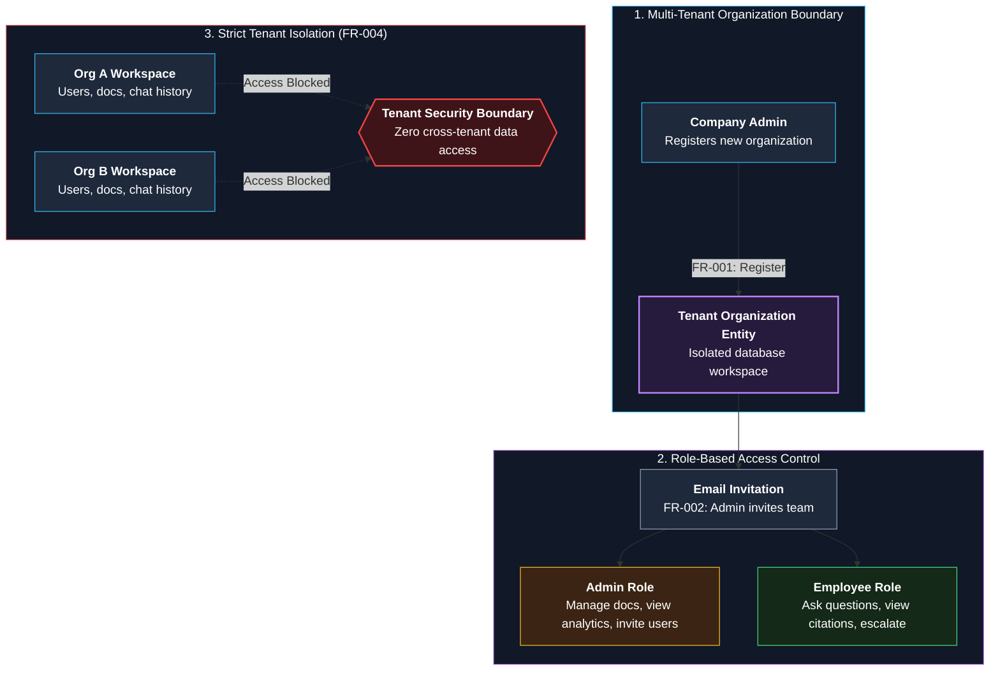
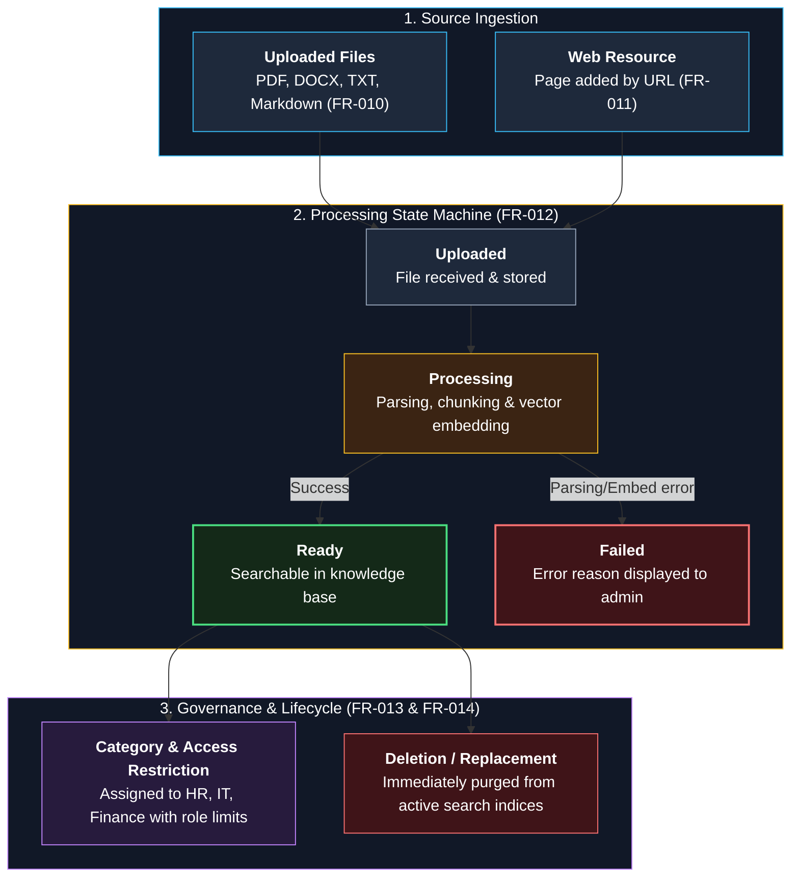
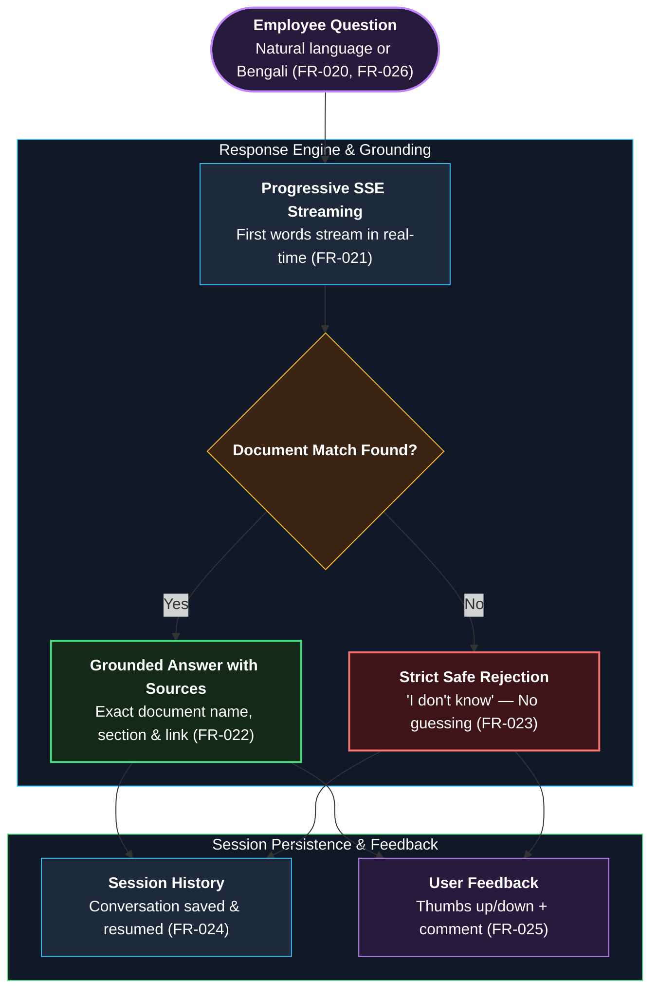
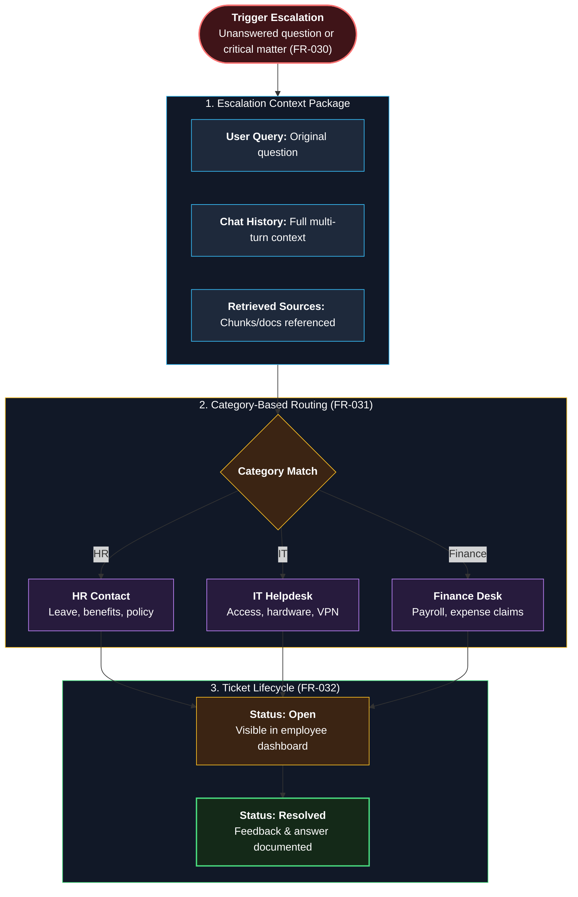
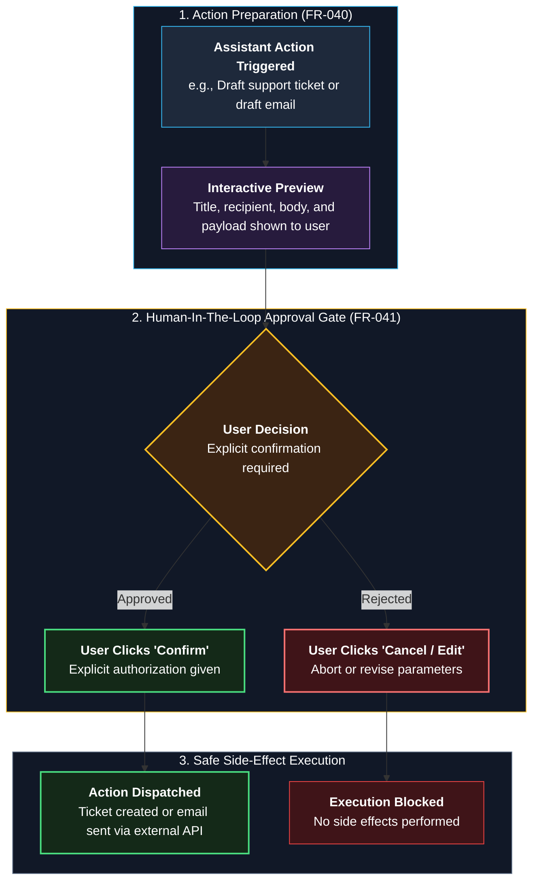
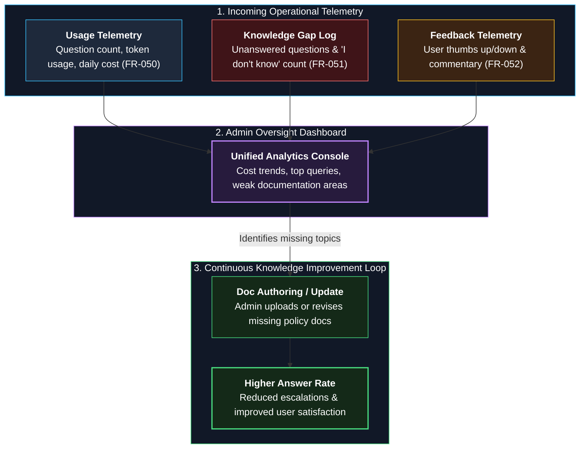

# 02 — Functional Requirements

**Status:** Draft v1 | **Owner:** Awolad | **Last updated:** 2026-09-30
**Priority scale (MoSCoW):** Must / Should / Could / Won't (v1)

> **How to write:**
> - In this file, write **what the system can do**. Do not mention technology names (`client -> backend -> db -> ai agent` is design, which belongs in Step 2).
> - Pattern: `The user can [action] [object] [condition].`
> - Each row must have an ID, priority, and acceptance criteria (how to verify).
> - Writing `04-user-stories.md` first makes writing this file much easier.

---

## 1. Authentication and Organizations

| ID | Requirement | Priority | Acceptance criteria |
|---|---|---|---|
| FR-001 | A company admin can register a new organization. | Must | New organization exists and admin can log in |
| FR-002 | An admin can invite users by email and assign a role (Admin, Employee). | Must | Invited user can join with the given role |
| FR-003 | A user can log in and log out; sessions expire after inactivity. | Must | Expired session requires login again |
| FR-004 | A user can only see data of their own organization. | Must | Test: user of Org A gets nothing from Org B |

### Architecture & Boundary Flow

---

## 2. Document Management

| ID | Requirement | Priority | Acceptance criteria |
|---|---|---|---|
| FR-010 | An admin can upload PDF, DOCX, TXT, and Markdown files. | Must | Uploaded file appears in the document list |
| FR-011 | An admin can add a web page by URL. | Should | Page content becomes searchable |
| FR-012 | The system processes each document in the background and shows its status (Uploaded, Processing, Ready, Failed). | Must | Status changes; failure shows a reason |
| FR-013 | An admin can delete or replace a document; deleted content is no longer used in answers. | Must | Question about deleted content returns "I don't know" |
| FR-014 | An admin can assign a category (HR, IT, Finance) and restrict access by role. | Should | Employee cannot get answers from restricted documents |

### Ingestion Lifecycle & Governance Flow

---

## 3. Chat and Answers

| ID | Requirement | Priority | Acceptance criteria |
|---|---|---|---|
| FR-020 | An employee can ask a question in natural language. | Must | Answer returned for a question covered by documents |
| FR-021 | The answer appears progressively (streaming). | Should | First words appear before the full answer is ready |
| FR-022 | Every answer shows its sources (document name and page or section). | Must | Each answer has at least one citation that opens the source |
| FR-023 | If no relevant information exists, the system says it does not know and does not guess. | Must | Out-of-scope test questions get "I don't know" |
| FR-024 | Conversations are saved; a user can reopen past conversations and continue. | Must | Past chat is listed and can be continued |
| FR-025 | A user can rate an answer (thumbs up/down) with an optional comment. | Should | Rating is stored and visible to admin |
| FR-026 | A user can ask questions in Bengali. | Could | Bengali question returns a correct answer |

### Conversational Retrieval & Streaming Flow

---

## 4. Escalation

| ID | Requirement | Priority | Acceptance criteria |
|---|---|---|---|
| FR-030 | A user can escalate a question to a responsible person; the message includes the question, the conversation, and the sources found. | Must | Contact receives all three |
| FR-031 | An admin can set escalation contacts per category. | Should | Escalation goes to the matching contact |
| FR-032 | Escalations have a status (Open, Resolved) and the user can see it. | Could | Status visible to the user |

### Contextual Escalation Pipeline

---

## 5. Assistant Actions

| ID | Requirement | Priority | Acceptance criteria |
|---|---|---|---|
| FR-040 | The assistant can prepare actions such as creating a ticket or drafting an email. | Should | Draft is shown to the user |
| FR-041 | Any action with side effects needs explicit user confirmation before it runs. | Must (if FR-040) | No action runs without a click on "Confirm" |
| FR-042 | The assistant can answer questions from structured company data (read-only). | Could | Read-only query returns correct result |

### Human-In-The-Loop (HITL) Execution Gate

---

## 6. Admin Dashboard

| ID | Requirement | Priority | Acceptance criteria |
|---|---|---|---|
| FR-050 | An admin can see usage: number of questions, tokens, and cost per day. | Should | Numbers match stored usage |
| FR-051 | An admin can see questions that had no answer (knowledge gaps). | Should | "I don't know" questions listed |
| FR-052 | An admin can see answer ratings and comments. | Could | Ratings listed |

### Admin Observability & Knowledge Feedback Loop

---

## 7. Not in v1 (Won't)

- Mobile app
- Voice input/output
- Slack / Teams integration (revisit later)
- Billing and payments

## 8. Plans, onboarding, and data control

| ID | Requirement | Priority | Acceptance criteria |
|---|---|---|---|
| FR-060 | An admin can view the organization's plan, limits, and current usage. | Should | The usage page shows questions used compared with the plan limit. |
| FR-061 | The system enforces plan limits for employees, documents, and questions, warns at 80%, and blocks usage at 100%. | Must (for paid plans) | Requests beyond a limit receive a clear message; warnings appear at 80%. |
| FR-062 | A new admin receives a guided first-run checklist to upload a document, ask a question, and invite a user. | Should | A new admin can complete the checklist in under 10 minutes. |
| FR-063 | An admin can export all organization data, including documents and conversations, on request. | Must (for paid plans) | The export contains the organization's documents and conversations. |
| FR-064 | An admin can request deletion of the organization and its data. | Must (for paid plans) | Data is removed within the published retention period, and the admin receives confirmation. |
| FR-065 | An admin can view an audit log of important actions, including uploads, deletions, role changes, and exports. | Should | Each log entry includes the actor, action, and time. |
| FR-066 | A platform owner can produce a monthly invoice record for each organization from its plan and usage. | Could | An invoice record can be exported as CSV or PDF. |
| FR-067 | A user can send feedback or contact support from the application. | Should | The message is delivered to the configured support channel and its delivery result is recorded. |

---

## 9. Traceability

Each requirement should be traced to a story in [the user stories](04-user-stories.md). If a requirement has no story, ask who needs it.
