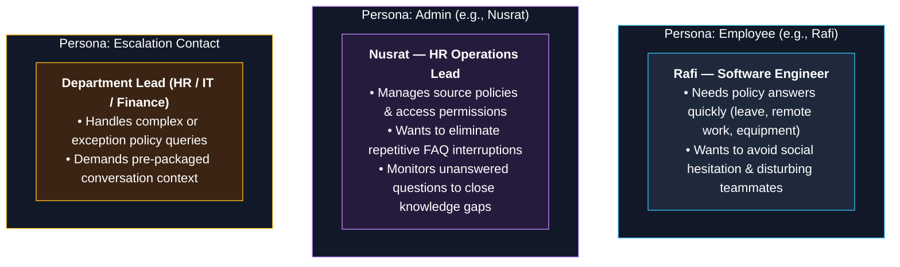
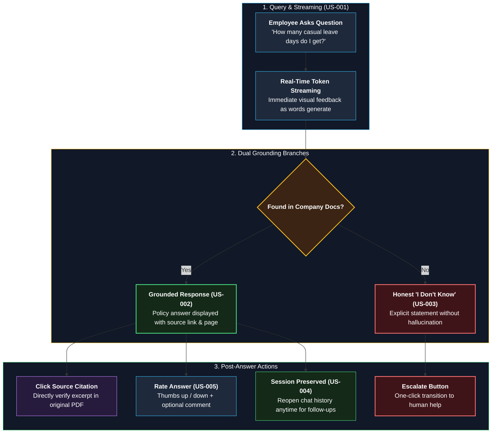
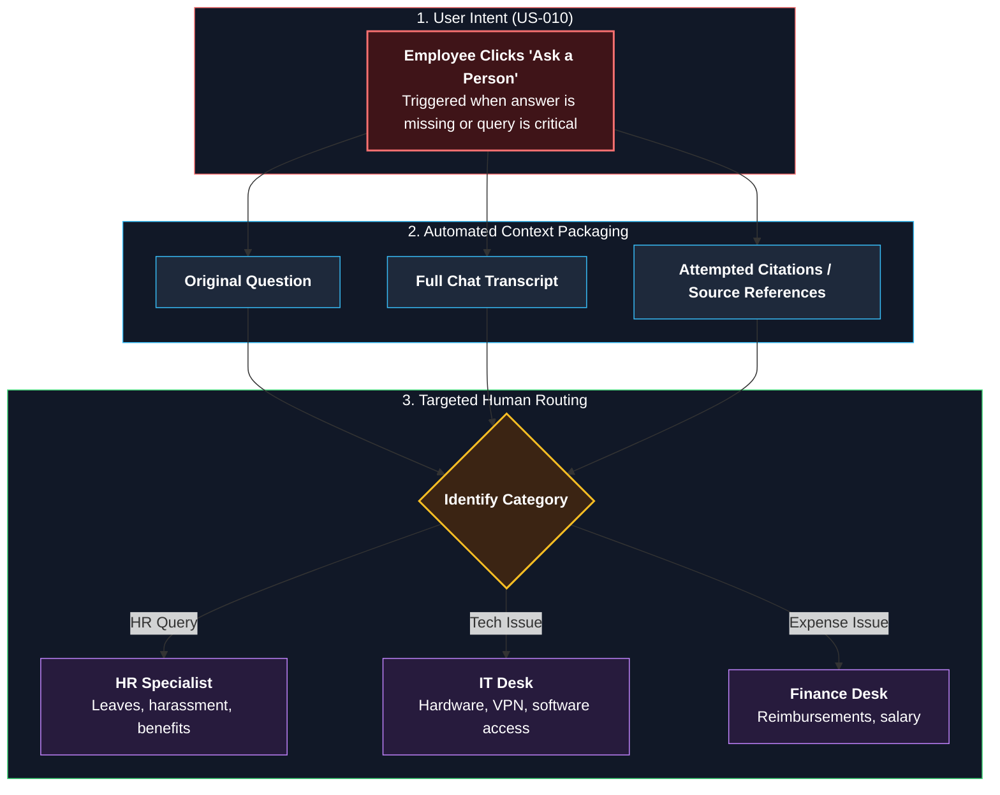
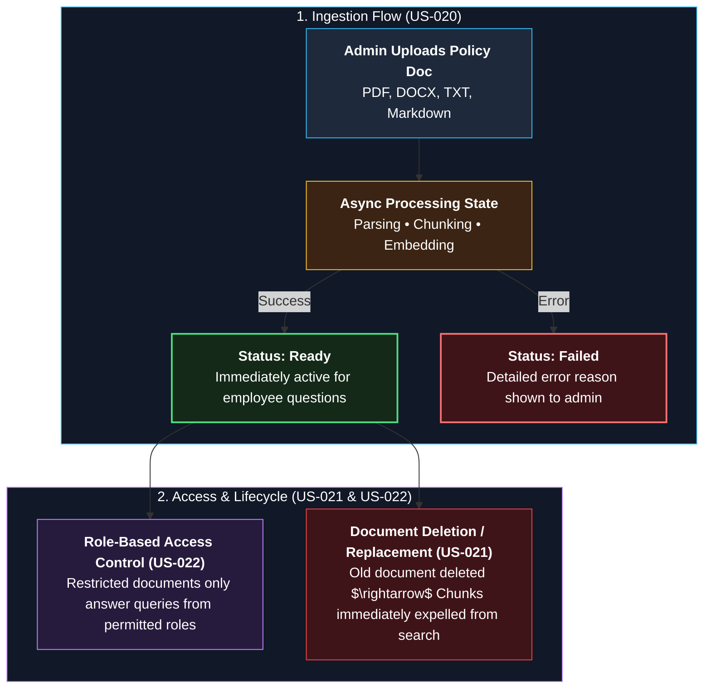
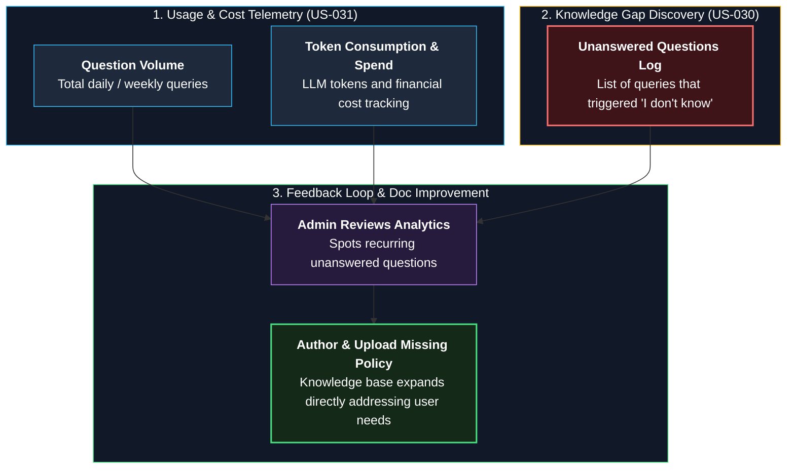
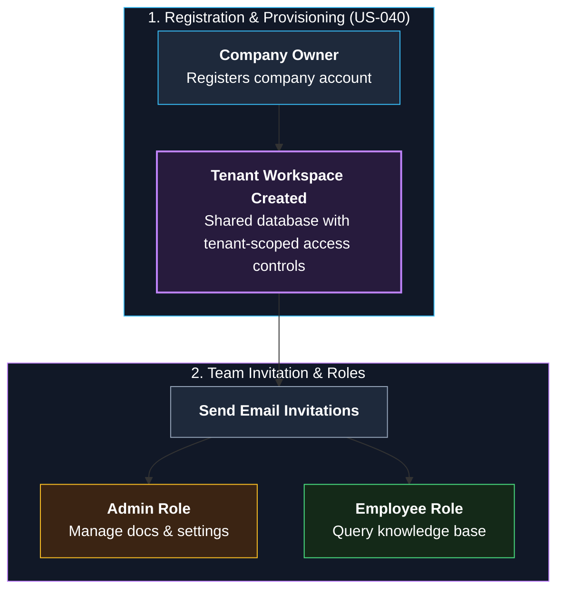

# 04 — User Stories

**Status:** Draft v1 | **Owner:** Awolad | **Last updated:** 2026-09-30

> **How to write:**
> - Story = a task from the **user's perspective**. Pattern: `As a [role], I want [action], so that [benefit].`
> - **Do not omit "so that" (benefit).** That explains why the feature is needed.
> - Under each story, include **Acceptance Criteria**: `Given [context], When [action], Then [result].`
> - Link each story with its corresponding FR ID (traceability).
> - Keep them small: one story = 1 task, roughly 1-3 days of work.

---

## Personas

| Persona | Description | Goal |
|---|---|---|
| **Employee** (e.g., Rafi, developer, 6 months in company) | Has questions about leave, IT, expenses | Get an answer fast, without disturbing anyone |
| **Admin** (e.g., Nusrat, HR manager) | Owns company documents | Keep information correct, reduce repeated questions |
| **Escalation contact** | HR / IT / Finance person | Receive only questions that need a human, with context |

### Persona Architecture & Goals

---

## Epic A: Get Answers

### US-001 Ask a question
As an **Employee**, I want to ask a question in plain language, so that I get the rule without searching documents. *(FR-020, FR-021)*

- **Given** the leave policy is uploaded, **when** I ask "How many casual leave days do I get?", **then** I receive an answer based on the policy.
- **Given** the answer is being generated, **when** the first words are ready, **then** they appear immediately.

### US-002 See sources
As an **Employee**, I want to see where each answer came from, so that I can trust it and read the original. *(FR-022)*

- **Given** an answer is shown, **when** I look below it, **then** I see the document name and page or section.

### US-003 Honest "I don't know"
As an **Employee**, I want the assistant to say when it does not know, so that I am never given a made-up rule. *(FR-023)*

- **Given** no document covers my question, **when** I ask it, **then** I see "I could not find this in the company documents" and an option to escalate.

### US-004 Continue later
As an **Employee**, I want to reopen my past conversations, so that I can ask a follow-up later without repeating myself. *(FR-024)*

- **Given** I asked a question yesterday, **when** I open my history, **then** I can continue that conversation.

### US-005 Rate an answer
As an **Employee**, I want to mark an answer helpful or not, so that the company can improve it. *(FR-025)*

### Conversational Answer Journey

---

## Epic B: Escalate

### US-010 Escalate an important question
As an **Employee**, I want to send my question to the right person with the context, so that I do not need to explain everything again. *(FR-030, FR-031)*

- **Given** the assistant could not answer, **when** I click "Ask a person", **then** the contact receives my question, the conversation, and the sources found.

### Contextual Escalation Journey

---

## Epic C: Manage Knowledge

### US-020 Upload documents
As an **Admin**, I want to upload company documents, so that employees get answers from them. *(FR-010, FR-012)*

- **Given** I upload a PDF, **when** processing finishes, **then** its status is "Ready" and questions can use it.
- **Given** processing fails, **when** I check the status, **then** I see "Failed" with a reason.

### US-021 Remove outdated documents
As an **Admin**, I want to delete or replace a document, so that employees never get an outdated rule. *(FR-013)*

- **Given** I deleted a document, **when** someone asks about its content, **then** the old content is not used.

### US-022 Control access
As an **Admin**, I want to restrict some documents to certain roles, so that sensitive information stays private. *(FR-014, FR-004)*

### Knowledge Lifecycle & Access Control Flow

---

## Epic D: Understand Usage

### US-030 See knowledge gaps
As an **Admin**, I want to see the questions nobody could answer, so that I know which documents to add. *(FR-051)*

### US-031 See cost and usage
As an **Admin**, I want to see questions, tokens, and cost per day, so that I can control spending. *(FR-050)*

### Admin Analytics & Knowledge Improvement Loop

---

## Epic E: Account

### US-040 Set up my organization
As a **Company owner**, I want to register my company and invite my team, so that we can start using OpsPilot. *(FR-001, FR-002, FR-003)*

### Organization Onboarding Journey

---

## Story to Requirement Map

| Story | Requirements |
|---|---|
| US-001 | FR-020, FR-021 |
| US-002 | FR-022 |
| US-003 | FR-023 |
| US-004 | FR-024 |
| US-005 | FR-025 |
| US-010 | FR-030, FR-031 |
| US-020 | FR-010, FR-012 |
| US-021 | FR-013 |
| US-022 | FR-014, FR-004 |
| US-030 | FR-051 |
| US-031 | FR-050 |
| US-040 | FR-001, FR-002, FR-003 |

## Epic F: Onboarding, data control, and support

### US-050 View plan and usage

As an **Admin**, I want to see my organization's plan and usage, so that I understand our limits and costs.

- **Given** my organization has a plan, **when** I open the usage page, **then** I see current usage and plan limits.
- **Given** usage reaches 80% of a limit, **when** I view the page, **then** I see a warning.

### US-051 Complete first-time setup

As a **new Admin**, I want a guided first-run checklist, so that I can set up the workspace and get value quickly.

- **Given** I have just registered, **when** I follow the checklist, **then** I can upload a document, ask a question, and invite a user in under 10 minutes.

### US-052 Export or delete organization data

As an **Admin**, I want to export or delete my organization's data, so that I remain in control of company information.

- **Given** I request an export, **when** it is ready, **then** it contains the organization's documents and conversations.
- **Given** I request deletion, **when** the retention period ends, **then** the organization's data is removed and I receive confirmation.

### US-053 Review the audit log

As an **Admin**, I want to review important actions, so that I can see who changed what and when.

- **Given** an admin action occurs, **when** I open the audit log, **then** I can see the actor, action, and time.

### US-054 Prepare monthly invoice records

As a **Platform owner**, I want monthly invoice records based on each customer's plan and usage, so that I can bill customers accurately.

- **Given** a billing period is complete, **when** I generate the invoice record, **then** I can export it as CSV or PDF.

### US-055 Send feedback or contact support

As a **User**, I want to send feedback or contact support from the application, so that I can report a problem or share a suggestion.

- **Given** I submit a support message, **when** it is accepted, **then** the application confirms receipt and the message reaches the configured support channel.

## Additional story-to-requirement mappings

| Story | Requirements |
|---|---|
| US-050 | FR-060, FR-061 |
| US-051 | FR-062 |
| US-052 | FR-063, FR-064 |
| US-053 | FR-065 |
| US-054 | FR-066 |
| US-055 | FR-067 |
