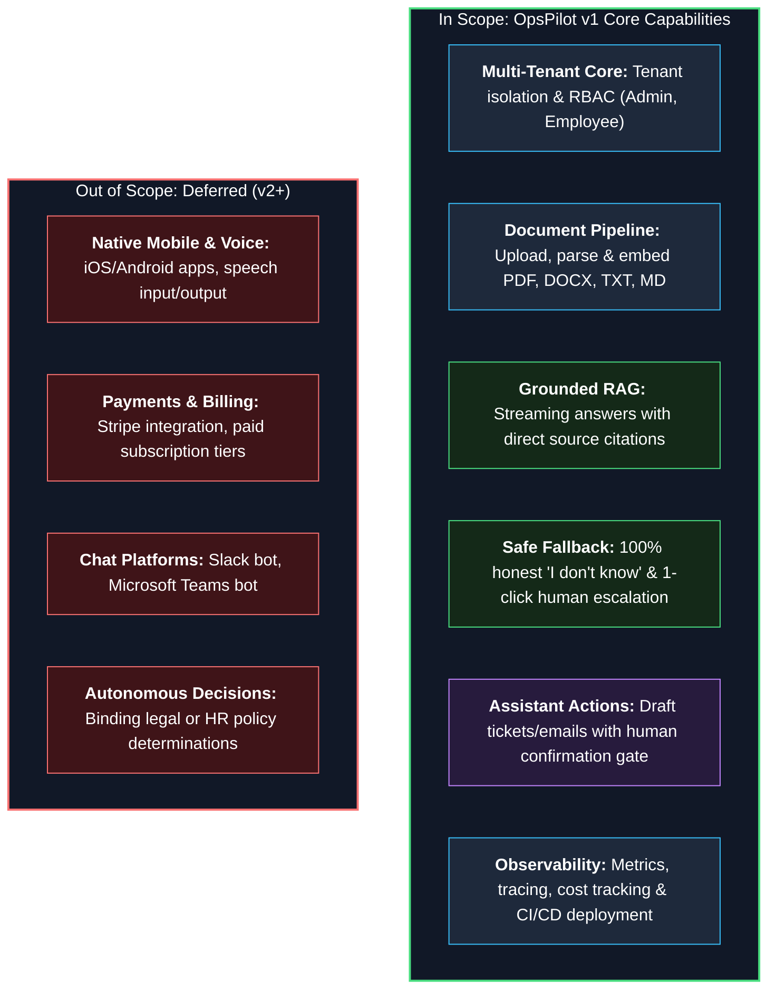
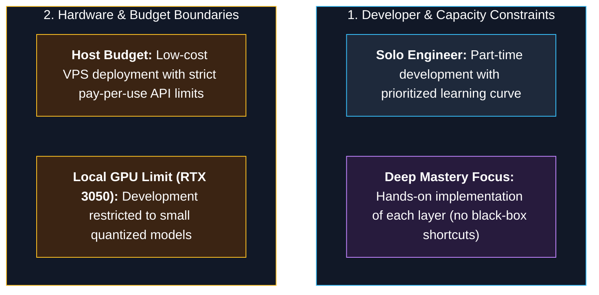
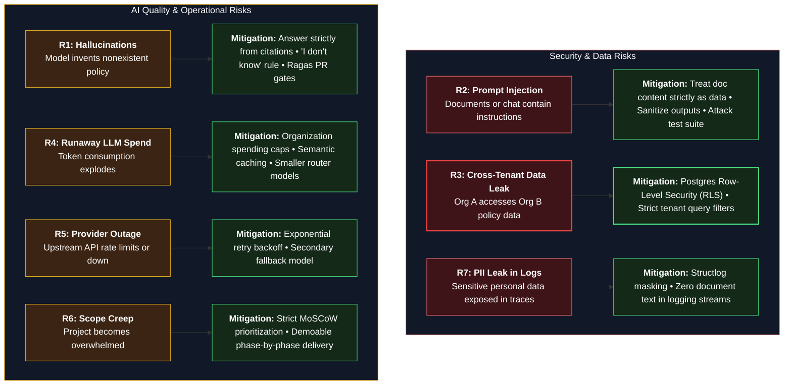
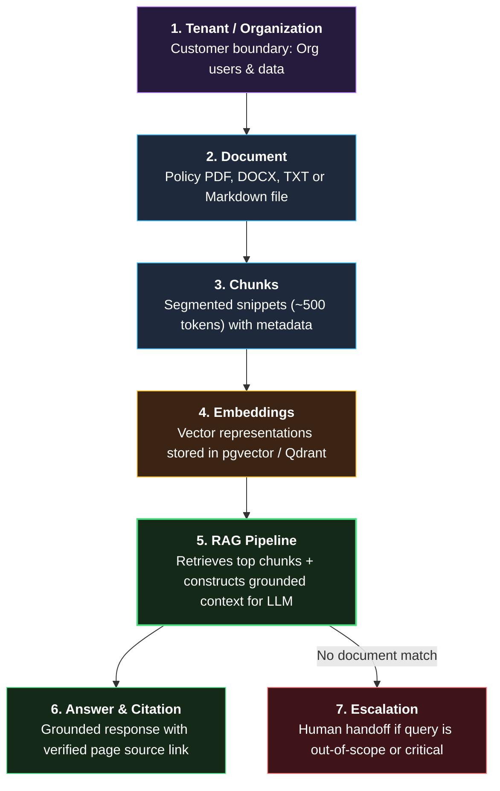

# 05 — Scope, Assumptions, Constraints, Risks

**Status:** Draft v1 | **Owner:** Awolad | **Last updated:** 2026-09-30

> **How to write:** This file defines the project's **boundaries**: what is included, what is excluded, what we assume, and what could go wrong.
> Include a mitigation (how to reduce it) for every **risk**. This is very useful in interviews.

---

## 1. In Scope (v1)

- Multi-organization (multi-tenant) web application
- Document upload and processing (PDF, DOCX, TXT, MD)
- Question answering with citations
- Escalation to a person
- Assistant actions with user confirmation
- Admin dashboard (usage, cost, knowledge gaps)
- Monitoring, logging, tracing, CI/CD, deployment

## 2. Out of Scope (v1)

- Mobile app, voice
- Billing and payments
- Integrations with Slack / Teams
- Legal or HR decisions made by the system

### Scope Boundary Architecture

---

## 3. Assumptions

| # | Assumption | How to validate |
|---|---|---|
| A1 | A company has fewer than 500 documents | Test with a large sample |
| A2 | Documents are mostly text (not scanned images) | Test with sample PDFs |
| A3 | Users accept a short answer plus sources | Try with a few real users |
| A4 | An external LLM API is available during development | Check provider limits |

---

## 4. Constraints

- Solo developer, part-time learning project
- Limited budget (low-cost VPS, pay-per-use LLM API)
- Local development laptop has a small GPU (RTX 3050), so only small local models can run
- Learning goal: each technology should be implemented and understood, not only used

### Engineering & Resource Constraints

---

## 5. Risks

| # | Risk | Likelihood | Impact | Mitigation |
|---|---|---|---|---|
| R1 | Wrong answer (hallucination) | High | High | Answer only from retrieved text, show citations, "I don't know" rule, evaluation in CI |
| R2 | Prompt injection through documents or chat | Medium | High | Treat document text as data, input/output checks, attack test set |
| R3 | One company sees another company's data | Low | Critical | Tenant filter on every query, row-level security, isolation tests |
| R4 | LLM cost grows out of control | Medium | Medium | Usage tracking, per-organization cap, caching, smaller models |
| R5 | LLM provider outage or limit | Medium | Medium | Fallback provider, retry with backoff |
| R6 | Scope grows and project never finishes | High | High | MoSCoW priorities, one phase at a time, demoable milestone per phase |
| R7 | Personal data leaks into logs | Medium | High | Log rules, masking, review |

### Risk Matrix & Mitigation Architecture

---

## 6. Open Questions

- [ ] Which LLM provider(s) for v1?
- [ ] Hosting: which VPS and region?
- [ ] Which evaluation dataset will be used (write our own questions from sample policy documents)?

---

## 7. Project Glossary

| Term | Meaning |
|---|---|
| **Tenant / Organization** | One customer company and its data |
| **Document** | A file or web page uploaded by an admin |
| **Chunk** | A small piece of a document used for searching |
| **Embedding** | Numbers that represent the meaning of a text |
| **RAG** | Retrieval-Augmented Generation: find relevant text first, then let the LLM answer from it |
| **Citation** | Link from an answer to its source |
| **Escalation** | Sending a question to a human with context |

### Conceptual Relationships & Information Pipeline

