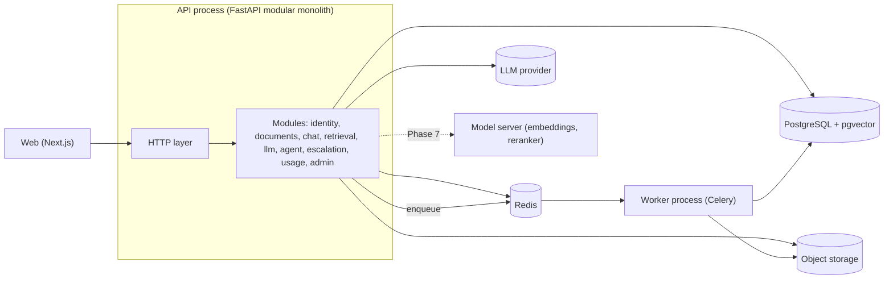

# Is OpsPilot a Microservice Architecture? — **No.**

> Revisit this document regularly. Interviewers are likely to ask, "Is this a microservices architecture?"
> **A major correction:** I previously proposed separate NestJS and FastAPI services. After further consideration, I **changed that decision**. The reasoning is below; recognizing and correcting a design mistake is part of learning.

---

## 1. Short answer

**OpsPilot = modular monolith + background worker (+ optional model server later).**

- One backend application (FastAPI) with clearly separated **modules** (identity, documents, chat, retrieval, LLM, agent, and others).
- One **worker process** from the same codebase for background jobs.
- One frontend.
- Database, Redis, object storage.
- In Phase 7, an optional **model server** can run local embedding or reranking models in a separate container. This is the planned exercise for learning service extraction.

This is **not a microservices architecture.**

---

## 2. Key terms (a restaurant analogy)

| Style | Restaurant upoma | Software |
|---|---|---|
| **Monolith** | One kitchen with no separation between cooking stations | One application with no clear internal module boundaries |
| **Modular monolith** | One kitchen with separate stations (grill, salad, dessert) and clear rules between them | One application with clear modules and boundaries |
| **A few services** | Two or three kitchens | Two to four deployable applications |
| **Microservices** | A separate restaurant, manager, and bank account for every dish | Many small services, each with its own database, team, and deployment |

**Microservices-er definition:**
1. Many small services, each responsible for **one business capability**.
2. Each service **owns its data** and does not access another service's database directly.
3. **Independent deployment:** deploying one service does not affect the others.
4. Services communicate over the network.
5. Services are often owned by **separate teams**.

---

## 3. Six-question test (apply it to any project)

| Question | Choose microservices if... | OpsPilot |
|---|---|---|
| 1. Are many developers or teams working in parallel? | Yes, more than 20 people | **No**, one developer |
| 2. Must each part be **deployed independently**? | Yes, with separate release cycles | **No**, release together |
| 3. Does any part have a **very different scaling pattern**? | Yes (for example, 100× load) | **Partly**: ingestion already runs in a separate process; model inference may in Phase 7 |
| 4. Does any part require a **different technology**? | Yes | **Partly**: model serving may use a GPU; the rest uses Python |
| 5. Must one part continue if another fails? | Yes, with strict isolation | **Partly**: the worker is separate, so chat can continue if ingestion fails |
| 6. Are the domain boundaries **clear and stable**? | Yes | **No**, the project is new and requirements may change |

**Result:** Three answers are "no" and three are "partly." This argues **against a full microservices architecture**, while still providing enough reason to run the worker as a separate process. Choose only the separation the project needs.

---

## 4. The operational cost of microservices (why not start with them)

Every additional service increases this operational work:

| Concern | In a monolith | In microservices |
|---|---|---|
| Function call | In-process call; failures raise exceptions | Network call with timeouts, retries, partial failures, and version mismatches |
| Transaction | One database transaction | Distributed transaction, saga, or eventual consistency |
| Debugging | One stack trace | Distributed tracing is required |
| Testing | One test suite | Contract tests and an integration environment |
| Deployment | One pipeline | Multiple pipelines and version compatibility |
| Local run | One command | Orchestration across many containers |
| Security | One authentication boundary | Service-to-service authentication |
| Observability | One log stream | Aggregated logs and trace ID propagation |

For a solo developer's six-month learning project, this operational cost would consume **time needed to learn AI engineering**.

---

## 5. Why I changed the earlier design (NestJS + FastAPI)

The earlier proposal was NestJS for business logic and FastAPI for AI. On closer review:

1. **Your goal is to learn AI engineering.** A second NestJS codebase would add little to that goal. You already have NestJS experience on your résumé and work as an AI Engineer.
2. **The boundary is not a natural service boundary.** Each chat request needs authentication, usage limits, history, retrieval, an LLM call, and usage recording. Business and AI work are **part of the same request**. A chatty network connection between two services adds failure points without a meaningful benefit.
3. **Solo development.** Two codebases mean two Dockerfiles, two CI pipelines, two test setups, two logging configurations, internal authentication, and an internal API contract.
4. **It makes a stronger engineering explanation:** "I deliberately chose a modular monolith and will extract a service when these conditions are met" is more defensible than simply saying "I built microservices."

This decision is recorded in **ADR-0003**, which supersedes the earlier proposal.

---

## 6. OpsPilot-er final shape

---

## 7. Can I still learn distributed-systems concepts?

**Yes**, in small, controlled parts of the system:

| Concept | Where to learn it |
|---|---|
| Async processing, at-least-once delivery, **idempotency**, retries | Ingestion worker (Phase 2) |
| **Eventual consistency** | Document status `uploaded → ready` |
| **Timeouts, retry with backoff, circuit breaker, fallback** | External LLM/embedding API (Phase 1, 5) |
| **Trace propagation** across processes | API → Redis → Worker (Phase 6) |
| **Service contract / versioning** | Public REST API, MCP server (Phase 4) |
| **Service extraction** | Model server (Phase 7) |
| **Backpressure, queue depth** | Worker metrics (Phase 6) |

---

## 8. Rules for keeping the monolith modular (and avoiding a "big ball of mud")

1. Each module has one **public interface** (`service.py`); everything else is private.
2. **Do not import another module's `models` or `repository`.**
3. Each module **owns its tables**. Other modules must call its service functions instead of querying those tables directly.
4. Dependencies are **one-way**: chat → retrieval → LLM. Retrieval must never depend on chat; avoid cycles.
5. **Enforce boundaries in CI** by defining contracts with a tool such as Python's `import-linter`. A change that breaks a rule must fail CI and block merging.
6. Each module has its own tests.

Following these rules makes it easier to extract a module into a separate service later, if needed.

---

## 9. When to extract a service (triggers)

| Trigger | Action |
|---|---|
| Model inference uses a GPU and needs a different scaling profile from the API | Extract the model server (Phase 7) |
| A worker dependency (such as a parsing library) makes the API image too large or slow to build | Give the worker its own image; it already runs as a separate process |
| A module has a separate release cycle or team | Extract it |
| A module failure brings down the rest of the system | Isolate it |
| Measurements show that this module is the bottleneck | Scale or extract it |

**Extract based on measurements, not intuition.**

---

## 10. Interview answer (adapt this in your own words)

> **Q: Is OpsPilot built with microservices?**
> "No. I chose a modular monolith with a separate worker process. I evaluated microservices against team size, deployment independence, scaling differences, and domain stability, and the operational cost did not fit a solo project. I plan to enforce module boundaries with CI rules so a service can be extracted later if needed. A model server for embeddings and reranking is a possible Phase 7 exercise because it has a different scaling and hardware profile."

---

## 11. Exercise

Apply the six-question test to these two systems:
- (a) An e-commerce company with 60 engineers and separate payment, catalog, and search teams.
- (b) Your own personal expense tracker.

Which direction do your answers support, and why? Write down your reasoning.
