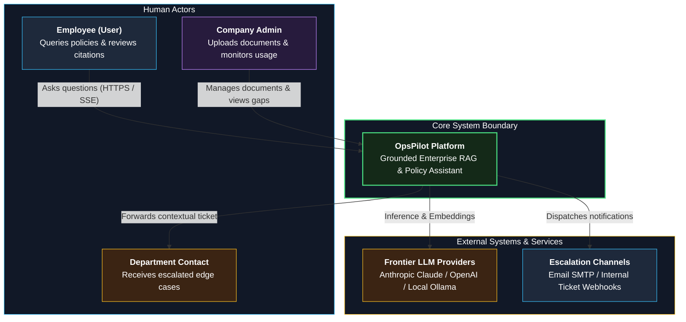
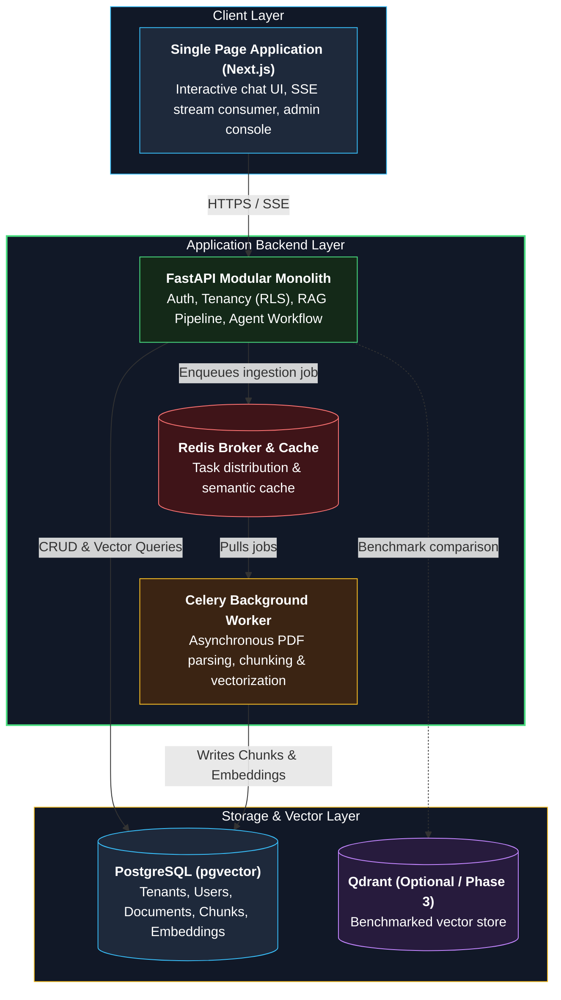
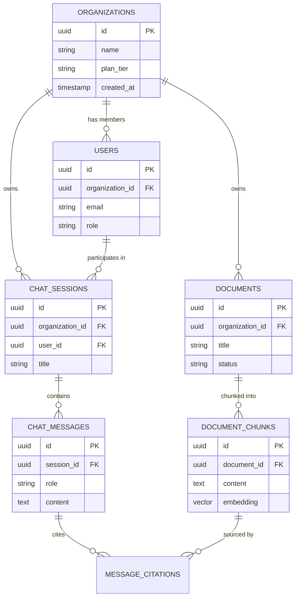
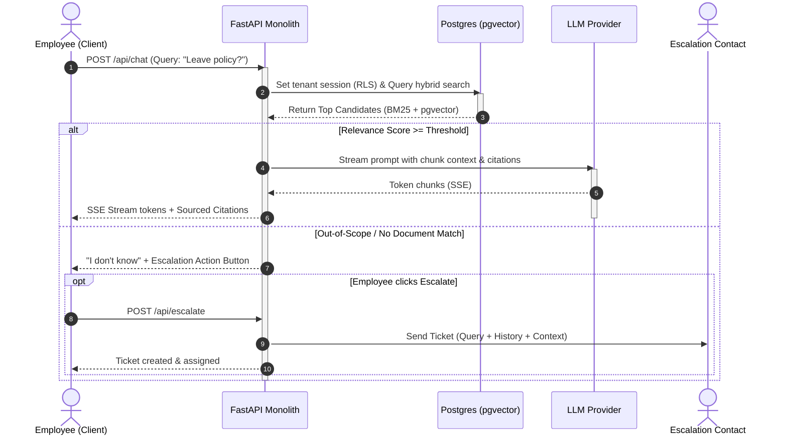

# [Project Name] — System Design Document

**Status:** Draft | In review | Approved
**Author:** [name] | **Last updated:** YYYY-MM-DD
**Related:** [requirements docs, ADRs]

> **How to write:** Fill out sections in order. If a section is not applicable, write "N/A, because ..." (do not leave it blank). Keep it under 8–12 pages.

---

## 1. Overview
What are we building and why? (3-5 sentences, link to problem statement)

## 2. Goals and Non-Goals
- **Goals:**
- **Non-goals:**

## 3. Architecture Drivers
| Requirement | Impact on design |
|---|---|

## 4. Constraints and Assumptions
- **Constraints (budget, team, time, hardware):**
- **Assumptions (to validate):**

## 5. Capacity Estimation
| Item | Estimate | How computed |
|---|---|---|
| Storage | | |
| Traffic | | |
| Cost | | |
| Latency budget | | |

---

## 6. System Context (C4 Level 1)

---

## 7. Architecture & Containers (C4 Level 2)

| Component | Responsibility | Owns (data) | Technology | Scales by |
|---|---|---|---|---|

Evolution path: v0 / v1 / v2

---

## 8. Data Design

---

## 9. Key Flows & Sequence

| Flow | Failure | Handling |
|---|---|---|

---

## 10. API Design
(Conventions, endpoint table, error format, auth)

## 11. Security and Privacy
(Threats and controls)

## 12. Observability
(Metrics, logs, traces, alerts, dashboards)

## 13. Deployment and Operations
(Environments, CI/CD, backup, rollback)

## 14. Technology Choices
| Area | Choice | Alternatives | ADR |
|---|---|---|---|

## 15. Risks and Open Questions
| Risk / question | Mitigation / owner |
|---|---|

---

## 16. Review Checklist
- [ ] Every must-have requirement maps to design
- [ ] Every driver has a design response
- [ ] Failure scenarios walked through
- [ ] Every major decision has an ADR
