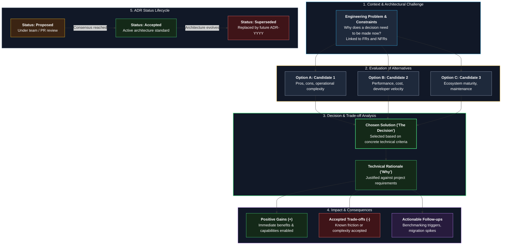

# ADR-XXXX: [Short title of the decision]

- **Status:** Proposed | Accepted | Superseded by ADR-YYYY
- **Date:** YYYY-MM-DD
- **Deciders:** [names]

> **How to write:** An ADR (Architecture Decision Record) is a concise document capturing "why we made this decision". One decision = one file.
> Keep it under 1 page. In technical interviews, this is your strongest evidence of sound engineering judgment.
> When to write: Whenever you choose one option from 2+ alternatives (database, framework, vector DB, message queue, etc.).

---

### ADR Decision Framework & Lifecycle

---

## Context
What is the problem? What are the constraints? Why does this decision need to be made now? (2-5 lines)

## Options considered
1. **Option A**: short description
2. **Option B**: short description
3. **Option C**: short description

## Decision
We will use **[option]**.

## Why
- Reason 1 (you can link to project requirements, e.g., NFR-010)
- Reason 2

## Consequences
- **Good:**
- **Bad / trade-offs:**
- **Follow-up:** (any required action, e.g., "benchmark at 100k chunks, revisit if slow")

## Related
- Requirements: FR-xxx, NFR-xxx
- Other ADRs:
