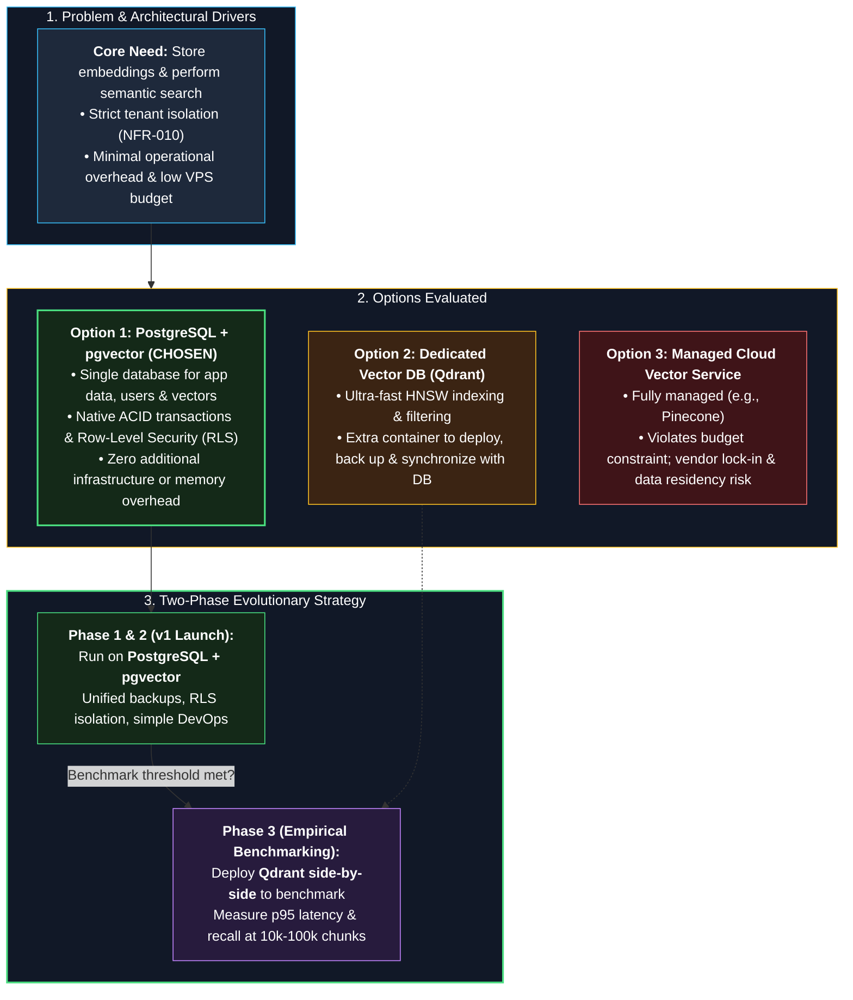

# ADR-0001: Vector storage for document search (EXAMPLE)

- **Status:** Example only. You will make the real decision in Step 2, after learning and testing.
- **Date:** YYYY-MM-DD
- **Deciders:** Awolad

> This is only an **example to demonstrate the format**. Write the actual decision after conducting your own research and testing; do not copy this content directly.

---

### Decision & Evaluation Architecture

---

## Context
OpsPilot needs to store text embeddings and find the most similar chunks for a question. Data of each organization must stay isolated (NFR-010). The system already needs a relational database for users, organizations, and chat history.

## Options considered
1. **PostgreSQL with pgvector**: vectors stored next to application data.
2. **Dedicated vector database (e.g., Qdrant)**: separate service built for vector search.
3. **Managed cloud vector service**: hosted, less to operate.

## Decision
Start with **PostgreSQL + pgvector** (example).

## Why
- One database to run and back up, fits the low-budget constraint.
- Tenant filter and vector search can use the same query and row-level security.
- Enough for v1 load (NFR-018: 10,000 chunks per organization).

## Consequences
- **Good:** simpler operations, transactional consistency between documents and vectors.
- **Bad / trade-offs:** may be slower than a dedicated vector database at large scale.
- **Follow-up:** benchmark pgvector vs Qdrant in Phase 3; write a new ADR if results justify a change.

## Related
- Requirements: FR-004, NFR-010, NFR-018
