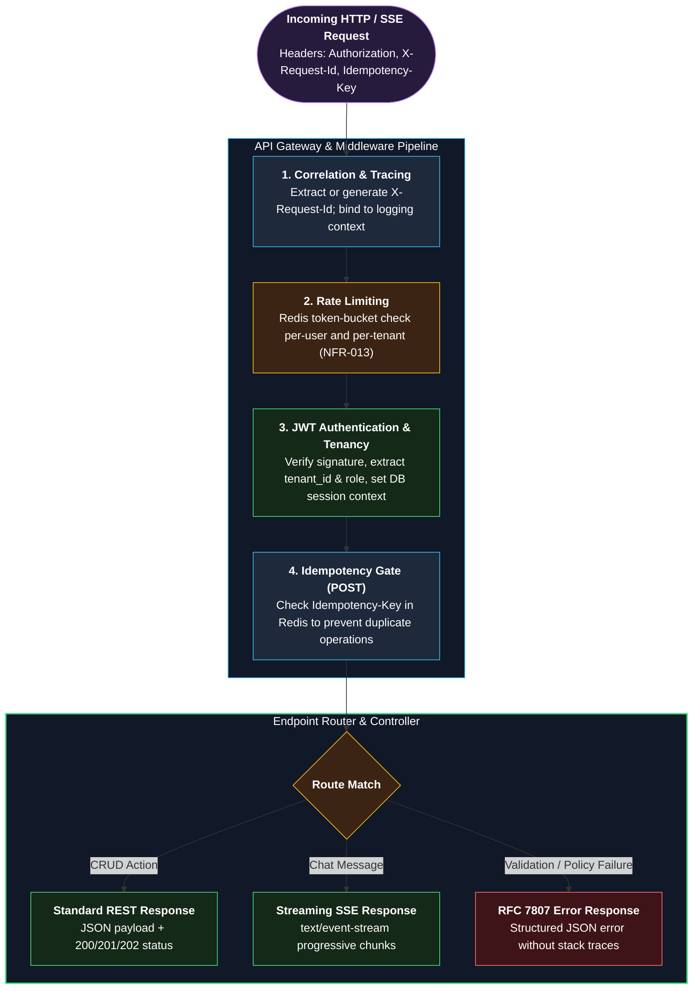
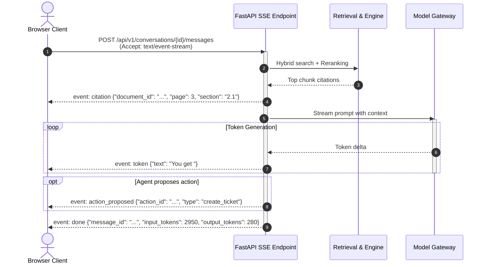
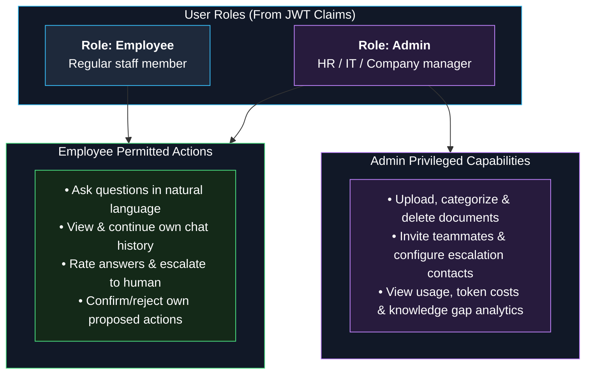
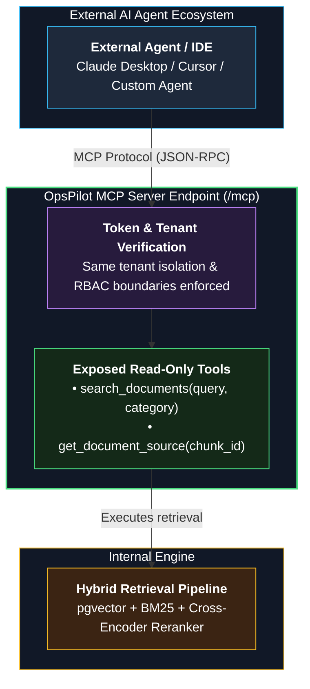

# 08 — API Design

**Status:** Approved v2 (reference) | **Last updated:** 2026-10-01

There is **one public REST API** (browser to backend). Calls between modules are in-process Python calls through module services, not network APIs (see [06](06-architecture.md)). A separate MCP server contract is added in Phase 4.

---

## 1. Conventions

| Topic | Rule |
|---|---|
| Base path | `/api/v1` |
| Format | JSON, `snake_case` fields, ISO 8601 UTC timestamps |
| Auth | `Authorization: Bearer <access_token>`; refresh token in HttpOnly cookie |
| Pagination | `?limit=20&cursor=<opaque>`; response has `next_cursor` |
| Idempotency | `Idempotency-Key` header on `POST /documents`, `POST /escalations`, `POST /actions/{id}/confirm` |
| Rate limits | Per user and per tenant; `429` with `Retry-After` |
| Tracing | `X-Request-Id` accepted or generated, returned in every response and error |
| Docs | OpenAPI generated by FastAPI, committed as a snapshot and checked in CI for breaking changes |

### API Ingress Pipeline & Middleware Gate



---

## 2. Error Format (RFC 7807)

```json
{
  "type": "https://opspilot.dev/errors/validation",
  "title": "Validation failed",
  "status": 400,
  "detail": "file type 'exe' is not supported",
  "request_id": "7f3c2c9e-..."
}
```

Never include stack traces or internal details.

---

## 3. Endpoints

| Method | Path | Purpose | FR | Notes |
|---|---|---|---|---|
| POST | `/auth/register-organization` | Create tenant and first admin | FR-001 | |
| POST | `/auth/login` | Log in | FR-003 | |
| POST | `/auth/refresh` | New access token (rotating refresh) | FR-003 | |
| POST | `/auth/logout` | Revoke refresh token | FR-003 | |
| POST | `/users/invitations` | Invite user | FR-002 | Admin only |
| POST | `/auth/accept-invitation` | Join with invitation token | FR-002 | |
| GET | `/users` | List users | FR-002 | Admin only |
| POST | `/documents` | Upload file (multipart) or add URL | FR-010, FR-011 | `202 Accepted`, document `status=uploaded` |
| GET | `/documents` | List with status | FR-012 | Filter by status, category |
| GET | `/documents/{id}` | Details | FR-012 | |
| PATCH | `/documents/{id}` | Change category or allowed roles | FR-014 | |
| DELETE | `/documents/{id}` | Delete | FR-013 | |
| POST | `/conversations` | Start conversation | FR-024 | |
| GET | `/conversations` | List own | FR-024 | |
| GET | `/conversations/{id}/messages` | History | FR-024 | |
| POST | `/conversations/{id}/messages` | Ask a question; answer streams | FR-020..023, FR-026 | `Accept: text/event-stream` |
| POST | `/messages/{id}/feedback` | Rate answer | FR-025 | |
| GET | `/citations/{id}/source` | Open cited chunk or document location | FR-022 | Checks role access |
| POST | `/escalations` | Escalate conversation | FR-030 | Idempotent |
| GET | `/escalations` | List | FR-032 | |
| PATCH | `/escalations/{id}` | Mark resolved | FR-032 | Contact or admin |
| GET/PUT | `/admin/escalation-contacts` | Manage contacts | FR-031 | Admin only |
| POST | `/actions/{id}/confirm` | Confirm proposed action | FR-041 | Idempotent |
| POST | `/actions/{id}/reject` | Reject | FR-041 | |
| GET | `/admin/usage?from=&to=` | Usage and cost | FR-050 | Admin only |
| GET | `/admin/knowledge-gaps` | Unanswered questions | FR-051 | Admin only |
| GET | `/admin/feedback` | Ratings and comments | FR-052 | Admin only |
| GET | `/health/live`, `/health/ready` | Probes | NFR-016 | No auth |
| GET | `/metrics` | Prometheus metrics | NFR-020 | Internal network only |

---

## 4. Streaming Contract (SSE)

`POST /api/v1/conversations/{id}/messages`

### SSE Streaming Sequence Flow



Request:
```json
{ "content": "How many casual leave days do I get?" }
```

Response events:

```
event: token
data: {"text": "You get "}

event: citation
data: {"citation_id": "...", "document_id": "...", "title": "Leave Policy", "page": 3, "section": "2.1"}

event: action_proposed
data: {"action_id": "...", "type": "create_ticket", "summary": "..."}

event: done
data: {"message_id": "...", "input_tokens": 2950, "output_tokens": 280}

event: error
data: {"type": "...", "title": "...", "request_id": "..."}
```

Rules: `done` or `error` is always the last event. Closing the connection cancels generation; the partial message is saved as `cancelled`.

---

## 5. Authorization Matrix

| Action | Employee | Admin |
|---|---|---|
| Ask questions, view own history | Yes | Yes |
| Escalate, rate, confirm own actions | Yes | Yes |
| Upload / delete documents | No | Yes |
| Manage users, contacts | No | Yes |
| View usage dashboard | No | Yes |

### Role-Based Access Control Boundaries



---

## 6. MCP Server (Phase 4)

A separate endpoint (`/mcp`) exposes read-only tools such as `search_documents`. Rules: authenticated with the same token model, tenant and role taken from the token, same retrieval filters, rate limited, no side-effect tools.

### Model Context Protocol (MCP) Integration Flow



---

## 7. Versioning and Compatibility

- Additive changes (new field) allowed within `v1`.
- Breaking changes need `/v2`.
- CI compares the OpenAPI snapshot and flags breaking changes.
