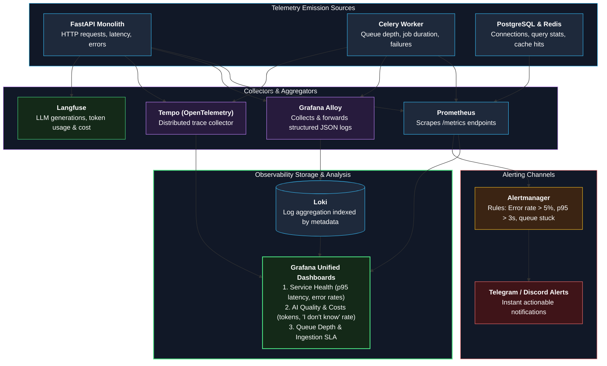

# 11 — Deployment and Observability

**Status:** Approved v2 (reference) | **Last updated:** 2026-10-01

---

## 1. Environments

| Environment | Purpose | How it runs |
|---|---|---|
| Local | Development | `docker compose up` (app, worker, database, queue, storage; observability profile optional) |
| CI | Tests and evaluation | GitHub Actions with service containers |
| Production (v1) | Live demo | One VPS, Docker Compose, reverse proxy (Caddy or Nginx) with HTTPS |

### Compose Profiles

| Profile | Services |
|---|---|
| `core` (default) | web, api, worker, postgres (pgvector), redis, minio |
| `obs` | prometheus, grafana, loki, alloy, tempo |
| `llmops` | langfuse and its dependencies (self-hosted Langfuse needs several components, so check current docs; on a small VPS prefer a hosted free tier or run it locally only) |
| `models` (Phase 7) | model server (GPU optional) |

Lean production = `core` + `prometheus` + `grafana` + `loki` + `alloy`. Add tracing and LLM tracing if the server has room (measure memory in Phase 6).

---

## 2. CI/CD Pipeline

```mermaid
flowchart TD
    subgraph STAGE_1 ["Stage 1: Static Quality & Architecture Gates"]
        PR["<b>Git Pull Request Opened</b>"]
        LINT["<b>Lint & Format</b><br/>ruff & Biome"]
        TYPE["<b>Static Analysis</b><br/>mypy strict type validation"]
        BOUND["<b>Module Boundary Check</b><br/>import-linter contract rules"]
        
        PR --> LINT --> TYPE --> BOUND
    end

    subgraph STAGE_2 ["Stage 2: Automated Testing Suite"]
        UNIT["<b>Unit Tests</b><br/>Fast pytest execution"]
        INTEG["<b>Integration Tests</b><br/>Real PostgreSQL + pgvector & Redis in Testcontainers"]
        BOUND --> UNIT --> INTEG
    end

    subgraph STAGE_3 ["Stage 3: Security & AI Regression Gate"]
        SCAN["<b>Security Audit & CVE Scans</b><br/>Trivy container scan + secret detection"]
        RAGAS["<b>Ragas AI Quality Benchmark</b><br/>Faithfulness & Citation accuracy eval set"]
        GATE{"<b>Passes Quality Thresholds?</b><br/>No regression from main branch"}

        INTEG --> SCAN --> RAGAS --> GATE
    end

    subgraph STAGE_4 ["Stage 4: Automated CD Deployment"]
        BUILD["<b>Build Docker Image</b><br/>Tagged with git commit SHA"]
        REGISTRY["<b>Push to Container Registry</b>"]
        DEPLOY["<b>Deploy to Production VPS</b><br/>Docker Compose zero-downtime rolling update"]
        SMOKE["<b>Smoke Tests & Health Check</b><br/>/health/ready verification (Rollback on failure)"]

        GATE -- "Yes: Merge to main" --> BUILD
        BUILD --> REGISTRY --> DEPLOY --> SMOKE
        GATE -- "No" --> BLOCK["<b>Merge Blocked</b><br/>Alerts developer on PR"]
    end

    style STAGE_1 fill:#111827,stroke:#38bdf8,stroke-width:1px,color:#ffffff
    style STAGE_2 fill:#111827,stroke:#c084fc,stroke-width:1px,color:#ffffff
    style STAGE_3 fill:#111827,stroke:#fbbf24,stroke-width:1px,color:#ffffff
    style STAGE_4 fill:#111827,stroke:#4ade80,stroke-width:2px,color:#ffffff

    style PR fill:#1e293b,stroke:#38bdf8,stroke-width:1px,color:#ffffff
    style LINT fill:#1e293b,stroke:#38bdf8,stroke-width:1px,color:#ffffff
    style TYPE fill:#1e293b,stroke:#38bdf8,stroke-width:1px,color:#ffffff
    style BOUND fill:#142918,stroke:#4ade80,stroke-width:1px,color:#ffffff
    style UNIT fill:#1e293b,stroke:#38bdf8,stroke-width:1px,color:#ffffff
    style INTEG fill:#1e293b,stroke:#38bdf8,stroke-width:1px,color:#ffffff
    style SCAN fill:#271b3d,stroke:#c084fc,stroke-width:1px,color:#ffffff
    style RAGAS fill:#271b3d,stroke:#c084fc,stroke-width:1px,color:#ffffff
    style GATE fill:#3b2413,stroke:#fbbf24,stroke-width:2px,color:#ffffff
    style BUILD fill:#1e293b,stroke:#38bdf8,stroke-width:1px,color:#ffffff
    style REGISTRY fill:#1e293b,stroke:#38bdf8,stroke-width:1px,color:#ffffff
    style DEPLOY fill:#142918,stroke:#4ade80,stroke-width:2px,color:#ffffff
    style SMOKE fill:#142918,stroke:#4ade80,stroke-width:1px,color:#ffffff
    style BLOCK fill:#3f1418,stroke:#ef4444,stroke-width:1px,color:#ffffff
```

One image runs both API and worker (different start command).

Quality gate: faithfulness and citation scores must not drop more than a set margin compared with `main` (NFR-007). To save cost, run the full evaluation on a schedule or when retrieval, prompt, or LLM code changes, and a small smoke set on every pull request.

---

## 3. Observability: Three Signals Plus LLM Traces

| Signal | Tool | What we record |
|---|---|---|
| Metrics | Prometheus + Grafana | Counts, rates, latency histograms, cost |
| Logs | Structured JSON, collected by Grafana Alloy into Loki | One line per event with `request_id`, `tenant_id`, `user_id` (no content). Promtail reached end of life on 2 March 2026, so Alloy is used. |
| Traces | OpenTelemetry to Tempo | One trace per request, propagated across API, queue, and worker |
| LLM traces | Langfuse | Prompt version, retrieved chunks, tokens, cost, latency, user feedback |

### Unified 4-Pillar Observability Architecture

### Core Metrics

| Metric | Type | Labels |
|---|---|---|
| `opspilot_http_request_duration_seconds` | Histogram | route, method, status |
| `opspilot_time_to_first_token_seconds` | Histogram | model |
| `opspilot_llm_tokens_total` | Counter | direction (`input`/`output`), model |
| `opspilot_llm_cost_usd_total` | Counter | model (tenant breakdown comes from the usage table, not a label, to avoid high cardinality) |
| `opspilot_retrieval_top_score` | Histogram | |
| `opspilot_no_answer_total` | Counter | |
| `opspilot_ingestion_duration_seconds` | Histogram | status |
| `opspilot_queue_depth` | Gauge | queue |
| `opspilot_llm_errors_total` | Counter | provider, type |

### Dashboards

1. **Service health:** request rate, error rate, latency p50/p95/p99.
2. **AI quality and cost:** time to first token, tokens, cost per day, "I don't know" rate, thumbs-down rate.
3. **Ingestion:** queue depth, job duration, failures.
4. **Infrastructure:** CPU, memory, disk, database connections.

### Alerts (Alertmanager to Telegram or Discord)

| Alert | Condition |
|---|---|
| High error rate | Error rate > 5% for 5 minutes |
| Slow first token | p95 > 3 s for 10 minutes |
| Queue stuck | Queue depth growing and no job finished for 10 minutes |
| Cost spike | Daily cost > 2x 7-day average |
| Service down | Health check failing for 2 minutes |

---

## 4. Backup and Recovery

- PostgreSQL: daily dump to object storage, retention 7 days; restore drill once per phase from Phase 6.
- Object storage: periodic sync to a second location.
- Recovery goal (assumption): restore within 4 hours, lose at most 24 hours of data.

---

## 5. Rollback

- Images tagged by commit SHA; deploy keeps the previous version.
- Database migrations are backward compatible (add first, remove later).

---

## 6. Local Development Notes (Fedora)

- Fedora ships Podman; either Docker Engine or Podman with a compose tool works. Decide in Phase 0 and record it.
- SELinux is enforcing by default: bind mounts in compose need the `:z` (shared) or `:Z` (private) suffix.
- GPU use (local models) needs the NVIDIA driver and container toolkit; check available VRAM with `nvidia-smi` before choosing model sizes.
