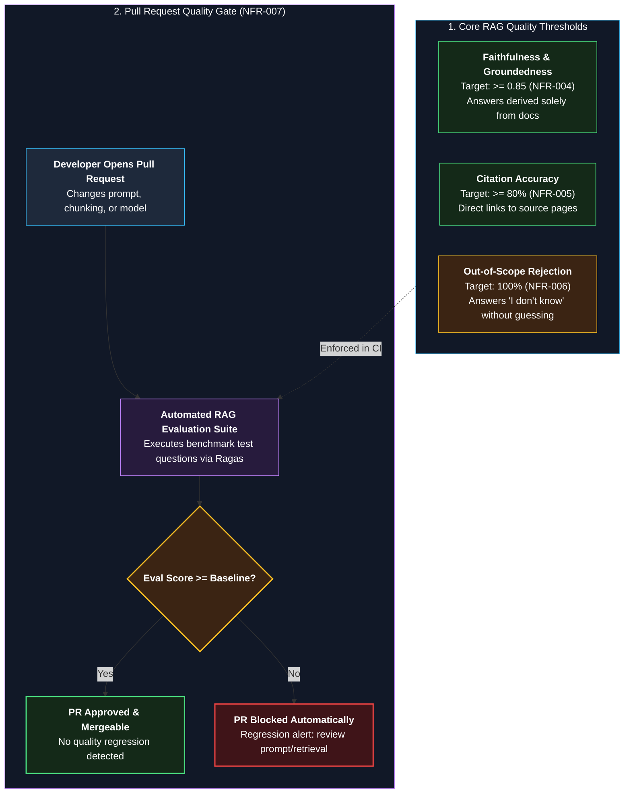
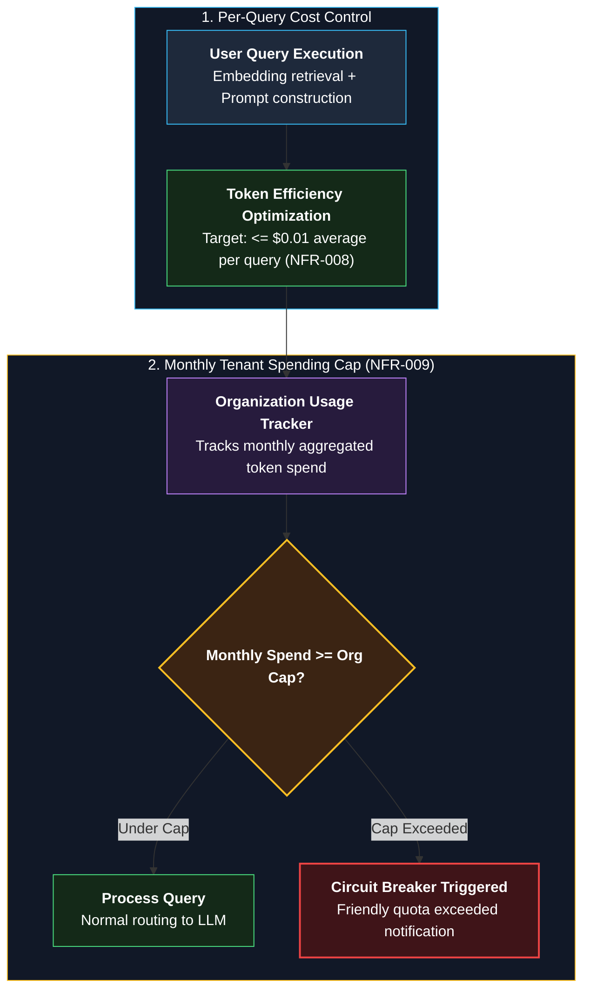
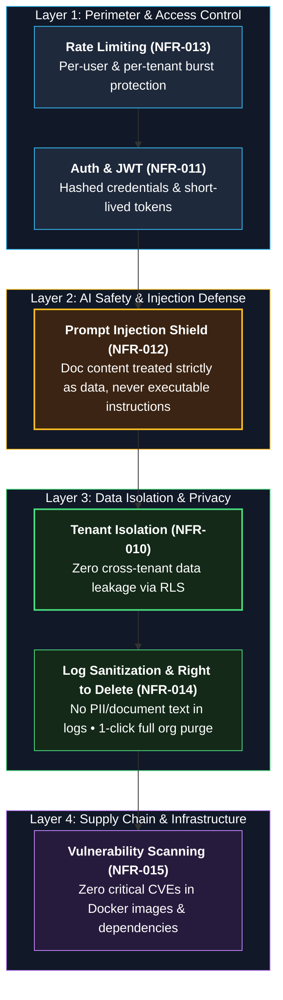
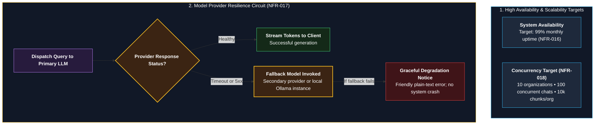
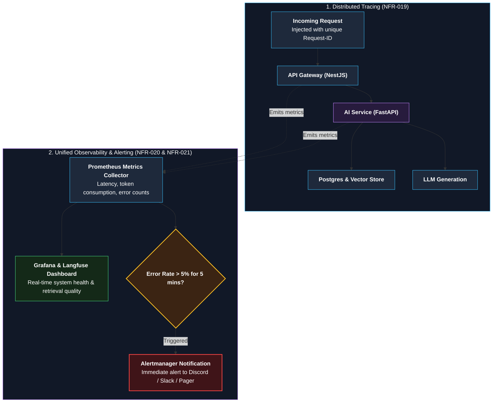
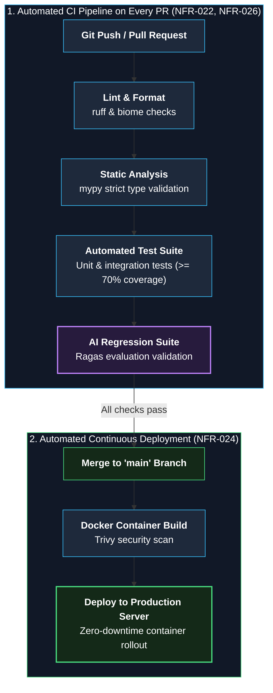

# 03 — Non-Functional Requirements (NFR)

**Status:** Draft v1 | **Owner:** Awolad | **Last updated:** 2026-09-30

> **How to write:**
> - FR describes **what** the system does; NFR describes **how** it performs: speed, security, cost, reliability.
> - Pattern: `[Quality]: [metric] [target] under [condition].`
> - **All NFRs must include numbers.** Do not just write "Fast", write "p95 < 2s".
> - If exact numbers are unknown, label them as **assumptions** and calibrate them later through benchmarking.
> - In an AI project, most of the real engineering is in NFRs: quality, cost, safety.
>
> **p95 means:** 95 out of 100 requests complete within this time.

> All numbers are **initial targets (assumptions)**.

---

## 1. Performance

| ID | Requirement | Target | How to measure |
|---|---|---|---|
| NFR-001 | Time to first token | p95 < 2 s | Latency histogram (Prometheus) |
| NFR-002 | Full answer time | p95 < 10 s | Same |
| NFR-003 | Document ingestion (10-page PDF) | Ready in < 60 s | Ingestion job duration |

### Latency Budget & Ingestion SLA

```mermaid
flowchart TD
    subgraph LATENCY ["1. Real-Time Chat Latency Budget"]
        REQ["<b>User Hits 'Send'</b><br/>Prompt payload sent over SSE"]
        TTFT["<b>Time to First Token (TTFT)</b><br/>Target: p95 < 2 seconds (NFR-001)"]
        FULL["<b>Full Answer Completion</b><br/>Target: p95 < 10 seconds (NFR-002)"]
        
        REQ -->|"Initial connection & retrieval"| TTFT
        TTFT -->|"Streaming tokens"| FULL
    end

    subgraph ASYNC ["2. Background Ingestion Pipeline"]
        INGEST["<b>10-Page PDF Ingested</b><br/>FR-010 upload triggered"]
        READY["<b>Document Search-Ready</b><br/>Target: < 60 seconds (NFR-003)"]
        
        INGEST -->|"Parse • Chunk • Vectorize"| READY
    end

    style LATENCY fill:#111827,stroke:#38bdf8,stroke-width:1px,color:#ffffff
    style ASYNC fill:#111827,stroke:#fbbf24,stroke-width:1px,color:#ffffff

    style REQ fill:#1e293b,stroke:#38bdf8,stroke-width:1px,color:#ffffff
    style TTFT fill:#142918,stroke:#4ade80,stroke-width:2px,color:#ffffff
    style FULL fill:#1e293b,stroke:#38bdf8,stroke-width:1px,color:#ffffff
    style INGEST fill:#271b3d,stroke:#c084fc,stroke-width:1px,color:#ffffff
    style READY fill:#142918,stroke:#4ade80,stroke-width:2px,color:#ffffff
```

---

## 2. AI Quality

| ID | Requirement | Target | How to measure |
|---|---|---|---|
| NFR-004 | Answers are grounded in sources (faithfulness) | >= 0.85 | Evaluation set (e.g., Ragas) |
| NFR-005 | Correct citation shown | >= 80% | Evaluation set |
| NFR-006 | Out-of-scope questions get "I don't know" | 100% | Evaluation set |
| NFR-007 | Quality does not regress | Evaluation runs on every pull request; PR fails if score drops | CI pipeline |

### RAG Quality Guardrails & Regression CI Gate

---

## 3. Cost

| ID | Requirement | Target | How to measure |
|---|---|---|---|
| NFR-008 | Average LLM cost per question | <= $0.01 (assumption) | Token usage tracking |
| NFR-009 | Monthly spending cap per organization | Configurable; requests stop at cap | Usage table |

### Token Budgeting & Spending Cap Circuit Breaker

---

## 4. Security and Privacy

| ID | Requirement | Target | How to measure |
|---|---|---|---|
| NFR-010 | Tenant isolation | No cross-organization data access, ever | Automated isolation tests |
| NFR-011 | Authentication and authorization | Hashed passwords, short-lived tokens, role-based access | Security tests |
| NFR-012 | Prompt injection resistance | Text inside documents is never treated as instructions | Attack test set in CI |
| NFR-013 | Rate limiting | Per user and per organization limits | Load test |
| NFR-014 | Privacy | No document content or personal data in logs; organization data can be deleted on request | Log review, deletion test |
| NFR-015 | Dependencies and images | No known critical vulnerabilities | Image and dependency scan in CI |

### Defense-in-Depth Security Framework

---

## 5. Reliability and Scalability

| ID | Requirement | Target | How to measure |
|---|---|---|---|
| NFR-016 | Availability (v1, single server) | 99% monthly | Uptime monitor |
| NFR-017 | LLM provider failure | Fallback model, or clear error message | Failure injection test |
| NFR-018 | v1 load | 10 organizations, 100 concurrent chats, 10,000 chunks per organization | Load test (k6 / Locust) |

### High Availability & Multi-Model Fallback Circuit

---

## 6. Observability

| ID | Requirement | Target | How to measure |
|---|---|---|---|
| NFR-019 | Every request traceable | Request ID across all services | Trace view |
| NFR-020 | Metrics and dashboards | Latency, errors, tokens, cost, retrieval quality | Grafana dashboard |
| NFR-021 | Alerts | Alert if error rate > 5% for 5 minutes | Alert rule fires in test |

### Unified Observability & Alerting Pipeline

---

## 7. Maintainability and Delivery

| ID | Requirement | Target | How to measure |
|---|---|---|---|
| NFR-022 | CI on every pull request | Lint, type check, tests, evaluation | CI status |
| NFR-023 | Local setup | One command starts the full system | Fresh-machine test |
| NFR-024 | Automated deployment | Merge to main deploys to server | Deployment pipeline |
| NFR-025 | Provider independence | LLM and embedding provider changeable by configuration | Swap test |
| NFR-026 | Test coverage | >= 70% of backend code | Coverage report |

### CI/CD Quality Gates & Automated Delivery

---

## 8. Usability

| ID | Requirement | Target | How to measure |
|---|---|---|---|
| NFR-027 | Works on mobile browser | Usable at 360 px width | Manual test |
| NFR-028 | Error messages | Plain language, no stack traces | Manual test |
