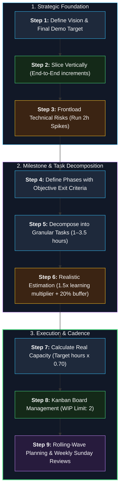
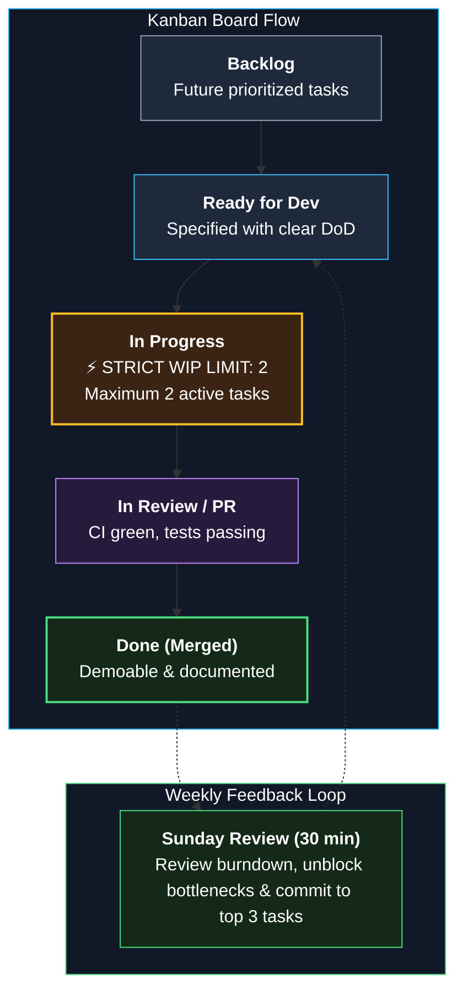
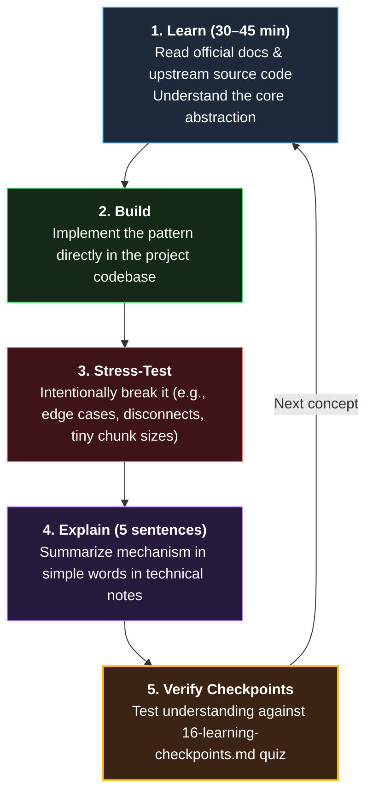

# How to Plan a Project — Mentor Guide (Reusable for Any Project)

> Read this guide repeatedly. You can apply this engineering planning framework to **any real-world software project**.
> We use OpsPilot as our concrete reference. **Read this guide first and draft your Phase 0–1 plan before comparing with the reference solutions.** True engineering leadership comes from working through capacity and risk trade-offs.

---

## 0. What Project Planning Is (and Isn't)

Project planning is **determining what to build now, what to build next, in what sequence, with what capacity, and how we know each milestone is truly complete**.

**Planning is not psychic prediction.** You cannot anticipate the future with 100% accuracy. The true goals of engineering planning are:
1. **Uncertainty Reduction:** Confront high-risk, unknown technical components early through targeted spikes.
2. **Optimal Execution Sequencing:** Build foundational dependencies before building user-facing features.
3. **Demonstrable Progress:** Generate functional deliverables regularly to preserve momentum and provide empirical proof of progress.
4. **Decision Fatigue Mitigation:** Free your daily engineering hours to focus exclusively on coding rather than wondering what to work on next.

### 3 Golden Planning Rules:
1. **Vertical Slices over Horizontal Layers:** Every phase must conclude with a **working, testable, end-to-end slice** of software.
2. **Frontload Risk:** Tackle the most ambiguous, high-risk technical unknowns first.
3. **Granular Tasks with Objective Definitions of Done:** Never create vague tasks like "Build RAG". Write specific, testable tasks like "Extract text from PDF preserving page numbers and return chunk objects".

---

## 1. Core Planning Terminology

| Term | Engineering Definition | OpsPilot Example |
|---|---|---|
| **Vision** | The one-sentence elevator pitch of what the product does. | "Ask questions against company documents and get cited, verifiable answers." |
| **Walking Skeleton (MVP)** | The smallest possible end-to-end implementation that executes across all tiers. | User logs in, submits chat prompt, and receives a streamed LLM response. |
| **Vertical Slice** | A thin slice of functionality touching all layers (UI $\rightarrow$ API $\rightarrow$ Database). | Upload PDF $\rightarrow$ Process $\rightarrow$ Ask question $\rightarrow$ Receive cited answer. |
| **Horizontal Layering** | Building an entire technical layer in isolation (e.g., all DB tables first). | **Strictly avoid this trap.** |
| **Phase / Milestone** | A major deliverable ending in a working demo and verifiable exit criteria. | Phase 2: Basic Grounded RAG. |
| **Exit Criteria** | Objective, verifiable checklist determining when a phase is complete. | Working demo + automated tests pass + architecture docs updated. |
| **Epic** | A cohesive group of related user capabilities. | Organization Authentication & RBAC. |
| **Story** | A capability described from the end-user's perspective. | `US-001`: Ask a question in plain language. |
| **Task** | A focused engineering work unit spanning 1–3.5 hours. | `P2-02`: Write robust PDF and Markdown parsers. |
| **Spike** | A time-boxed technical investigation answering a specific architectural unknown. | `P1-03`: Verify Postgres RLS behavior with connection pooling. |
| **Definition of Done (DoD)** | The quality threshold required before any task or PR is merged. | Automated tests pass + zero lint errors + CI green + docs updated. |
| **Capacity** | Realistic dedicated engineering hours available per week. | 10 focused hours per week. |
| **Rolling-Wave Planning** | High detail for near-term work; strategic abstraction for future work. | Phases 0–2 planned at task level; Phases 3–7 planned at story level. |

---

## 2. The 9-Step Planning Framework

### Step 1: Define the Vision and the Final Demo
Establish the destination before planning the journey.
- **Vision:** "A multi-tenant platform where organizations upload documents, employees receive sourced answers in seconds, and unanswered questions can be escalated with full context to designated human contacts."
- **Final Demo Target:** A live production URL with HTTPS, admin and employee login, policy PDF ingestion, streaming chat answers with clickable page citations, an "I don't know" response on unanswerable queries, email escalation, human-in-the-loop action confirmation, and a live Grafana observability dashboard.

### Step 2: Slice Vertically, Not Horizontally

```mermaid
flowchart TD
    subgraph BAD ["Anti-Pattern: Horizontal Layering (Fails at Integration)"]
        H1["Week 1–3: Implement ALL Database Schemas"]
        H2["Week 4–6: Implement ALL Backend REST Endpoints"]
        H3["Week 7–9: Implement ALL Frontend UI Screens"]
        H4["Week 10: Attempt Integration $\rightarrow$ EVERYTHING BREAKS"]
        H1 --> H2 --> H3 --> H4
    end

    subgraph GOOD ["Best Practice: Vertical Slices (Working Demo Every Phase)"]
        V1["<b>Phase 1 Slice:</b> Auth + Streaming Chat<br/>UI $\rightarrow$ API $\rightarrow$ Postgres $\rightarrow$ Working Demo"]
        V2["<b>Phase 2 Slice:</b> Document Upload & RAG<br/>Upload $\rightarrow$ Worker $\rightarrow$ Vector Search $\rightarrow$ Cited Answer Demo"]
        V3["<b>Phase 3 Slice:</b> Retrieval Quality & Benchmarks<br/>Hybrid Search $\rightarrow$ Reranker $\rightarrow$ Ragas Evaluation Table"]
        V1 --> V2 --> V3
    end

    style BAD fill:#111827,stroke:#f87171,stroke-width:1px,color:#ffffff
    style GOOD fill:#111827,stroke:#4ade80,stroke-width:2px,color:#ffffff

    style H1 fill:#1e293b,stroke:#94a3b8,stroke-width:1px,color:#ffffff
    style H2 fill:#1e293b,stroke:#94a3b8,stroke-width:1px,color:#ffffff
    style H3 fill:#1e293b,stroke:#94a3b8,stroke-width:1px,color:#ffffff
    style H4 fill:#3f1418,stroke:#ef4444,stroke-width:2px,color:#ffffff

    style V1 fill:#142918,stroke:#4ade80,stroke-width:1px,color:#ffffff
    style V2 fill:#142918,stroke:#4ade80,stroke-width:1px,color:#ffffff
    style V3 fill:#142918,stroke:#4ade80,stroke-width:1px,color:#ffffff
```

| Anti-Pattern: Horizontal Layers | Best Practice: Vertical Slices |
|---|---|
| Weeks 1–3: Implement all database schemas | Weeks 1–3: Implement login $\rightarrow$ authenticated chat streaming |
| Weeks 4–6: Implement all REST API routes | Weeks 4–6: Implement PDF upload $\rightarrow$ vector search $\rightarrow$ cited response |
| Weeks 7–9: Implement frontend screens | Weeks 7–9: Hybrid retrieval $\rightarrow$ reranking $\rightarrow$ evaluation benchmarking |
| Week 10: Attempt full integration; everything breaks | Every milestone delivers a testable, demoable increment |

*Why:* Horizontal layering keeps software broken until the very end, destroying morale. Vertical slicing delivers measurable dopamine and tangible proof of progress every 2–3 weeks.

### Step 3: Sequence by Technical Risk (Frontloading Spikes)
Identify what keeps you awake at night and resolve it first:

| Key Technical Risk | Investigative Spike | Placement |
|---|---|---|
| Does Postgres Row-Level Security correctly isolate tenants through connection pools? | 2-hour spike with test harness | Phase 1 (`P1-03`) |
| Does Server-Sent Events (SSE) streaming traverse reverse proxies reliably? | End-to-end streaming prototype | Phase 1 (`P1-11`) |
| How much does cross-encoder reranking degrade response latency? | Latency benchmarking against targets | Phase 3 |
| Can the local RTX 3050 GPU support quantized model fine-tuning? | VRAM allocation profiling spike | Phase 7 |

*Rule:* If you defer high-risk uncertainties to the end of the project, discovering a fatal architectural flaw will require rewriting the entire codebase.

### Step 4: Define Phases with Measurable Exit Criteria
Every phase requires four components:
1. **Core Objective:** A single concise sentence defining the phase's goal.
2. **Working Demo:** The concrete, visual scenario demonstrated at completion.
3. **Exit Criteria:** A deterministic checklist of tests, metrics, and documentation gates.
4. **Learning Outcomes:** The specific engineering concepts mastered during the phase.

### Step 5: Decompose into Epics, Stories, and Tasks
Follow the **INVEST** heuristics for task decomposition:
- **Small:** Tasks must be completable within 1–3.5 hours (a single focused session).
- **Verb-First:** Begin titles with active verbs: "Implement...", "Configure...", "Verify...".
- **Objective Acceptance:** Explicitly state "Done when: [automated test passes]".
- **Acyclic Dependencies:** Clearly map preceding task prerequisites (e.g., `Depends: P1-03`).

### Step 6: Realistic Estimation Techniques
- **Estimate in Hours, Not Days:** Part-time engineering requires hour-based precision.
- **Apply the Learning Multiplier:** When learning new technology, apply a **$1.5\times$ to $2.0\times$ multiplier** to baseline estimates.
- **Incorporate Contingency:** Add a global **$+20\%$ contingency buffer** across all milestones to absorb unexpected life and work interruptions.
- **Calibrate Post-Phase 0:** Measure your actual hours in Phase 0 to calibrate estimates for subsequent phases.

### Step 7: Calculate True Operational Capacity
If you have a full-time job, calculate capacity realistically:
$$\text{Realistic Weekly Capacity} = \text{Target Hours} \times 0.70$$
*(The 30% reduction accounts for context switching, fatigue, and workplace emergencies).*
OpsPilot assumes **10 focused engineering hours per week**. If your true capacity is 6 hours, adjust target milestone dates proportionally ($1.67\times$) rather than cutting quality.

### Step 8: Visual Tracking via Kanban

Manage execution on a GitHub Project Board:
$$\text{Backlog} \longrightarrow \text{Ready} \longrightarrow \text{In Progress (WIP Limit: 2)} \longrightarrow \text{In Review} \longrightarrow \text{Done}$$
- **WIP Limit:** Never allow more than 2 tasks in progress simultaneously. Context switching kills velocity.
- **Weekly Review (30 min every Sunday):** Review accomplishments, analyze blockers, calibrate estimates, and commit to the upcoming week's top 3 tasks.
- **Demo Recording:** Record a 2-minute video walkthrough at the close of every phase to document your portfolio.

### Step 9: Practice Rolling-Wave Planning
- Maintain **task-level precision** for the current and immediately subsequent phases.
- Maintain **story-level abstraction** for distant future phases.
- When deadlines tighten, **cut scope, never quality**. Downscope optional "Could-Have" features rather than skipping tests or security.

---

## 3. The 10-Hour Weekly Engineering Cadence

| Day | Time Commitment | Focus |
|---|---|---|
| **Sunday** | 30 minutes | **Weekly Review & Planning:** Update board, review burndown, select upcoming tasks. |
| **Monday–Thursday** | $4 \times 1.5$ hours | **Focused Execution:** Implement 1 discrete task per session. |
| **Friday** | 1 hour | **Quality & Documentation:** Update tests, refine documentation, record ADR updates. |
| **Saturday** | 2.5 hours | **Deep Work / Technical Spike:** Tackle challenging architectural problems or rest. |

*Crucial Advice:* Protect at least one full rest day per week. Developer burnout terminates more side projects than technical difficulty.

---

## 4. The 5-Stage Engineering Learning Loop

To avoid being a superficial "copy-paste" developer:
1. **Learn (30–45 min):** Read official documentation and upstream source code. Master the core abstraction.
2. **Build:** Implement the pattern directly within your project.
3. **Stress-Test:** Intentionally break the implementation (e.g., test chunk size $= 10$ or simulate database disconnects).
4. **Explain:** Summarize the core mechanism in 5 concise sentences in your technical notes (`docs/notes/`). If you cannot explain it simply, you do not understand it.
5. **Verify:** Test yourself against the questions in [16-learning-checkpoints.md](16-learning-checkpoints.md).

---

## 5. Common Planning Pitfalls to Avoid

1. **Horizontal Layer Planning:** Writing all database tables first instead of delivering end-to-end vertical slices.
2. **Milestones Without Demos:** Completing phases that cannot be visually or programmatically demonstrated.
3. **Oversized Tasks:** Creating 15-hour monolithic tasks that drag across weeks.
4. **Zero Buffer Planning:** Assuming $100\%$ optimal velocity without accounting for bugs or personal commitments.
5. **Backloading Risk:** Postponing difficult architectural spikes until the end of the project.
6. **Tool-Hopping:** Abandoning your planned tech stack midway to chase newly launched libraries.
7. **Perfection Paralysis:** Blocking progress because an early iteration is not elegant. A working, tested prototype beats theoretical perfection.
