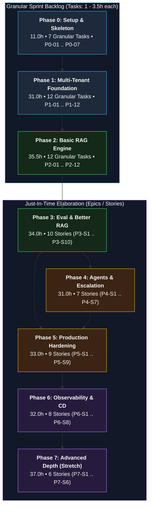

# 14 — Backlog

**Status:** Approved v1 (reference) | **Last updated:** 2026-10-01

> **Rolling-wave planning:** Phases 0-2 are broken down to tasks (1-3.5 h each). Phases 3-7 are at story level; break them into tasks at the start of each phase (do it together with your mentor) because you will know much more by then.
> **ID format:** `P<phase>-<number>` for tasks, `P<phase>-S<number>` for stories. Copy each row into a GitHub Issue (template in `github-templates/`).
> **Est** is hours, including learning time. **Done when** is the acceptance check.

---

## Workload Distribution & Rolling-Wave Planning

---

## Phase 0: Setup (11 h)

| ID | Task | Est | Depends | Done when |
|---|---|---|---|---|
| P0-01 | Create the GitHub repo, add license, `.gitignore`, README from template, import Step 1-3 docs and ADRs | 1.5 | | Repo pushed; docs and Mermaid diagrams render on GitHub |
| P0-02 | Set up the development environment on Fedora (Docker Engine or Podman, Python toolchain, Node, Git) and record the choice | 2 | | Container hello-world runs; Python and Node versions recorded in README |
| P0-03 | Create backend skeleton: package layout with module folders, `pyproject`, ruff, type checker, pytest, pre-commit | 2 | P0-01, P0-02 | One test runs; lint, types, tests pass locally; each module folder has a short README |
| P0-04 | Write `docker-compose.yml` with `core` profile (api, worker placeholder, postgres with pgvector, redis, minio) and `.env.example` | 2 | P0-03 | `docker compose up` shows all services healthy; SELinux `:z` labels handled |
| P0-05 | Add `/health/live` and `/health/ready` (database check) with tests | 1 | P0-04 | Ready returns failure when the database is stopped, proven by a test |
| P0-06 | Create CI v1 (lint, type check, tests) and protect `main` | 1.5 | P0-05 | Failing test blocks the pull request merge |
| P0-07 | Create GitHub Project board, labels, issue and PR templates; create Phase 1 issues | 1 | P0-01 | Board with columns and WIP rule; 12 Phase 1 issues created |

---

## Phase 1: Foundation (31 h)

| ID | Task | Est | Depends | Done when |
|---|---|---|---|---|
| P1-01 | Settings from environment and structured JSON logging with request ID middleware | 2 | P0-05 | Logs contain `request_id`; config validated at startup; test |
| P1-02 | Database layer: async session dependency, Alembic, first migration (tenants, users) | 3 | P1-01 | Migration runs in CI; session dependency tested |
| P1-03 | **Spike:** RLS with connection pooling (tenant set per transaction) | 2 | P1-02 | Written finding added to ADR-0002 (what works, failure modes) |
| P1-04 | Tenant context and RLS migrations; non-owner app role; `FORCE ROW LEVEL SECURITY` | 3 | P1-03 | Query without tenant context returns no rows; policy tested |
| P1-05 | Isolation test suite with two tenants | 2 | P1-04 | Cross-tenant reads return nothing; suite runs in CI |
| P1-06 | Register organization, login, access JWT with tenant and role claims (Argon2 hashing) | 4 | P1-04 | Tests for success and failure; token contents verified |
| P1-07 | Refresh token rotation, reuse detection, logout | 2.5 | P1-06 | Reused refresh token revokes the family (test) |
| P1-08 | RBAC dependency and invitations (invite, accept) | 2.5 | P1-06 | Employee gets 403 on admin endpoints (test); invitation flow works |
| P1-09 | Error handling in problem+json format with request ID | 1.5 | P1-01 | All errors share one shape; no stack traces leak |
| P1-10 | LLM gateway v0: interface, one provider, timeout and retry, fake provider for tests, usage capture | 3 | P1-01 | Tests run with fake provider; timeout and retry covered |
| P1-11 | Conversations and messages tables and endpoints; SSE chat without retrieval | 4 | P1-06, P1-10 | Tokens stream; messages and usage events saved; disconnect cancels generation (test) |
| P1-12 | Monthly token cap check (429), coverage gate in CI, update ADRs | 1.5 | P1-11 | Over-cap request returns 429; coverage threshold enforced |

---

## Phase 2: Basic RAG (35.5 h)

| ID | Task | Est | Depends | Done when |
|---|---|---|---|---|
| P2-01 | Documents table and upload endpoint storing files in object storage, content-hash dedupe, type and size validation | 3 | P1-08 | Duplicate upload returns 409; invalid type rejected; file stored |
| P2-02 | Parsers for PDF, DOCX, TXT, MD with page information | 3 | P2-01 | Parser tests on sample files; scanned PDF fails with a clear reason |
| P2-03 | Chunking v1 with configurable size and overlap, keeping page and section | 3 | P2-02 | Unit tests; metadata preserved |
| P2-04 | Embedding client with batching, retry, fake provider; record `embedding_model` | 2 | P1-10 | Batch call tested; model name stored |
| P2-05 | Chunks table with HNSW and keyword indexes, RLS, idempotent store | 3 | P2-03, P2-04 | Re-running ingestion replaces chunks; RLS test passes |
| P2-06 | Celery worker ingestion job with status transitions, retries, failure reasons | 4 | P2-05 | Statuses move correctly; worker killed mid-job and job completes on retry |
| P2-07 | Retrieval v1: embed question, vector search filtered by tenant and role | 2 | P2-05 | Returns top-k from own tenant only (test) |
| P2-08 | Prompt v1 with sources block and "I don't know" threshold | 3 | P2-07, P1-10 | 10 manual questions: answerable ones cite sources, unrelated ones return "I don't know" |
| P2-09 | Chat uses retrieval; citation events saved; source link endpoint; `answered` flag | 3.5 | P2-08, P1-11 | Citation opens the source location; unanswered saved with `answered=false` |
| P2-10 | Document list, detail, delete with chunk cleanup | 2 | P2-06 | Deleted document no longer used in answers |
| P2-11 | Minimal UI: login, upload and status list, chat with citations | 6 | P2-09, P2-10 | Works end to end at phone width |
| P2-12 | Smoke test, demo script and recording, phase retro | 1 | all | Demo recorded; exit criteria checked |

---

## Phase 3: Better RAG and Evaluation (34 h)

| ID | Story | Est | Done when |
|---|---|---|---|
| P3-S1 | Write evaluation dataset: 50 questions (answerable, multi-document, unanswerable, adversarial) from sample policy documents | 4 | Dataset in `eval/`, versioned, with expected sources |
| P3-S2 | Evaluation harness: run pipeline over the dataset, compute retrieval metrics (hit rate, MRR) and answer metrics (faithfulness, citation correctness) | 5 | One command prints a score table |
| P3-S3 | Chunking experiments (size, overlap) | 3 | Results table; choice recorded |
| P3-S4 | Hybrid search (keyword + vector, reciprocal rank fusion) | 4 | Score compared with vector only |
| P3-S5 | Reranker on top candidates | 3 | Score and latency compared |
| P3-S6 | Follow-up question rewriting | 3 | Multi-turn questions improve on the set |
| P3-S7 | Tune "I don't know" threshold | 2 | Wrong answers on unanswerable set reduced; chosen threshold documented |
| P3-S8 | Benchmark pgvector vs Qdrant (recall with filters, latency, memory) and update ADR-0006 | 4 | ADR updated with numbers |
| P3-S9 | Evaluation in CI with quality gate (small set per PR, full set on schedule) | 3 | PR fails when score drops past margin |
| P3-S10 | Categories and role-based document access (FR-014), role update syncs chunks | 3 | Employee cannot get answers from restricted documents (test) |

---

## Phase 4: Agents and Escalation (31 h)

| ID | Story | Est | Done when |
|---|---|---|---|
| P4-S1 | Escalation: contacts, create escalation with idempotency, email job with retry, status | 5 | Contact receives question, conversation, sources; duplicate click creates one |
| P4-S2 | Pending actions with confirm, reject, expiry | 4 | Expired or repeated confirm handled (tests) |
| P4-S3 | Agent v1 (LangGraph): tools `search_documents`, `propose_ticket`, `draft_email`; propose only | 8 | No side effect without confirm (test); trace visible |
| P4-S4 | Read-only structured data tool with allow-listed tables (Could) | 3 | Read-only role enforced (test) |
| P4-S5 | MCP server exposing read-only search tool | 4 | Works with an MCP client; tenant and role respected |
| P4-S6 | Prompt injection test set and guardrails v1 | 4 | Attack set passes in CI |
| P4-S7 | Agent evaluation (tool selection accuracy) | 3 | Accuracy reported |

---

## Phase 5: Production Hardening and Admin (33 h)

| ID | Story | Est | Done when |
|---|---|---|---|
| P5-S1 | Rate limiting per user and tenant (Redis) | 3 | 429 with `Retry-After`; test |
| P5-S2 | Caching: exact answer cache, embedding cache; semantic cache experiment | 5 | Hit rate measured; tenant in cache keys |
| P5-S3 | Provider fallback and circuit breaker | 4 | Failure injection test passes |
| P5-S4 | PII masking in logs and output validation | 3 | Log review test; no content in INFO logs |
| P5-S5 | Admin APIs: usage, knowledge gaps, feedback | 4 | Numbers match stored usage |
| P5-S6 | Admin UI pages | 5 | Usage, gaps, feedback visible |
| P5-S7 | Idempotency key middleware | 2 | Duplicate POST returns same result |
| P5-S8 | Load test baseline (k6) and fix top bottleneck | 4 | Report with before and after |
| P5-S9 | URL ingestion (FR-011) and answer feedback endpoint (FR-025) | 3 | Web page searchable; rating stored |

---

## Phase 6: Observability, CI/CD, Deployment (32 h)

| ID | Story | Est | Done when |
|---|---|---|---|
| P6-S1 | OpenTelemetry instrumentation (API, database, HTTP client, worker) | 4 | One trace spans API, queue, worker |
| P6-S2 | Prometheus metrics and four Grafana dashboards | 6 | Dashboards show real data |
| P6-S3 | Logs to Loki via Grafana Alloy | 3 | Search by `request_id` works |
| P6-S4 | Tempo for traces | 3 | Trace view from a dashboard link |
| P6-S5 | Langfuse integration (hosted or local) | 3 | Prompt, chunks, tokens visible per request |
| P6-S6 | Alertmanager rules and Telegram or Discord notifications | 3 | Forced error triggers an alert |
| P6-S7 | CI/CD: build image, scan, push to registry, deploy on merge | 5 | Merge to main deploys; smoke test; rollback works |
| P6-S8 | Server setup, reverse proxy with HTTPS, secrets, backup script and restore drill | 5 | Live HTTPS URL; restore tested |

---

## Phase 7: Advanced Depth (Stretch, 37 h)

| ID | Story | Est | Done when |
|---|---|---|---|
| P7-S1 | Extract model server for embeddings and reranker behind the same interface | 6 | API calls model server; latency compared |
| P7-S2 | Model routing (cheap vs strong model) with evaluation | 5 | Cost and quality comparison table |
| P7-S3 | Fine-tune a small model for a narrow task using parameter-efficient methods; check VRAM first | 12 | Comparison against baseline on a held-out set |
| P7-S4 | Bengali support experiment (multilingual embeddings, keyword search approach) | 5 | Evaluation on Bengali questions documented (FR-026) |
| P7-S5 | Final load test and capacity report | 3 | Report against NFR-018 |
| P7-S6 | Write-up (architecture and lessons), README polish, demo video | 6 | Published post and video |

---

## Workload Totals

| Phase | Hours | Focus Area |
|---|---|---|
| 0 | 11.0 | Setup, CI skeleton, Docker Compose |
| 1 | 31.0 | Multi-tenant foundation, Auth, RLS, SSE |
| 2 | 35.5 | Document ingestion, pgvector HNSW, RAG UI |
| 3 | 34.0 | Evaluation dataset, Hybrid search, Reranking |
| 4 | 31.0 | Human escalation, HITL agents, MCP tool |
| 5 | 33.0 | Redis rate limiting, caching, admin analytics |
| 6 | 32.0 | Observability stack, alerting, automated deploy |
| 7 | 37.0 | Model server, routing, fine-tuning stretch |
| **Total** | **244.5** | **Complete Production Portfolio Project** |
