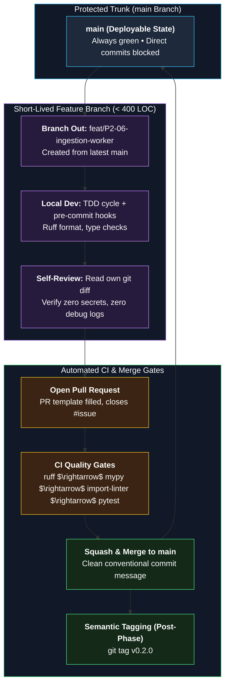
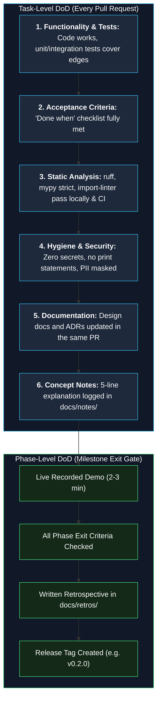
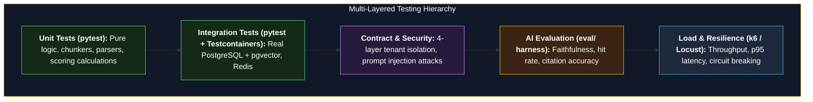

# 15 — Working Agreements

**Status:** Approved v1 (reference) | **Last updated:** 2026-10-01

> An agreement with yourself. Establish these operating principles before beginning development so you never have to deliberate on routine process decisions.

---

## 1. Repository Structure

```
opspilot/
├── backend/
│   ├── app/
│   │   ├── core/              # config, db session, security context, logging, telemetry
│   │   └── modules/
│   │       ├── identity/
│   │       ├── documents/
│   │       ├── ingestion/
│   │       ├── retrieval/
│   │       ├── llm/
│   │       ├── chat/
│   │       ├── agent/
│   │       ├── escalation/
│   │       ├── usage/
│   │       └── admin/
│   ├── alembic/
│   ├── tests/
│   └── pyproject.toml
├── frontend/
├── eval/                      # datasets, evaluation scripts, reports
├── infra/                     # compose files, prometheus, grafana, loki, alloy, proxy config
├── docs/                      # requirements, design, ADRs, notes, retros
│   ├── adr/
│   ├── notes/                 # your own concept notes
│   └── retros/
├── .github/
│   ├── ISSUE_TEMPLATE/
│   ├── workflows/
│   └── pull_request_template.md
├── docker-compose.yml
├── Makefile
└── README.md
```

Each module folder contains: `service.py` (public interface), private `models`, `repository`, `schemas`, `tests`.

---

## 2. Git Workflow (Trunk-Based, Short Branches)



| Rule | Detail |
|---|---|
| `main` | Always deployable; protected; changes only by pull request; CI must pass |
| Branch name | `<type>/<task-id>-<short-name>`, for example `feat/P2-06-ingestion-worker` |
| Branch life | Short: merge within 1-3 days, never weeks |
| PR size | Aim for under about 400 changed lines; split bigger work |
| Merge | Squash merge with a clean title |
| Self-review | Read your own diff before asking CI to pass |
| Tags | Tag each finished phase (`v0.1.0` after Phase 1 and so on) |

### Commit Messages (Conventional Commits)

Format: `<type>(<scope>): <summary>`

| Type | Use |
|---|---|
| `feat` | New feature |
| `fix` | Bug fix |
| `docs` | Documentation |
| `test` | Tests |
| `refactor` | Code change without behavior change |
| `chore` | Tooling, dependencies |
| `ci` | Pipeline changes |
| `perf` | Performance |

---

## 3. Definition of Done (DoD)



### Per Task Checklist
- [ ] Code works and **is tested** (unit or integration)
- [ ] "Done when" criterion of the task is met
- [ ] Lint, type check, module boundary check pass
- [ ] CI is green
- [ ] No secrets, no `print` debugging, no commented-out code
- [ ] Docs updated if behavior, API, or design changed (and ADR if a decision changed)
- [ ] You can explain it in 5 lines (note added to `docs/notes/` for new concepts)

### Per Phase Checklist
See [13 section 8](13-roadmap-and-milestones.md).

---

## 4. Code Standards

| Area | Rule |
|---|---|
| Style | Formatter and linter run by pre-commit and CI; no style debates |
| Types | Type hints everywhere; type checker in CI |
| Naming | Clear names over comments; English everywhere in code |
| Modules | Respect boundaries (import contracts in CI) |
| Errors | Domain errors mapped to the standard error format |
| Config | Environment variables only; no constants for secrets |
| Logging | Structured, no secrets or document content |
| Async | Do not block the event loop; database and HTTP calls are async |
| Dependencies | Add deliberately; pin versions; review before adding |

---

## 5. Testing Strategy & Hierarchy



| Level | What | Tools (examples) |
|---|---|---|
| Unit | Pure logic: chunking, scoring, parsers | pytest |
| Integration | API with real Postgres and Redis | pytest with service containers |
| Contract | Isolation, injection, API snapshot | Dedicated test suites |
| Evaluation | RAG quality on dataset | `eval/` harness |
| Load | Throughput and latency | k6 or Locust |

Rule: bug found, then write a failing test first, then fix.

---

## 6. Documentation Rules

- Code change that changes design: update the doc in the same pull request.
- Major decision: ADR before or with the code.
- Every phase: retro file in `docs/retros/`.
- Concept notes in your own words in `docs/notes/` (these are for you, and prove understanding).

---

## 7. Time and Focus

- WIP limit 2.
- Weekly review every Sunday (template in the planning guide).
- One rest day per week, no exceptions.
- If stuck more than 45 minutes on one problem, write the question down in 5 lines (rubber-duck) and then ask for help.
- Time-box experiments: stop when time is over and write down what you learned.

---

## 8. Security Hygiene

- `.env` never committed; `.env.example` only names.
- Secret scanning in CI.
- Do not paste real company or personal documents into test data; use made-up sample policies.
- Keep API keys with spending limits set at the provider.
