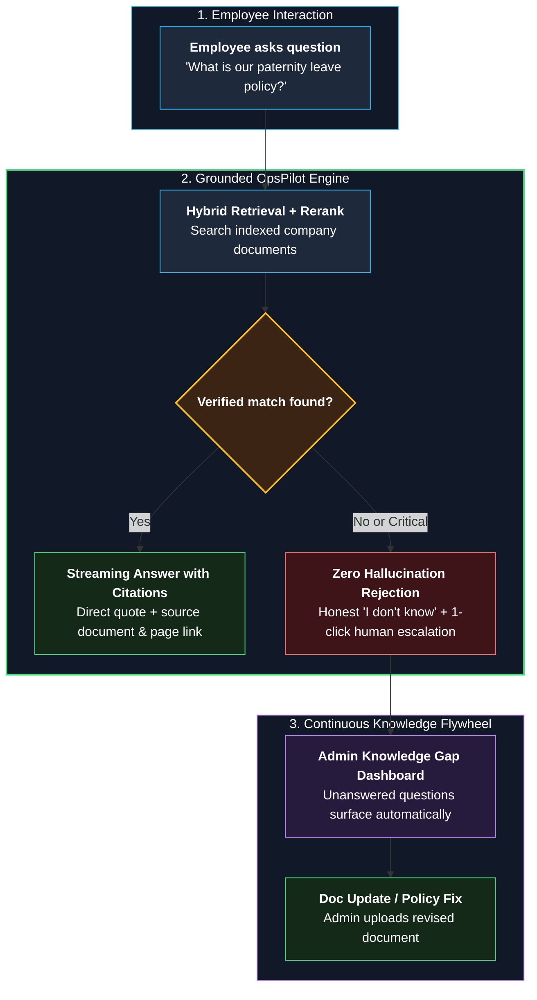
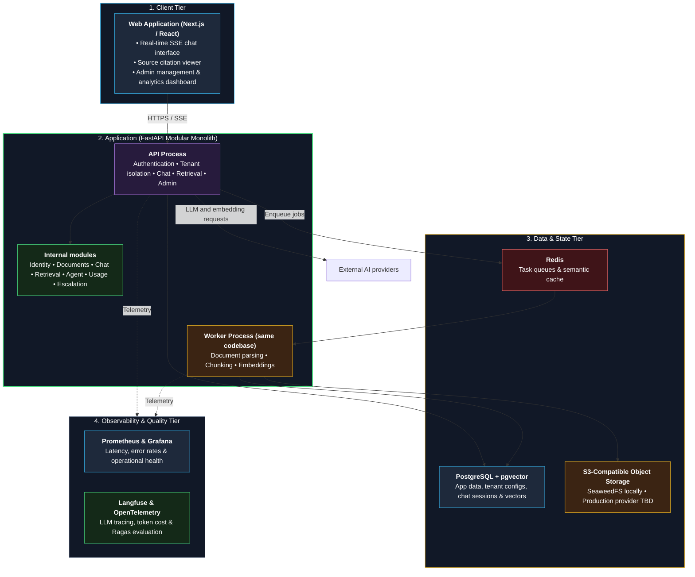

# OpsPilot

> **One-line description:** An enterprise AI assistant that answers employees' questions strictly from their company's own documents, provides verified source citations, and escalates to human specialists when answers are missing or critical.

> **How to write:** The README is the repository's "front door". A recruiter or reviewer will spend roughly 30 seconds here. Write this at the end (as the project progresses); if any section is left blank, write "Coming soon".

**Status:** In Development (Phase 1: Foundation)

---

## Why OpsPilot?

Employees waste time searching scattered drives or interrupting colleagues with repeated policy questions. OpsPilot aims to provide quick, source-backed answers, avoid unsupported claims, and make it easy to escalate questions to a person.

### End-to-End User Experience & Value Flow



---

## Features

- [x] Documented requirements and architecture decisions
- [ ] Multi-tenant organization isolation (PostgreSQL RLS)
- [ ] Document upload and background ingestion (PDF, DOCX, TXT, MD)
- [ ] Hybrid retrieval (Dense vector + BM25) with cross-encoder reranking
- [ ] Real-time streaming chat with verified document citations
- [ ] Safe fallback: 100% "I don't know" threshold with 1-click human escalation
- [ ] Assistant actions with Human-in-the-Loop (HITL) confirmation
- [ ] Admin dashboard (usage, token costs, knowledge gap discovery)
- [ ] Full observability (Prometheus, Grafana, OpenTelemetry, Langfuse)

---

## System Architecture

OpsPilot is designed as a modular monolith with a separate worker process. The API and worker share one Python codebase; the worker handles background document ingestion. PostgreSQL with pgvector stores application data and vectors, Redis supports background jobs and caching, and object storage holds uploaded files.



---

## Tech Stack

| Domain | Technology | Rationale |
|---|---|---|
| **Frontend** | Next.js / React, Tailwind CSS | Progressive streaming (SSE), modern component architecture |
| **Backend** | FastAPI (Python), modular monolith | API and domain modules in one codebase |
| **Background jobs** | Celery + Redis | Asynchronous document processing in a separate worker process |
| **Databases** | PostgreSQL + pgvector | Relational tenancy, chat history, and embedded vector retrieval |
| **Object storage** | SeaweedFS locally, S3 API | Production provider to be selected in Phase 6 |
| **Cache & Message Broker** | Redis | Job queue broker and cache |
| **RAG & Search** | Hybrid (BM25 + Dense) + BGE Reranker | High precision retrieval grounded strictly in company documentation |
| **Agent Framework** | LangGraph | State machine workflows, tool calling, and human-in-the-loop approvals |
| **LLM Router** | Claude / OpenAI / Local Ollama | Flexibility between cloud frontier models and local private inference |
| **AI Evaluation** | Ragas | Continuous automated regression testing on every PR |
| **Observability** | Prometheus, Grafana, OpenTelemetry, Langfuse | End-to-end tracing, latency profiling, and token cost accounting |
| **DevOps & Containers** | Docker, Docker Compose, GitHub Actions | Containerized API and worker with automated CI/CD |

---

## Getting Started

```bash
git clone <repo-url>
cd opspilot
cp .env.example .env
docker compose up
```

---

## Documentation

- [00 — How to Write Docs](../01-product/00-writing-documentation.md)
- [01 — Problem Statement](../01-product/01-problem-statement.md)
- [02 — Functional Requirements](../01-product/02-functional-requirements.md)
- [03 — Non-Functional Requirements](../01-product/03-non-functional-requirements.md)
- [04 — User Stories](../01-product/04-user-stories.md)
- [05 — Scope, Assumptions, Risks](../01-product/05-scope-assumptions-risks.md)
- [Architecture Decision Records (ADRs)](../02-system-design/decisions)

---

## Roadmap

See phases and milestones in the project board.

## License

TBD
