# 🚀 Complete AI Engineer Learning Roadmap

> **Personal Study & Mastery Guide**  
> এই রোডম্যাপটি একজন পূর্ণাঙ্গ ও প্রোডাকশন-রেডি **AI & LLM Systems Engineer** হিসেবে নিজেকে গড়ে তোলার জন্য ক্রমানুসারে সাজানো হয়েছে। প্রতিটি টপিকের পাশে পড়ার ও শেখার ট্র্যাকিংয়ের জন্য চেকবক্স `[ ]` রাখা হয়েছে।

---

## 🗺️ Roadmap Overview

```mermaid
flowchart TD
    subgraph S1 ["Phase 1: Foundations"]
        M1["1️⃣ Python Fundamentals"]
        M2["2️⃣ Python for AI/Data"]
        M3["3️⃣ FastAPI Backend"]
        M1 --> M2 --> M3
    end

    subgraph S2 ["Phase 2: Machine Learning & Deep Learning"]
        M4["4️⃣ ML Fundamentals"]
        M5["5️⃣ Deep Learning"]
        M3 --> M4 --> M5
    end

    subgraph S3 ["Phase 3: GenAI & LLM Core"]
        M6["6️⃣ GenAI Fundamentals"]
        M7["7️⃣ Large Language Models (LLM)"]
        M8["8️⃣ Prompt Engineering"]
        M9["9️⃣ Embeddings ⭐"]
        M10["🔟 Vector Databases"]
        M5 --> M6 --> M7 --> M8 --> M9 --> M10
    end

    subgraph S4 ["Phase 4: RAG, Agents & Frameworks"]
        M11["1️⃣1️⃣ RAG Systems ⭐⭐⭐"]
        M12["1️⃣2️⃣ LLM App Development"]
        M13["1️⃣3️⃣ Tool Calling"]
        M14["1️⃣4️⃣ AI Agents 🤖"]
        M15["1️⃣5️⃣ LangChain"]
        M16["1️⃣6️⃣ LangGraph ⭐⭐⭐"]
        M17["1️⃣7️⃣ Agentic RAG"]
        M10 --> M11 --> M12 --> M13 --> M14 --> M15 --> M16 --> M17
    end

    subgraph S5 ["Phase 5: Production, Security & Advanced"]
        M18["1️⃣8️⃣ AI Evaluation ⭐⭐⭐"]
        M19["1️⃣9️⃣ AI Security"]
        M20["2️⃣0️⃣ Production AI / LLMOps"]
        M21["2️⃣1️⃣ Cloud & Deployment (AWS)"]
        M22["2️⃣2️⃣ Advanced AI Systems"]
        M17 --> M18 --> M19 --> M20 --> M21 --> M22
    end

    style S1 fill:#111827,stroke:#38bdf8,stroke-width:1px,color:#ffffff
    style S2 fill:#111827,stroke:#4ade80,stroke-width:1px,color:#ffffff
    style S3 fill:#111827,stroke:#fbbf24,stroke-width:1px,color:#ffffff
    style S4 fill:#111827,stroke:#c084fc,stroke-width:1px,color:#ffffff
    style S5 fill:#111827,stroke:#f87171,stroke-width:1px,color:#ffffff
```



---

## 1️⃣ Python Fundamentals

### Core Python
- [ ] Variables
- [ ] Data Types
- [ ] Operators
- [ ] if / elif / else
- [ ] for loop
- [ ] while loop
- [ ] break / continue / pass
- [ ] Functions
- [ ] Parameters
- [ ] Return values
- [ ] `*args`
- [ ] `**kwargs`

### Data Structures
- [ ] List
- [ ] Tuple
- [ ] Set
- [ ] Dictionary
- [ ] String
- [ ] List comprehension
- [ ] Dictionary comprehension

### Python Modules
- [ ] `import`
- [ ] Modules
- [ ] Packages
- [ ] `__init__.py`
- [ ] Standard library
- [ ] Virtual environment (`venv` / `uv`)
- [ ] `pip` / `uv`

### Error Handling
- [ ] `try`
- [ ] `except`
- [ ] `else`
- [ ] `finally`
- [ ] `raise`
- [ ] Custom exceptions

### OOP (Object-Oriented Programming)
- [ ] Class
- [ ] Object
- [ ] Constructor (`__init__`)
- [ ] Instance variable
- [ ] Class variable
- [ ] Method
- [ ] Inheritance
- [ ] Encapsulation
- [ ] Polymorphism
- [ ] Abstraction

### Advanced Python
- [ ] Decorators
- [ ] Generators
- [ ] Iterators
- [ ] Context managers (`with` statement)
- [ ] Lambda
- [ ] `map`
- [ ] `filter`
- [ ] `reduce`
- [ ] Type hints
- [ ] `dataclass`

### Async Python
- [ ] `async`
- [ ] `await`
- [ ] Coroutine
- [ ] Event loop
- [ ] `asyncio`
- [ ] Async HTTP requests (`httpx` / `aiohttp`)

---

## 2️⃣ Python for AI/Data

### NumPy
- [ ] Array
- [ ] Shape
- [ ] Dimension
- [ ] Indexing
- [ ] Slicing
- [ ] Broadcasting
- [ ] Vector operations
- [ ] Matrix operations

### Pandas
- [ ] DataFrame
- [ ] Series
- [ ] Reading CSV
- [ ] Reading JSON
- [ ] Filtering
- [ ] Sorting
- [ ] GroupBy
- [ ] Merge
- [ ] Join
- [ ] Missing values handling
- [ ] Duplicate values handling
- [ ] Data cleaning

### Visualization
- [ ] Matplotlib
- [ ] Basic charts (line, bar, scatter)
- [ ] Distribution
- [ ] Correlation

### Pydantic
- [ ] Models
- [ ] Validation
- [ ] Type validation
- [ ] Nested models
- [ ] Serialization (`model_dump`, `model_dump_json`)

---

## 3️⃣ FastAPI

> **Note:** তুমি যেহেতু already FastAPI শুরু করেছো, এটা continue করবে।

### Basics
- [ ] Routing
- [ ] HTTP Methods: `GET`, `POST`, `PUT`, `PATCH`, `DELETE`
- [ ] Path parameters
- [ ] Query parameters
- [ ] Request body
- [ ] Response body

### Validation
- [ ] Pydantic integration
- [ ] Validation errors
- [ ] Custom validation

### Backend Architecture
- [ ] Dependency Injection (`Depends`)
- [ ] Authentication
- [ ] JWT (JSON Web Tokens)
- [ ] Authorization & RBAC
- [ ] Middleware
- [ ] Exception handling
- [ ] Background tasks

### Database
- [ ] PostgreSQL
- [ ] SQLAlchemy (Async ORM)
- [ ] Alembic (Migrations)
- [ ] Transactions
- [ ] Relationships
- [ ] Indexes

### Production Readiness
- [ ] Async operations
- [ ] Logging (Structured JSON)
- [ ] Testing (`pytest`, `pytest-asyncio`, `httpx`)
- [ ] Docker containerization
- [ ] Environment variables (`pydantic-settings`)
- [ ] API documentation (Swagger UI / OpenAPI)
- [ ] Health checks (`/health/live`, `/health/ready`)

---

## 4️⃣ Machine Learning Fundamentals

### Basic Concepts
- [ ] AI vs ML vs Deep Learning
- [ ] Supervised Learning
- [ ] Unsupervised Learning
- [ ] Reinforcement Learning

### Dataset
- [ ] Features
- [ ] Labels
- [ ] Training set
- [ ] Validation set
- [ ] Test set

### Data Processing
- [ ] Missing values
- [ ] Outliers detection & handling
- [ ] Categorical encoding (One-Hot, Label)
- [ ] Normalization (Min-Max)
- [ ] Standardization (Z-score)
- [ ] Feature engineering

### Core Algorithms
- [ ] Linear Regression
- [ ] Logistic Regression
- [ ] Decision Tree
- [ ] Random Forest
- [ ] KNN (K-Nearest Neighbors)
- [ ] SVM (Support Vector Machine)
- [ ] K-Means Clustering
- [ ] Naive Bayes

### Model Evaluation
- [ ] Accuracy
- [ ] Precision
- [ ] Recall
- [ ] F1-score
- [ ] Confusion Matrix
- [ ] ROC-AUC
- [ ] MAE (Mean Absolute Error)
- [ ] MSE (Mean Squared Error)
- [ ] RMSE (Root Mean Squared Error)

### Important Concepts
- [ ] Overfitting & Underfitting
- [ ] Bias vs Variance Trade-off
- [ ] Cross-validation (K-Fold)
- [ ] Hyperparameter tuning

### Framework
- [ ] Scikit-learn

---

## 5️⃣ Deep Learning

### Neural Networks
- [ ] Neuron / Perceptron
- [ ] Weights
- [ ] Bias
- [ ] Activation functions (ReLU, Sigmoid, Tanh, Softmax)
- [ ] Forward propagation
- [ ] Loss function
- [ ] Backpropagation
- [ ] Gradient descent (SGD, Adam)

### Neural Architectures
- [ ] ANN (Artificial Neural Networks)
- [ ] CNN (Convolutional Neural Networks)
- [ ] RNN (Recurrent Neural Networks)
- [ ] LSTM (Long Short-Term Memory)
- [ ] GRU (Gated Recurrent Unit)
- [ ] Transformer architecture

### Framework
- [ ] PyTorch

### Important Engineering Concepts
- [ ] Tensor operations
- [ ] `Dataset` class
- [ ] `DataLoader` class
- [ ] Training loop implementation
- [ ] Validation loop implementation
- [ ] Optimizer
- [ ] Learning rate scheduler
- [ ] Epoch
- [ ] Batch size

---

## 6️⃣ Generative AI Fundamentals

> 💡 **এখান থেকে তোমার GenAI journey শুরু।**

### Learn
- [ ] What is Generative AI?
- [ ] Generative vs Predictive AI
- [ ] Foundation Models
- [ ] Neural Language Models
- [ ] Transformer architecture
  - [ ] Encoder
  - [ ] Decoder
  - [ ] Encoder-Decoder
- [ ] Attention Mechanism
- [ ] Self-attention

### Understand
- [ ] Token
- [ ] Tokenization (BPE, WordPiece)
- [ ] Context
- [ ] Context window
- [ ] Parameters (Billions of weights)
- [ ] Model weights
- [ ] Inference
- [ ] Temperature (Creativity vs Determinism)
- [ ] Top-p (Nucleus sampling)

---

## 7️⃣ LLM — Large Language Models

### Fundamentals
- [ ] What is an LLM?
- [ ] How LLMs work
- [ ] Pre-training (Next token prediction)
- [ ] Fine-tuning
- [ ] Instruction tuning
- [ ] RLHF (Reinforcement Learning from Human Feedback)
- [ ] Alignment (Helpful, Honest, Harmless)

### LLM Concepts
- [ ] Token mechanics
- [ ] Context window limits
- [ ] Input tokens vs Output tokens
- [ ] Model parameters (7B, 14B, 70B)
- [ ] Temperature
- [ ] Max tokens
- [ ] Streaming tokens

### Frontier & Open Models
- [ ] GPT (OpenAI)
- [ ] Gemini (Google)
- [ ] Claude (Anthropic)
- [ ] Llama (Meta)
- [ ] Mistral (Mistral AI)

### API Integration
- [ ] API key management
- [ ] Request payload
- [ ] Response handling
- [ ] Streaming response (SSE)
- [ ] Structured output
- [ ] JSON output mode

---

## 8️⃣ Prompt Engineering

### Basics
- [ ] System prompt (Personality & constraints)
- [ ] User prompt
- [ ] Assistant message
- [ ] Prompt templates
- [ ] Zero-shot prompting
- [ ] Few-shot prompting

### Advanced Techniques
- [ ] Structured prompting
- [ ] JSON output enforcement
- [ ] XML-style prompting (`<context>`, `<instruction>`)
- [ ] Context injection
- [ ] Prompt chaining
- [ ] Prompt versioning

### Security & Guardrails
- [ ] Prompt injection defense (Direct & Indirect)
- [ ] Jailbreak awareness
- [ ] Sensitive information handling & PII masking

---

## 9️⃣ Embeddings ⭐

> 🎯 **এটা খুব ভালোভাবে শিখবে। RAG এবং ভেক্টর সার্চের ভিত্তি এটি।**

### Learn
- [ ] What is an embedding?
- [ ] Vector & Vector representation
- [ ] Dimensions (e.g. 768, 1536, 3072)
- [ ] Semantic similarity
- [ ] Cosine similarity
- [ ] Euclidean distance

### Understand Flow
```
Text ──> [ Embedding Model ] ──> Dense Float Vector [0.012, -0.421, ...]
```

### Key Topics
- [ ] Embedding models (text-embedding-3, nomic, BGE, etc.)
- [ ] Sentence embeddings
- [ ] Document embeddings
- [ ] Query embeddings
- [ ] Similarity search

---

## 🔟 Vector Database

### Learn
- [ ] What is a vector database?
- [ ] Why do we need vector databases instead of traditional B-trees?
- [ ] Vector storage mechanics
- [ ] Vector indexing (HNSW, IVFFlat)
- [ ] Similarity search algorithms

### Technologies Progression
```
1. First (Recommended for start):
   ├── PostgreSQL + pgvector (Simplicity, ACID, shared tables)
   
2. Then (Dedicated vector engines):
   ├── Qdrant (Rust-based, fast, rich payload filtering)
   ├── Pinecone (Managed serverless)
   └── Weaviate (Hybrid & multimodal search)
```

### Concepts
- [ ] Vector index
- [ ] Metadata storage
- [ ] Metadata filtering (pre-filtering vs post-filtering)
- [ ] Top-K search
- [ ] Similarity threshold
- [ ] Hybrid search (Sparse + Dense)

---

## 1️⃣1️⃣ RAG ⭐⭐⭐

> 🏆 **RAG = Retrieval-Augmented Generation (এটা তোমার major milestone)।**

### Basic RAG Pipeline
```
[ Document (PDF/DOCX) ]
        │
        ▼
   [ Chunking ]
        │
        ▼
   [ Embedding ]
        │
        ▼
  [ Vector DB ] <────── (Search Query)
        │
        ▼
   [ Retrieval ] ──────> [ Injected Context ]
                               │
                               ▼
                          [ Prompt ] ──> [ LLM ] ──> [ Cited Answer ]
```

### Learn
#### Document Processing
- [ ] PDF parsing
- [ ] DOCX
- [ ] TXT
- [ ] HTML
- [ ] Markdown

#### Chunking Strategies
- [ ] Fixed-size chunking
- [ ] Recursive chunking
- [ ] Semantic chunking
- [ ] Chunk size tuning
- [ ] Chunk overlap configuration

#### Retrieval
- [ ] Similarity search
- [ ] Top-K retrieval
- [ ] Metadata filtering
- [ ] Hybrid search (BM25 + Dense Vectors)

### Advanced RAG
- [ ] Query rewriting
- [ ] Multi-query retrieval
- [ ] Reranking (Cross-encoder rerankers like Cohere / BGE)
- [ ] Context compression
- [ ] Parent-child retrieval
- [ ] Hybrid retrieval (Reciprocal Rank Fusion - RRF)

---

## 1️⃣2️⃣ LLM Application Development

> 🛠️ **এখন LLM দিয়ে proper production application বানাবে।**

### Core Capabilities
- [ ] LLM API integration
- [ ] Streaming completions
- [ ] Structured output parsing
- [ ] Function calling
- [ ] Conversation history persistence
- [ ] Memory management
- [ ] Semantic & Exact Caching
- [ ] Rate limiting per user and tenant
- [ ] Token management & token budgets
- [ ] Cost tracking & observability

### Production Backend Stack
```
FastAPI + PostgreSQL + Redis + LLM + Vector DB (pgvector / Qdrant)
```

---

## 1️⃣3️⃣ Tool Calling

> 🔑 **এটা Agent-এর foundation।**

### Understand

LLM নিজে কোনো সিস্টেম সরাসরি এক্সেস করতে পারে না:
```
LLM নিজে ──❌──> Database / API / Calculator / Email / Web Search
```
**তুমি Tools ডিফাইন করবে, LLM ডিসাইড করবে কখন কল করতে হবে:**
```
[ User Prompt ] ──> [ LLM ]
                      │ (Decides: tool_call)
                      ▼
             [ Choose Tool & Args ]
                      │
                      ▼
           [ Your Python Function ] ──> (Executes safely)
                      │
                      ▼
               [ Tool Result ]
                      │
                      ▼
                   [ LLM ] ──> [ Final User Response ]
```

### Learn
- [ ] Function calling mechanics
- [ ] Tool schema definition (JSON Schema / Pydantic)
- [ ] Tool arguments extraction
- [ ] Tool execution
- [ ] Tool result return
- [ ] Multiple tools handling
- [ ] Tool error handling & recovery

---

## 1️⃣4️⃣ AI Agents 🤖

> 🤖 **এখন Agent তৈরি করার পালা।**

### Basic Agent Loop
```
[ User Request ]
       │
       ▼
    [ LLM ] <──────────────────────────────────────┐
       │                                           │
       ▼                                           │
[ Decide Action ] ──> [ Execute Tool ] ──> [ Observe Result ]
       │
       ▼ (Task Complete)
[ Final Answer ]
```

### Learn
- [ ] What is an Agent?
- [ ] Agent loop (Sense $\rightarrow$ Plan $\rightarrow$ Act)
- [ ] Reasoning / action concept (ReAct framework)
- [ ] Tool selection
- [ ] Tool execution
- [ ] Short-term & Long-term memory
- [ ] Planning & Sub-goal decomposition
- [ ] Reflection & Self-correction
- [ ] Error handling

### Agent Types
- [ ] ReAct-style agents
- [ ] Tool-using agents
- [ ] Workflow agents
- [ ] Multi-agent systems

---

## 1️⃣5️⃣ LangChain

> ⚠️ **এখন LangChain শিখবে, আগে না। বেসিক পাইথন ও এপিআই ভালোমতো জানার পরই ফ্রেমওয়ার্কে যাওয়া উচিত।**

### Core Modules
- [ ] Models
- [ ] Prompts
- [ ] Messages
- [ ] Output parsers
- [ ] Chains (LCEL - LangChain Expression Language)
- [ ] Retrievers
- [ ] Tools
- [ ] Tool calling
- [ ] Document loaders
- [ ] Text splitters
- [ ] Embeddings
- [ ] Vector stores

### Build Projects
- [ ] Simple chatbot
- [ ] RAG chatbot with citations
- [ ] Tool-using assistant

---

## 1️⃣6️⃣ LangGraph ⭐⭐⭐

> 🎯 **এখন LangGraph শিখবে। প্রোডাকশন এজেন্ট সিস্টেমের জন্য এটি ইন্ডাস্ট্রি স্ট্যান্ডার্ড।**

### Core Concepts
- [ ] Graph architecture
- [ ] State (Shared typed state)
- [ ] Nodes (Python functions that transform state)
- [ ] Edges (Transitions between nodes)
- [ ] Conditional edges (Routing decisions)
- [ ] `START` and `END` nodes

### Execution Flow
```
[ START ] ──> [ Node A: State ] ──> [ Node B: Reason ] ──> [ Conditional Routing ]
                                                                   │
                                                ┌──────────────────┴──────────────────┐
                                                ▼                                     ▼
                                       [ Tool Execution ]                          [ LLM ]
                                                │                                     │
                                                └──────────────────┬──────────────────┘
                                                                   ▼
                                                                [ END ]
```

### Advanced LangGraph Features
- [ ] State management & reducers
- [ ] Checkpointing & Time-travel
- [ ] Persistence (Postgres checkpointer)
- [ ] Human-in-the-loop (HITL) approval gates
- [ ] Interrupts & resume
- [ ] Automatic retry
- [ ] Error handling
- [ ] Long-running stateful workflows

---

## 1️⃣7️⃣ Agentic RAG

> ⚡ **এখানে RAG + Agent একসাথে মিলে ডায়নামিক ও ইন্টেলিজেন্ট রিট্রিভাল গঠন করে।**

### Comparison: Normal RAG vs Agentic RAG

#### Normal (Linear) RAG:
```
[ Question ] ──> [ Retrieve Docs ] ──> [ LLM ] ──> [ Answer ]
```

#### Agentic RAG:
```
[ Question ] ──> [ Agent Planner ]
                        │
                        ▼
             "Should I search docs?"
                        │
                        ├── Yes ──> [ Search Vector DB ]
                        │                  │
                        │                  ▼
                        │         "Is result enough?"
                        │                  │
                        │                  ├── No  ──> [ Rewrite Query & Search again ]
                        │                  │
                        │                  └── Yes ──┐
                        │                            ▼
                        └──────────────────────> [ Grounded Answer ]
```

### Learn
- [ ] Query routing (Deciding which index/DB to query)
- [ ] Retrieval decision (Answering directly vs searching)
- [ ] Query rewriting (Self-refining ambiguous queries)
- [ ] Multiple retrievers integration
- [ ] Reranking retrieved candidates
- [ ] Tool-based retrieval
- [ ] Self-correction & hallucination reflection
- [ ] Multi-step retrieval for complex multi-hop questions

---

## 1️⃣8️⃣ AI Evaluation ⭐⭐⭐

> 📊 **এটা production AI-এর জন্য অত্যন্ত important। কোনো মডেল বা প্রম্পট পরিবর্তন ভালো হলো না খারাপ, তা মেট্রিক্স দিয়ে যাচাই করতে হবে।**

### RAG Evaluation
- [ ] Retrieval quality
- [ ] Context relevance
- [ ] Answer relevance
- [ ] Faithfulness (Groundedness / No hallucinations)
- [ ] Hallucination detection

### Agent Evaluation
- [ ] Tool selection accuracy
- [ ] Tool argument accuracy
- [ ] Final answer quality
- [ ] Task completion rate

### Evaluation Frameworks & Tools
- [ ] Ragas (RAG Assessment framework)
- [ ] LangSmith
- [ ] Arize Phoenix

---

## 1️⃣9️⃣ AI Security

### Threats & Countermeasures
- [ ] Direct prompt injection
- [ ] Indirect prompt injection (Malicious content inside PDFs/webpages)
- [ ] Data leakage prevention
- [ ] Sensitive information & PII redaction
- [ ] Access control & Tenant isolation
- [ ] Authentication & Authorization (RBAC)
- [ ] Tool abuse prevention (Limiting destructive operations to propose-only)
- [ ] Malicious documents sanitization
- [ ] Output validation & guardrails
- [ ] Rate limiting & denial of wallet defense

---

## 2️⃣0️⃣ Production AI / LLMOps

### Application Layer
- [ ] FastAPI async architecture
- [ ] Async Python event loop optimization
- [ ] Redis caching & token bucket rate limiting
- [ ] PostgreSQL with `pgvector`
- [ ] Connection pooling with PgBouncer

### Infrastructure Layer
- [ ] Docker containerization
- [ ] Docker Compose orchestration
- [ ] Cloud deployment (AWS / VPS)
- [ ] CI/CD pipelines (GitHub Actions)

### AI Production Operations
- [ ] Model versioning
- [ ] Prompt versioning
- [ ] Automated evaluation pipelines
- [ ] Structured logging
- [ ] Monitoring & Metrics (Prometheus / Grafana)
- [ ] Distributed tracing (OpenTelemetry / Tempo)
- [ ] Cost tracking per tenant/user
- [ ] Token consumption monitoring
- [ ] Latency monitoring (p50, p95, p99)
- [ ] Semantic caching
- [ ] Fallback models chain (Primary $\rightarrow$ Fallback)
- [ ] Automatic retry with exponential backoff & jitter
- [ ] Request timeouts & circuit breakers

---

## 2️⃣1️⃣ Cloud & Deployment (AWS)

> ☁️ **তোমার already EC2 knowledge আছে, তাই next AWS সার্ভিসগুলো এক্সপ্লোর করবে:**

### AWS Services
- [ ] EC2 (Compute)
- [ ] S3 (Object Storage for documents)
- [ ] IAM (Roles, Policies, Security credentials)
- [ ] CloudWatch (Logs & Metrics)
- [ ] RDS (Managed PostgreSQL)
- [ ] Lambda (Serverless functions)
- [ ] ECS (Elastic Container Service)
- [ ] ECR (Elastic Container Registry)
- [ ] SQS (Simple Queue Service for async tasks)

### Deployment Architecture
```
[ FastAPI App ] ──> [ Docker Image ] ──> [ AWS ECR / Registry ] ──> [ AWS EC2 / ECS ] ──> [ Production Live with HTTPS ]
```

---

## 2️⃣2️⃣ Advanced AI Systems

> 🔮 **সবশেষে দক্ষতা আরও গভীরে নিয়ে যাওয়ার জন্য:**

### Advanced Agentic Architectures
- [ ] Multi-Agent Systems
- [ ] Agent orchestration (Supervisor / Hierarchical)
- [ ] Long-term memory & episodic memory
- [ ] Knowledge graphs
- [ ] Graph RAG (Combining vector search with property graphs)

### Multimodal & Real-time AI
- [ ] Multimodal AI
- [ ] Vision-Language Models (VLM)
- [ ] Voice AI
- [ ] Speech-to-Text (STT - Whisper)
- [ ] Text-to-Speech (TTS)
- [ ] Real-time streaming AI

### AI Workflow Automation
- [ ] Automated end-to-end pipelines
- [ ] Dynamic model routing (Cheap fast model vs Strong frontier model)
- [ ] Small Language Models (SLMs) deployment

### Model Customization & Optimization
- [ ] Fine-tuning strategies
- [ ] LoRA (Low-Rank Adaptation)
- [ ] PEFT (Parameter-Efficient Fine-Tuning)
- [ ] Weight Quantization (INT8, INT4, AWQ, GGUF)
- [ ] Model serving engines (vLLM, Ollama, Triton)

---

## 🎯 Final Milestone Checklist

- [ ] Python & Data engineering foundations completed
- [ ] FastAPI backend with PostgreSQL + pgvector deployed
- [ ] Grounded RAG with citations and hybrid search built
- [ ] Autonomous Agent with LangGraph & human-in-the-loop actions operational
- [ ] Automated Ragas evaluation gate integrated into CI
- [ ] Full production LLMOps observability (Grafana + Prometheus + Traces) running
- [ ] Portfolio project (OpsPilot) live with demo and documentation!
