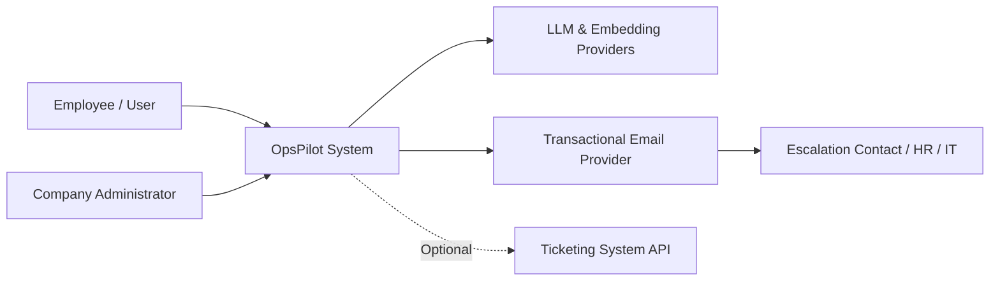
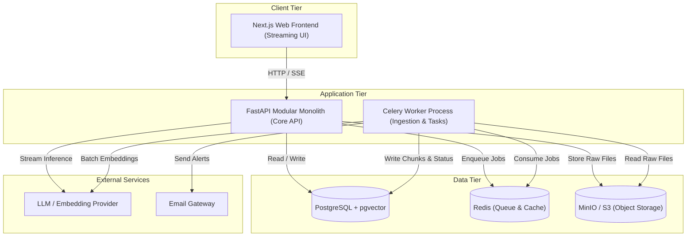

# How to Do System Design — Mentor Guide (Reusable for Any Project)

> Read this guide repeatedly. You can apply this exact process to **any software engineering project**.
> We use OpsPilot as our concrete, worked example. **First, read `01-is-opspilot-microservices.md`** (monolith vs. microservices architectural decision). In every step, follow this structure: **Concept → Why → How → OpsPilot Example → Your Action Item.**
> Reference solutions can be found across the companion design files. **Attempt each design step yourself first before comparing.** Real learning happens in the struggle of working through trade-offs.

---

## 0. Mindset: What is System Design?

System design is **not merely drawing boxes and arrows**. System design is:

> **Evaluating requirements and constraints, exploring alternative options, analyzing trade-offs, making deliberate decisions, and documenting the rationale.**

- **Junior Engineer:** "I will use FastAPI, Redis, Kafka, and Qdrant." *(Starts from technology).*
- **Senior Engineer / Staff Architect:** "What core problem are we solving for this requirement? What are our hard constraints? What are the trade-offs between available options? What is the simplest architecture that reliably satisfies the requirements?" *(Starts from the problem and constraints).*

### 3 Golden Architectural Rules:
1. **Start simple; split only with a concrete reason.** Every added component (service, queue, database) introduces operational overhead, network latency, and failure modes. If there is no architectural driver demanding a new box, remove it.
2. **Every choice is a trade-off; there are no perfect solutions.** Never say "this tool is the best." Say "this option is optimal for our specific context because [reasons], despite [drawbacks]."
3. **Always document the "Why".** Writing Architecture Decision Records (ADRs) captures the context and trade-offs. In technical interviews, this demonstrates mature engineering judgment.

---

## 1. Overview: The 10-Step Process

| # | Step | Primary Output |
|---|---|---|
| 1 | Extract architecture-driving requirements | Architectural Drivers List |
| 2 | Identify constraints and capacity estimations | Back-of-the-envelope calculations |
| 3 | Define system context (C4 Level 1) | System Context Diagram |
| 4 | Design high-level containers (C4 Level 2) | Container Diagram & Responsibility Matrix |
| 5 | Data architecture & tenancy design | ER Diagram, Schemas, Tenancy Strategy |
| 6 | Map core flows (Happy + Failure paths) | Sequence Diagrams & Failure Matrices |
| 7 | API design & contracts | Endpoint Specifications & Standards |
| 8 | Address cross-cutting concerns | Security, Observability, Errors, Deployment |
| 9 | Evaluate technology choices | Decision Matrices & ADRs |
| 10 | Validate & review | Scenario Walkthroughs & Review Checklist |

**Expected Timeframe:** 2–4 days for a scoped project. Avoid perfection paralysis: aim for **"good enough to start implementation confidently."**

---

## Step 1: Extract Architecture-Driving Requirements

**Concept:** Not every functional requirement influences the system's architecture. For instance, "An admin can delete a document" is straightforward CRUD. In contrast, "Tenant A must never access Tenant B's data under any circumstance" **shapes the entire storage and security model.**

**How to Identify Architectural Drivers:**
Review your Functional Requirements (FR) and Non-Functional Requirements (NFR) asking:
- Does this impact **where and how data is stored or isolated**? (e.g., Multi-tenancy)
- Does this impose **strict latency or throughput demands**? (e.g., Streaming responses, caching)
- Does this involve **long-running or computationally heavy work**? (e.g., Background document ingestion)
- Does this require **horizontal scaling or queuing**? (e.g., Spiky workloads)
- Is it **safety or security critical**? (e.g., Prompt injection defense, PII masking)
- Does it incur **variable operating costs**? (e.g., LLM token tracking, rate limits)
- Does it depend on **unreliable third-party systems**? (e.g., LLM provider outages, rate limits)

### OpsPilot Architectural Drivers:

| Requirement | Architectural Impact |
|---|---|
| **NFR-010 Tenant Isolation** | `tenant_id` on all tables, Postgres Row-Level Security (RLS), tenant context propagation, automated isolation tests |
| **NFR-001 First Token < 2s** | Server-Sent Events (SSE) streaming, latency budget, lightweight hybrid retrieval, selective reranking |
| **NFR-003, FR-012 Background Ingestion** | Asynchronous queue with dedicated worker process, idempotent chunking, job state tracking |
| **NFR-008, NFR-009 Cost Controls** | Token tracking per request, per-tenant monthly quotas, prompt caching |
| **NFR-017, NFR-025 Provider Resilience** | Unified LLM abstraction layer, automated fallback chains, circuit breakers |
| **NFR-012, FR-041 Injection Defense & Approvals** | Propose-only agent tooling, strict delimiters treating retrieved documents as data (not instructions), human-in-the-loop confirmation |
| **NFR-004..007 AI Quality & Faithfulness** | Hybrid search (Dense vector + BM25 keyword), relevance score thresholding ("I don't know" fallback), automated CI evaluation gates |

**Your Action Item:** Extract 6–8 architectural drivers from your requirements and document the design implication for each.

---

## Step 2: Constraints & Back-of-the-Envelope Capacity Estimation

**Concept:** Before designing, establish the **operational scale**. Designing for 10 organizations is completely different from designing for 10 million users.

**Constraints:** Non-negotiable limits such as budget, team capacity, project timeline, skillset, and development hardware.
- *OpsPilot Constraints:* Solo developer, low-budget VPS hosting, local development on an RTX 3050 laptop GPU.
- *Immediate Architectural Conclusion:* Do not introduce distributed Kubernetes clusters or complex microservice meshes.

### Capacity Estimation Formulas:
```
Storage  = Number of Items × Size per Item
Traffic  = Active Users × Requests per User / Time Window
Cost     = (Input Tokens × Input Price) + (Output Tokens × Output Price)
Latency  = Sum of Latencies across all steps in the critical path
```

### OpsPilot Example Estimations:
- **Chunks & Embeddings:**
  - 10 tenants × 10,000 chunks = **100,000 chunks**.
  - Embedding vector (1024-dimension float32) = 1024 × 4 bytes = **~4 KB**.
  - Total raw vector size = 100,000 × 4 KB = **~400 MB** (with HNSW index overhead: **~1 GB** total).
  - *Conclusion:* A single PostgreSQL instance with `pgvector` easily fits in memory on a budget server. A dedicated external vector database cluster is not needed for v1.
- **Traffic & Concurrency:**
  - Target: 100 concurrent streaming chat sessions.
  - Streaming connections are lightweight I/O, but external LLM rate limits and database connection pools become the primary bottlenecks.
- **Token Usage & Cost per Query:**
  - Retrieval context: 5 chunks × ~400 tokens = ~2,000 tokens.
  - System prompt (~500 tokens) + chat history (~500 tokens) = **~3,000 input tokens**.
  - Output answer: **~300 tokens**.
  - Cost estimate (using illustrative $1.00 / 1M input, $4.00 / 1M output):
    `Cost = (3,000 × $0.000001) + (300 × $0.000004) = $0.003 + $0.0012 = ~$0.0042 per query`.
  - Well within the NFR-008 budget target of $\le \$0.01$ per question.

### Latency Budget (Target: Time-to-First-Token < 2.0s):

| Step in Request Pipeline | Latency Budget |
|---|---|
| Authentication, rate-limit check, request parsing | 20 ms |
| Question query embedding generation | 200 ms |
| Hybrid retrieval (vector + BM25 keyword search) | 80 ms |
| Cross-encoder reranking (top-K candidates) | 300 ms |
| LLM time-to-first-token (TTFT) | 1,000 ms |
| Network and serialization overhead | 100 ms |
| **Total Pipeline Latency** | **~1.70 s** |

*Architectural Takeaway:* If reranking takes $> 300\text{ ms}$, we either tune the candidate pool size, switch to a lighter cross-encoder model, or bypass reranking when retrieval confidence is high.

**Your Action Item:** Build a capacity estimation table (storage, traffic, tokens, cost, latency budget) for your target system.

---

## Step 3: System Context (C4 Model — Level 1)

**Concept:** Treat the entire system as a single black box. Identify who interacts with it (actors/personas) and which third-party systems it depends on.



**Why it matters:** Establishes firm boundaries. Integrations not present in the Level 1 diagram (e.g., Slack/Teams bots) are explicitly out of scope for v1.

**Your Action Item:** Draw a C4 Context diagram in Mermaid identifying all actors and external dependencies.

---

## Step 4: High-Level Architecture (C4 Model — Level 2: Containers)

**Concept:** Open the black box to show deployable execution units (web frontend, API backend, background worker, database, cache) and their explicit responsibilities.

### Construction Heuristic:
1. **Start with the simplest viable foundation:** A single web app and one database.
2. **Add a component only when an architectural driver demands it:**
   - Long-running, blocking operations $\rightarrow$ **Queue + Asynchronous Worker Process**
   - Distinct compute/scaling profile (e.g., GPU model inference) $\rightarrow$ **Dedicated Model Server (Deferred)**
   - High-throughput shared state / volatile cache $\rightarrow$ **Redis**
   - Unstructured binary documents $\rightarrow$ **Object Storage (S3 / MinIO)**
3. **Single responsibility per container:** Avoid overlapping duties across containers.
4. **Data ownership:** Each table and bucket must have a single owning module.

### Monolith vs. Microservices Decision Matrix:

| Dimension | Modular Monolith | Microservices Architecture |
|---|---|---|
| **Development Velocity** | High (single repository, unified CI/CD, fast refactoring) | Low for small teams (contract negotiations, multiple pipelines) |
| **Operational Overhead** | Low (single image, unified observability, local Docker Compose) | High (service discovery, distributed tracing, mesh networks) |
| **Data Consistency** | ACID transactions inside one database | Distributed transactions (Sagas, 2PC, eventual consistency) |
| **Network Failure Modes** | In-process calls cannot fail with network timeouts | Every inter-service hop is a point of failure |
| **When to Use** | Single developer, small team, new products, fast iteration | Large engineering organizations with separate cross-functional teams |

### The OpsPilot Architectural Decision:
> **Modular Monolith in FastAPI with an Asynchronous Worker Process (Celery + Redis). No Microservices.**

- **Core API Service:** FastAPI modular monolith organized into strict internal domain modules (`identity`, `documents`, `chat`, `retrieval`, `llm`, `agent`, `escalation`, `usage`).
- **Worker Service:** Celery worker running from the exact same codebase, handling parsing, chunking, and embedding generation asynchronously.
- **Data Stores:** Single PostgreSQL instance running `pgvector`, Redis for queues/caching, and MinIO for raw file storage.
- **Service Extraction Trigger:** In Phase 7, if embedding/reranking models require dedicated GPU hardware, extract them into a lightweight model server.



**Your Action Item:** Draw your C4 Container diagram. For each box, define its responsibility, the data it owns, and the requirement driving its existence.

---

## Step 5: Data Architecture & Multi-Tenancy

**Concept:** Code is easy to change; database schemas are difficult and expensive to migrate once production data exists.

### The Multi-Tenancy Decision:

| Multi-Tenancy Strategy | Isolation Strength | Operational & Cost Burden | Ideal Use Case |
|---|---|---|---|
| **Database per Tenant** | Highest (physical separation) | Very High (individual backups, connection pools, migrations) | Heavy enterprise customers with strict regulatory compliance |
| **Schema per Tenant** | Strong | High (repeating migrations across hundreds of schemas) | Medium-sized SaaS |
| **Shared Tables with `tenant_id` + RLS** | High (when enforced cryptographically & at DB level) | Minimal (single database, unified migrations, fast backups) | High-tenant SaaS, agile teams (OpsPilot choice) |

### OpsPilot 4-Layer Defense-in-Depth for Tenant Isolation:
1. **Token Layer:** JWT claims contain the immutable `tenant_id` and verified `role`. Clients cannot specify or override the tenant ID in request bodies.
2. **Application Layer:** Request context automatically injects `tenant_id` into repository queries.
3. **Database Layer (Row-Level Security):** Transactions execute `SELECT set_config('app.tenant_id', :tenant_id, true)`. PostgreSQL RLS policies enforce that no query can see rows with a different `tenant_id`. Tables enable `FORCE ROW LEVEL SECURITY`.
4. **Automated Verification:** CI test suites create dual tenants and explicitly assert that Tenant A receives zero records when querying Tenant B's endpoints.

### RAG Search Schema (`document_chunks` table):
- `id` (UUID), `tenant_id` (UUID, indexed)
- `document_id` (UUID, foreign key with CASCADE)
- `ordinal` (Integer chunk sequence)
- `content` (Text of chunk)
- `page_number`, `section_title` (Citations)
- `embedding` (`vector(1024)`) with HNSW index
- `tsv` (`tsvector` for BM25 / Full-Text Search)
- `allowed_roles` (`text[]` for role-based document access control)

**Your Action Item:** Define entity models, relationships (ER Diagram), and the tenant isolation enforcement mechanism.

---

## Step 6: Core Execution Flows (Sequence Diagrams)

**Concept:** Static architectural diagrams show component layout; sequence diagrams show how components interact over time during real-world user operations.

### Two Critical Rules for Sequence Flows:
1. **Always trace the Happy Path first.**
2. **Always model the Failure Paths:**
   - What happens if an external dependency **times out or returns 500/429**?
   - What happens if a client sends a **duplicate request**? *(Enforce Idempotency via hashes or headers)*
   - What happens if a **partial failure** occurs? *(e.g., file saved in S3, but queue enqueue fails)*

### Flow 1: Document Upload & Asynchronous Ingestion:
- Client sends file $\rightarrow$ API saves to object store $\rightarrow$ Inserts document row (`status='uploaded'`) $\rightarrow$ Pushes job to Redis queue $\rightarrow$ Returns `202 Accepted`.
- Worker picks up job $\rightarrow$ Updates status to `processing` $\rightarrow$ Parses and chunks document $\rightarrow$ Generates embeddings in batches with retry $\rightarrow$ Writes chunks and vector index in single transaction $\rightarrow$ Marks document `ready`.
- *Failure handling:* Re-deliverable jobs must be idempotent (worker purges existing chunks for that `document_id` before inserting new ones).

### Flow 2: Streaming Chatted Q&A (RAG):
- Client opens SSE connection $\rightarrow$ API verifies JWT & rate limits $\rightarrow$ Embeds question $\rightarrow$ Executes hybrid retrieval (dense vector + keyword full-text) filtered by `tenant_id` and user role $\rightarrow$ Reranks top candidates $\rightarrow$ Assesses top score against relevance threshold $\rightarrow$ Streams answer tokens with citations to client $\rightarrow$ Records token consumption and latency asynchronously.

**Your Action Item:** Draw sequence diagrams for your top 2 primary flows, documenting at least two failure modes per flow.

---

## Step 7: API Design & System Contracts

**Concept:** An API is a public contract. Breaking changes disrupt clients and frontend integrations.

### API Conventions Checklist:
- **Protocol:** REST with JSON payloads over HTTPS; Server-Sent Events (`text/event-stream`) for streaming LLM tokens.
- **Resource Naming:** Lowercase, plural nouns: `/api/v1/documents`, `/api/v1/conversations/{id}/messages`.
- **Status Codes:**
  - `200 OK` (Standard success)
  - `201 Created` (Synchronous entity creation)
  - `202 Accepted` (Asynchronous processing started)
  - `400 Bad Request` (Client validation error)
  - `401 Unauthorized` (Missing or invalid authentication token)
  - `403 Forbidden` (Insufficient role permissions)
  - `404 Not Found` (Resource does not exist or belongs to another tenant)
  - `409 Conflict` (Duplicate upload detected by content hash)
  - `429 Too Many Requests` (Rate limit or token budget exceeded)
- **Standard Error Response Format (RFC 7807):**
  ```json
  {
    "type": "https://opspilot.dev/errors/rate-limit-exceeded",
    "title": "Rate Limit Exceeded",
    "status": 429,
    "detail": "Tenant monthly token quota has been exhausted.",
    "request_id": "7f3c2c9e-5b12-4f89-8d77-62a1c0d0e123"
  }
  ```
- **Idempotency:** Dangerous state modifications (`POST /documents`, `POST /actions/{id}/confirm`) require an `Idempotency-Key` header.

**Your Action Item:** Document the endpoint list, request/response models, and error structures for all MVP requirements.

---

## Step 8: Cross-Cutting Concerns

Cross-cutting concerns cut across all features and must be planned up front:

| Concern | Architectural Strategy |
|---|---|
| **Authentication & AuthZ** | Short-lived JWT access tokens (15m), rotating HTTP-only refresh tokens, Role-Based Access Control (RBAC). |
| **System Observability** | OpenTelemetry traces across API and Celery workers; Grafana Alloy shipping logs to Loki; Prometheus metrics for latency and error rates. |
| **LLM Observability** | Langfuse tracking prompts, token counts, model latency, retrieval recall, and user ratings. |
| **Prompt Injection Defense** | Retrieved content is treated strictly as data within delimited markdown blocks. The model is given zero execution authority without explicit user confirmation. |
| **Resilience & Fallbacks** | Exponential backoff with jitter on third-party API calls; circuit breakers to secondary LLM models when primary provider errors spike. |
| **Data Lifecycle** | Soft deletes on user documents; background cleanup jobs purging orphaned chunks; automated backups with point-in-time recovery. |

---

## Step 9: Technology Selection via Decision Matrices (ADRs)

**Concept:** Every major architectural choice requires a weighted decision matrix and a permanent Architecture Decision Record (ADR).

### Example: Vector Storage Selection (ADR-0001 / ADR-0006):

| Evaluation Criteria | Weight (1–5) | PostgreSQL + pgvector | Dedicated Vector DB (e.g., Qdrant) |
|---|:---:|:---:|:---:|
| Operational simplicity (solo developer) | 5 | 5 (25) | 3 (15) |
| Native Tenant Isolation with Postgres RLS | 4 | 5 (20) | 3 (12) |
| Retrieval latency at massive scale (> 10M vectors)| 2 | 3 (6) | 5 (10) |
| Skill transferability to backend engineering | 4 | 5 (20) | 4 (16) |
| **Weighted Total** | | **71** | **53** |

**Conclusion:** Start with `PostgreSQL + pgvector`. Establish an explicit revisit condition: *"If retrieval latency exceeds 150 ms at 500,000 vectors, benchmark Qdrant and execute migration."*

---

## Step 10: Validation & Scenario Walkthroughs

Before writing implementation code, stress-test your design:

1. **User Story Walkthrough:** Trace each Must-Have user story from UI to database and back. Confirm every step has an owning endpoint, table, and service.
2. **Failure Injection Scenario Review:**
   - *What happens when the LLM provider experiences an outage?* Fallback chain triggers; graceful user notifications.
   - *What happens when a worker crashes mid-ingestion?* Redis re-queues job; worker cleans partial chunks idempotently.
   - *What happens when an adversarial user submits a prompt injection PDF?* Propose-only agent model prevents unauthorized execution.
3. **The 2-Minute Architectural Pitch:** Can you articulate your design, trade-offs, and scaling bottlenecks concisely out loud?

---

## How to Articulate Your Architecture in Interviews

Practice delivering this 2-minute elevator pitch:

> *"OpsPilot is a multi-tenant enterprise AI assistant that delivers sourced answers from internal documents. I designed the architecture starting from core drivers: strict tenant isolation, a sub-2-second streaming response budget, asynchronous ingestion, and cost controls.*
> 
> *Rather than prematurely adopting microservices, I implemented a modular monolith in FastAPI with an asynchronous Celery worker process sharing a single codebase. Module boundaries are enforced via static linting contracts, allowing future service extraction if needed.*
> 
> *Multi-tenancy uses shared tables hardened by PostgreSQL Row-Level Security, token claims, and automated isolation tests in CI. Retrieval combines dense vector embeddings with BM25 keyword search, followed by cross-encoder reranking. To guarantee reliability, external LLM calls use an abstraction layer with fallback chains, and every critical decision—such as starting with pgvector over dedicated vector databases—is documented in Architecture Decision Records with quantifiable trade-offs."*

---

## Common Architecture Traps to Avoid

1. **Technology Fetishism:** Selecting tools before defining problems (e.g., "We must use Kafka and microservices").
2. **Ignoring Failure Paths:** Designing only for the happy path and neglecting timeouts, retries, and network partitions.
3. **Postponing Multi-Tenancy:** Retrofitting tenant isolation onto an existing schema requires painful, risky database migrations.
4. **Analysis Paralysis:** Spending months drafting theoretical documents. Design for 2–4 days, run targeted spikes, then build.
5. **Drifting Documentation:** Outdated documentation is worse than no documentation. Treat architecture documents as living artifacts maintained with code changes.
