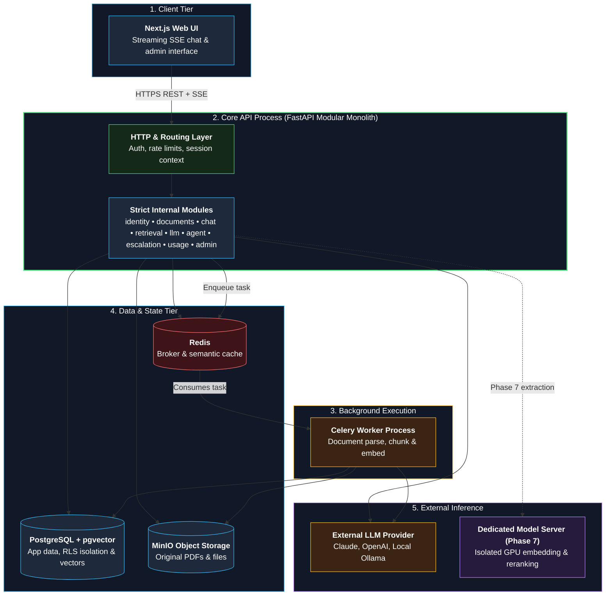
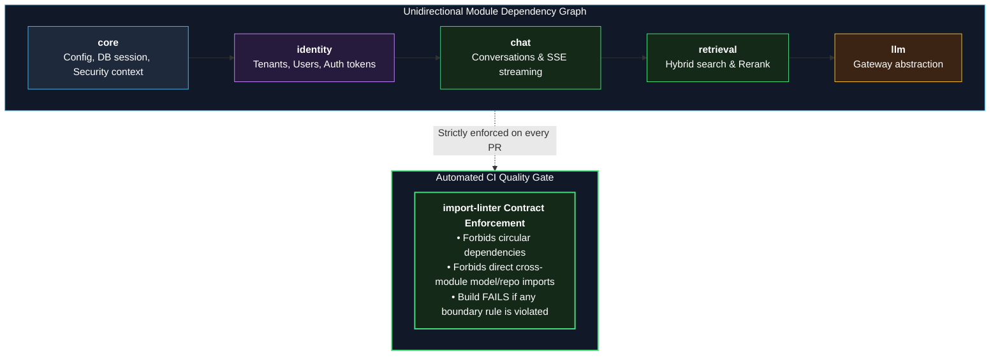

# Is OpsPilot a Microservices Architecture? — Answer: **No.**

> Read this guide repeatedly. In technical interviews, the question *"Is this built with microservices?"* will inevitably arise.
> **An architectural correction:** Earlier, a two-service design (NestJS API Gateway + FastAPI AI Service) was proposed. Upon rigorous architectural evaluation, **that proposal was superseded**. The rationale for choosing a modular monolith is detailed below as an exercise in architectural maturity and trade-off analysis.

---

## 1. Short Answer

**OpsPilot is a Modular Monolith with an Asynchronous Background Worker (plus an optional dedicated Model Server in Phase 7).**

- A single backend core application (**FastAPI**), partitioned into strictly decoupled internal **modules** (`identity`, `documents`, `chat`, `retrieval`, `llm`, `agent`, `escalation`, `usage`, `admin`).
- An **asynchronous worker process** (Celery, running from the same codebase in a separate container) handling background ingestion.
- A **frontend client application** (Next.js).
- Shared persistence infrastructure (**PostgreSQL + pgvector**, **Redis**, and **MinIO/S3**).
- An optional **model server** in Phase 7 (local embedding and reranking models hosted in a standalone container), serving as a hands-on service extraction milestone.

This architecture is **not a microservices architecture**, and that choice is entirely deliberate.

---

## 2. Terminology: The Restaurant Metaphor

| Architecture Style | Restaurant Analogy | Software Equivalent |
|---|---|---|
| **Monolith (Unstructured)** | A single kitchen where every cook works chaotically without defined stations. | A single codebase with tangled dependencies, circular imports, and shared mutable state. |
| **Modular Monolith** | A single kitchen organized into disciplined stations (Grill, Pastry, Salad) with strict handoff protocols. | A single deployable service with strict internal module boundaries, private schemas, and clean public interfaces. |
| **Few Services (Service-Oriented)** | 2–3 specialized kitchens (e.g., Main Dining vs. Bakery). | 2–4 coarse-grained deployable applications communicating over an internal network. |
| **Microservices** | Separate autonomous restaurants for every individual dish, each with its own manager, kitchen, and accounting. | Dozens of fine-grained services, each owning a distinct database, managed by separate teams, and deployed independently. |

### Architectural Continuum & Comparison

```mermaid
flowchart TD
    subgraph CHAOS ["Anti-Pattern: Chaotic Monolith ('Big Ball of Mud')"]
        C_APP["<b>Single Untangled Codebase</b><br/>Circular imports • Shared mutable state • Spaghetti dependencies"]
    end

    subgraph MODULAR ["Chosen: Disciplined Modular Monolith"]
        M_APP["<b>Single Deployable FastAPI Process</b><br/>Strict domain modules with private schemas & public service facades<br/>Enforced via CI import-linter contracts"]
        M_WORK["<b>Async Worker Process (Celery)</b><br/>Heavy I/O & batch vectorization offloaded via Redis"]
        M_APP -->|"Enqueue job"| M_WORK
    end

    subgraph MICRO ["Overkill: Distributed Microservices"]
        MS_1["Service 1: Auth"]
        MS_2["Service 2: Chat"]
        MS_3["Service 3: Docs"]
        MS_4["Service 4: Vector"]
        MS_1 <-->|"Network Hop"| MS_2 <-->|"Network Hop"| MS_3 <-->|"Network Hop"| MS_4
    end

    style CHAOS fill:#111827,stroke:#f87171,stroke-width:1px,color:#ffffff
    style MODULAR fill:#111827,stroke:#4ade80,stroke-width:2px,color:#ffffff
    style MICRO fill:#111827,stroke:#fbbf24,stroke-width:1px,color:#ffffff

    style C_APP fill:#3f1418,stroke:#ef4444,stroke-width:1px,color:#ffffff
    style M_APP fill:#142918,stroke:#4ade80,stroke-width:1px,color:#ffffff
    style M_WORK fill:#3b2413,stroke:#fbbf24,stroke-width:1px,color:#ffffff
    style MS_1 fill:#1e293b,stroke:#94a3b8,stroke-width:1px,color:#ffffff
    style MS_2 fill:#1e293b,stroke:#94a3b8,stroke-width:1px,color:#ffffff
    style MS_3 fill:#1e293b,stroke:#94a3b8,stroke-width:1px,color:#ffffff
    style MS_4 fill:#1e293b,stroke:#94a3b8,stroke-width:1px,color:#ffffff
```

### Canonical Definition of Microservices:
1. Fine-grained services, each encapsulating a **single bounded business capability**.
2. **Decentralized data management:** Each service strictly owns its database (cross-service database queries are forbidden).
3. **Independent deployability:** Deploying service A never requires a synchronized deployment of service B.
4. Inter-service communication occurs over the network (HTTP/gRPC/Messaging).
5. Typically aligned with **separate autonomous engineering teams** (Conway's Law).

---

## 3. The 6-Question Architectural Decision Test

Apply this test to any system before adopting microservices:

| Diagnostic Question | Favor Microservices If... | OpsPilot Context | Verdict |
|---|---|---|:---:|
| **1. Team Size:** Are there multiple cross-functional teams working simultaneously? | Yes (20+ engineers) | **No**, solo developer | ❌ Monolith |
| **2. Deployment Independence:** Must business domains release independently on different schedules? | Yes, independent release cycles | **No**, unified release schedule | ❌ Monolith |
| **3. Heterogeneous Scaling:** Does one component experience 100x the load or require different scaling? | Yes (e.g., video transcoding) | **Partially**: Heavy ingestion is handled by an async worker process; model inference in Phase 7 | ⚠️ Worker Process |
| **4. Technology Heterogeneity:** Do components require fundamentally different languages or hardware? | Yes (e.g., Go for networking, Python for ML) | **Partially**: Local model inference requires GPU access; standard Python backend suffices elsewhere | ⚠️ Deferred Service Extraction |
| **5. Fault Isolation:** Must the failure of one domain never degrade other domains? | Yes, mission-critical isolation | **Partially**: If document ingestion fails, chat answering continues unaffected via Celery worker | ⚠️ Worker Process |
| **6. Domain Stability:** Are business boundaries mature, stable, and deeply understood? | Yes, stable domain boundaries | **No**, new exploratory project with rapidly evolving requirements | ❌ Monolith |

**Summary:** 3 strict "No"s and 3 "Partially"s. There is zero justification for full microservices. Splitting asynchronous workloads into a dedicated background worker process delivers all needed isolation without distributed system overhead.

---

## 4. The "Microservices Tax"

Every network boundary introduced into a system incurs significant engineering overhead:

### The Microservices Tax vs. Monolith Efficiency

```mermaid
flowchart TD
    subgraph TAX ["The Heavy Microservices Tax (Distributed Overhead)"]
        T1["<b>Network Latency:</b> HTTP serialization on every chat token"]
        T2["<b>Distributed State:</b> Sagas & two-phase commits instead of ACID"]
        T3["<b>Operational Drag:</b> N Dockerfiles, N CI pipelines, service meshes"]
        T4["<b>Distributed Failures:</b> Partial network timeouts & cascading errors"]
        T1 --- T2 --- T3 --- T4
    end

    subgraph LEAN ["Modular Monolith Efficiency (High-Velocity Dev)"]
        L1["<b>In-Process Calls:</b> Microsecond execution & native stack traces"]
        L2["<b>ACID Transactions:</b> Single PostgreSQL database consistency"]
        L3["<b>Single Pipeline:</b> One Docker image, one CI test suite, one command up"]
        L4["<b>Direct Focus:</b> 100% engineering effort spent mastering AI and RAG"]
        L1 --- L2 --- L3 --- L4
    end

    style TAX fill:#111827,stroke:#f87171,stroke-width:1px,color:#ffffff
    style LEAN fill:#111827,stroke:#4ade80,stroke-width:2px,color:#ffffff

    style T1 fill:#3f1418,stroke:#f87171,stroke-width:1px,color:#ffffff
    style T2 fill:#3f1418,stroke:#f87171,stroke-width:1px,color:#ffffff
    style T3 fill:#3f1418,stroke:#f87171,stroke-width:1px,color:#ffffff
    style T4 fill:#3f1418,stroke:#f87171,stroke-width:1px,color:#ffffff

    style L1 fill:#142918,stroke:#4ade80,stroke-width:1px,color:#ffffff
    style L2 fill:#142918,stroke:#4ade80,stroke-width:1px,color:#ffffff
    style L3 fill:#142918,stroke:#4ade80,stroke-width:1px,color:#ffffff
    style L4 fill:#142918,stroke:#4ade80,stroke-width:1px,color:#ffffff
```

| Engineering Dimension | Monolith / Modular Monolith | Microservices Architecture |
|---|---|---|
| **Inter-component Calls** | In-process function call (microseconds, native exceptions) | Network call (HTTP/gRPC: latency, timeouts, retries, circuit breakers) |
| **Data Transactions** | Single ACID database transaction | Distributed transactions (Sagas, two-phase commit, eventual consistency) |
| **Debugging & Troubleshooting** | Single unified stack trace | Distributed tracing required (OpenTelemetry, Jaeger, trace propagation) |
| **Testing** | Unified in-memory test suite (`pytest`) | Complex contract testing, ephemeral test environments |
| **CI/CD & Deployment** | Single build pipeline, one container image | $N$ distinct pipelines, backward-compatibility version negotiations |
| **Local Development** | Single command (`docker compose up`) | Heavy container orchestration, high RAM footprint |
| **Security Boundaries** | Unified perimeter authentication | Service-to-service mTLS, token forwarding, internal authorization |
| **Logging & Metrics** | Single structured log stream | Distributed log aggregation, correlation IDs across hops |

For a solo developer with a six-month learning timeline, paying the full microservices tax wastes time on distributed plumbing instead of mastering AI engineering.

---

## 5. Why the Earlier Two-Service Proposal (NestJS + FastAPI) Was Superseded

An earlier iteration considered NestJS for core business logic and FastAPI for AI services. Upon re-evaluation:

1. **Learning Objective:** The primary goal is mastering AI engineering and production systems. Managing a secondary NestJS codebase contributes nothing to AI competency while consuming precious hours.
2. **Artificial Boundary:** A single chat turn requires authentication, tenant verification, quota checks, chat history retrieval, vector search, LLM inference, citation extraction, and token usage recording. Business logic and AI operations are tightly coupled in the same execution flow. Splitting them across an internal HTTP network hop introduces latency and multiple points of failure for no tangible benefit.
3. **Operational Overhead:** Two codebases require two Dockerfiles, two CI pipelines, two test configurations, duplicate logging setups, and internal service-to-service authentication.
4. **Senior Engineering Mindset:** Articulating *"I deliberately selected a modular monolith and established concrete metrics for future service extraction"* showcases far greater architectural maturity in an interview than blindly implementing multiple services.

This architectural shift is formally recorded in [ADR-0003](../adr/0003-modular-monolith-not-microservices.md).

---

## 6. OpsPilot Component Architecture

---

## 7. Distributed Systems Concepts You Will Still Master

You do not need microservices to gain deep experience with distributed systems patterns:

| Distributed System Pattern | Where Implemented in OpsPilot |
|---|---|
| **Asynchronous Processing & Idempotency** | Document ingestion worker pipeline with at-least-once delivery (Phase 2) |
| **Eventual Consistency** | Document processing state transitions (`uploaded` $\rightarrow$ `processing` $\rightarrow$ `ready`) |
| **Network Resilience & Circuit Breakers** | External LLM and embedding API failure handling, exponential backoff, fallback chains (Phases 1, 5) |
| **Distributed Trace Propagation** | Propagating trace contexts from HTTP API through Redis to Celery background workers (Phase 6) |
| **API Versioning & Service Contracts** | Public REST API specs and Model Context Protocol (MCP) server interfaces (Phase 4) |
| **Service Extraction** | Decoupling the model server into an isolated container with its own compute profile (Phase 7) |
| **Queue Depth & Backpressure Monitoring** | Worker queue telemetry and Prometheus alerts (Phase 6) |

---

## 8. Principles for Maintaining Module Hygiene

To prevent a modular monolith from decaying into an untangled "Big Ball of Mud", enforce these rules:

1. **Explicit Public Interfaces:** Every module must expose a single public facade (`service.py`). Internal implementation details remain private to the module.
2. **No Direct Cross-Module Model Access:** Module A must never import repository or ORM models from Module B.
3. **Data Ownership:** Each table is strictly owned by one module. External modules interact exclusively through that module's service methods.
4. **Acyclic Dependencies:** Enforce a unidirectional dependency graph (e.g., `chat` $\rightarrow$ `retrieval` $\rightarrow$ `llm`). Circular imports are strictly forbidden.
5. **Static CI Enforcement:** Enforce architectural module boundaries in the CI pipeline using static analysis tools like `import-linter`. Any illegal cross-module import fails the build.
6. **Isolated Unit Tests:** Each module maintains its own dedicated unit and contract test suite.

Following these boundaries ensures that if any module ever needs to be extracted into an independent microservice, the refactoring cost is minimal.

### Module Hygiene & CI Gate

---

## 9. Concrete Triggers for Service Extraction

Never extract a service based on intuition; extract only when measurable operational thresholds are crossed:

| Concrete Trigger | Architectural Remediation |
|---|---|
| Model inference requires dedicated GPU hardware or different autoscaling rules | Extract the model server into an isolated container (Phase 7). |
| Document parsing libraries (PDF/OCR) bloat the primary API container image | Package the worker into its own slim container image. |
| Engineering team expands and a dedicated team assumes ownership of a bounded domain | Extract the corresponding module into an independent service. |
| A specific module's failures threaten the availability of core chat operations | Decouple into an isolated service with dedicated circuit breakers. |
| Profiling telemetry identifies an isolated CPU/memory bottleneck | Scale or extract the bottlenecked module independently. |

---

## 10. The 2-Minute Interview Response

> **Question:** *"Why didn't you build OpsPilot using a microservices architecture?"*
> 
> **Answer:** *"I evaluated microservices against our constraints and deliberately selected a modular monolith with an asynchronous worker process. Given a solo engineering context and the learning objective of mastering AI systems, the distributed overhead of microservices—such as network serialization, distributed tracing, and eventual consistency—would have created unnecessary friction.*
> 
> *Instead, I prioritized domain isolation within a single codebase using strict module interfaces enforced by CI linting rules. Heavy workloads, such as document ingestion, run asynchronously in a Celery worker. This architecture gave us the velocity of a monolith while preserving clean boundaries, allowing us to easily extract compute-heavy components—such as our embedding model server—only when hardware scaling requirements demanded it."*
