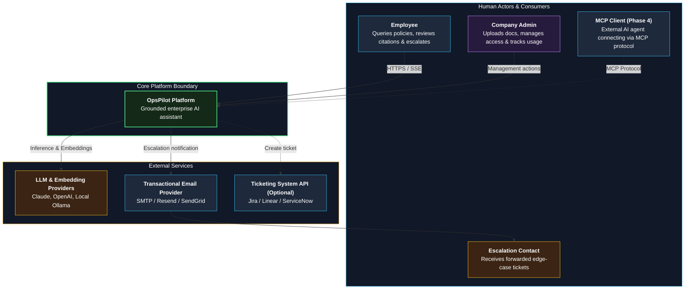
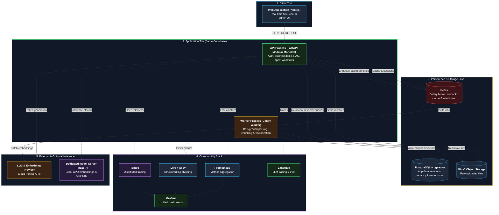
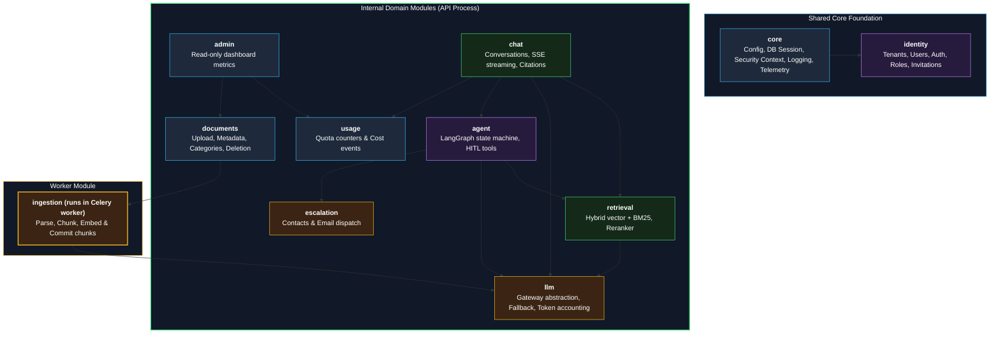
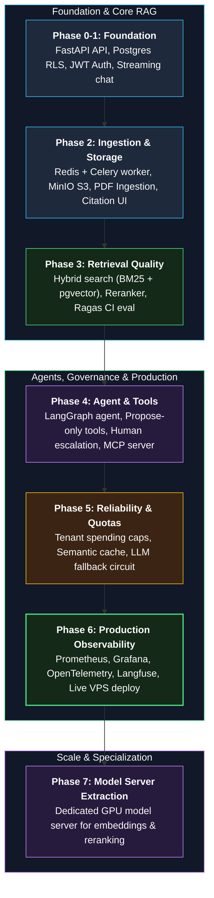

# 06 — Architecture

**Status:** Approved v2 (reference) | **Last updated:** 2026-10-01
**Inputs:** [02 FR](../02-functional-requirements.md), [03 NFR](../03-non-functional-requirements.md), [05 Scope](../05-scope-assumptions-risks.md)
**Style:** Modular monolith with a separate worker process. Not microservices (see [ADR-0003](../adr/0003-modular-monolith-not-microservices.md) and [explainer](../Code%20setup/01-is-opspilot-microservices.md)).

---

## 1. Architecture Drivers

| Requirement | Impact on design |
|---|---|
| NFR-010 Tenant isolation | `tenant_id` on every table, Postgres row-level security, isolation tests |
| NFR-001 First token < 2 s | Streaming (SSE), latency budget, hybrid retrieval with limited rerank |
| NFR-003, FR-012 Background ingestion with status | Queue and worker process, job state, retries |
| NFR-008, NFR-009 Cost | Token accounting per request, per-tenant cap, caching |
| NFR-017, NFR-025 Provider failure and independence | LLM gateway abstraction with fallback |
| NFR-012, FR-041 Prompt injection, confirmation | Agent only proposes actions; retrieved text treated as data |
| NFR-004..007 AI quality | Hybrid retrieval, "I don't know" threshold, evaluation in CI |

---

## 2. Capacity Assumptions

| Item | Estimate |
|---|---|
| Chunks | 10 tenants x 10,000 = 100,000 |
| Vector storage | 100,000 x ~4 KB (1024 dims, float32) = ~400 MB, ~1 GB with index |
| Tokens per question | ~3,000 input, ~300 output |
| Concurrency | 100 concurrent streaming chats |

One modest server is enough for v1 (~8 GB RAM assumption for the lean production stack; measure in Phase 6).

---

## 3. System Context (C4 Level 1)

---

## 4. Containers (Deployable Units — C4 Level 2)

---

## 5. Modules Inside the API Process (Modular Monolith)

All modules depend on a small `core` package (configuration, database session, security context, logging, telemetry) and on `identity` for the current tenant and user.

### Module Responsibilities

| Module | Responsibility (one line) | Owns tables |
|---|---|---|
| identity | Tenants, users, login, roles, invitations | tenants, users |
| documents | Upload, metadata, status, categories, delete | documents, document_categories |
| ingestion | Parse, chunk, embed, store chunks (worker tasks) | document_chunks, ingestion_jobs |
| retrieval | Hybrid search, rerank, relevance threshold, role filter | none (reads chunks via ingestion's public interface) |
| llm | Provider interface, fallback, token and cost accounting | none |
| chat | Conversations, messages, SSE streaming, citations | conversations, messages, citations, feedback |
| agent | Tools, agent graph, pending actions | pending_actions |
| escalation | Contacts, escalations, email sending | escalation_contacts, escalations |
| usage | Usage events, caps, reports | usage_events |
| admin | Dashboard queries across modules (read-only through public interfaces) | none |

### Boundary Rules (Enforced in CI)

1. Each module exposes a public `service` interface; everything else is private.
2. A module never imports another module's `models` or `repository`.
3. A module reads or writes another module's data only through that module's service.
4. Dependencies point one way (see diagram); no cycles.
5. Rules are written as contracts in `import-linter` and checked on every pull request.

---

## 6. Components

| Component | Responsibility | Tech | Scales by |
|---|---|---|---|
| Web app | Chat UI, admin UI (kept thin, time-boxed) | Next.js | Static hosting / more instances |
| API process | HTTP API, auth, business rules, chat, retrieval, agent | FastAPI | More instances (stateless) |
| Worker process | Ingestion, email, cleanup, scheduled jobs | Celery, Redis broker | More workers |
| PostgreSQL | System of record, vector and keyword search | PostgreSQL + pgvector | Vertical first, read replicas later |
| Redis | Queue broker, cache, rate-limit counters | Redis | Vertical |
| Object storage | Original uploaded files | MinIO (S3 API) | Disks / cloud S3 |
| Observability | Metrics, logs, traces, LLM traces | Prometheus, Grafana, Loki, Alloy, Tempo, Langfuse | Separate host later |
| Model server (optional) | Embeddings and reranker models | Local model server container | GPU host |

---

## 7. Evolution Path (Build in Slices)

| Phase | What exists | Demo |
|---|---|---|
| 0-1 | API process, Postgres, tenancy, auth, LLM streaming | Login and chat streams, isolation test passes |
| 2 | + Redis, MinIO, worker, ingestion, retrieval, minimal UI | Upload policy PDF, ask, get cited answer |
| 3 | + evaluation harness, hybrid search, reranker | Score table comparing variants |
| 4 | + agent, escalation, MCP server | Propose action, confirm, escalate |
| 5 | + rate limits, caching, fallback, admin dashboard | Load test report |
| 6 | + full observability, CI/CD, deployment | Live URL with dashboards and alerts |
| 7 | + model server, routing, fine-tuning experiment | Extraction and benchmark write-up |

---

## 8. When We Would Extract a Service

| Trigger | Action |
|---|---|
| Model inference needs GPU or a different scaling profile | Extract model server (Phase 7) |
| A module has a different team or release cycle | Extract it |
| Measured bottleneck in one module | Scale or extract it |

---

## 9. Technology Choices

| Area | Choice | Main alternative | ADR |
|---|---|---|---|
| Architecture style | Modular monolith + worker | Microservices | [ADR-0003](../adr/0003-modular-monolith-not-microservices.md) |
| Tenancy | Shared tables + RLS | Schema or database per tenant | [ADR-0002](../adr/0002-tenant-isolation-shared-tables-rls.md) |
| Background jobs | Celery + Redis | ARQ, Dramatiq | [ADR-0004](../adr/0004-async-ingestion-with-queue.md) |
| Retrieval | Hybrid + rerank | Vector only | [ADR-0005](../adr/0005-hybrid-retrieval-with-rerank.md) |
| Vector store | pgvector first | Qdrant | ADR-0006 |
| LLM access | Thin internal gateway, fallback chain | Direct SDK calls | ADR-0007 |
| Authentication | Own JWT and refresh tokens using proven libraries | External identity provider | ADR-0008 |
| Agent | LangGraph, propose-only tools | Hand-written loop | ADR-0009 |

---

## 10. Risks Specific to This Architecture

| Risk | Mitigation |
|---|---|
| Modules slowly couple together | import-linter contracts in CI, module tests |
| Worker and API share code and drift | One codebase, one image, different entry command |
| Embedding model change forces re-embedding | Store `embedding_model` per chunk, re-index job |
| Too many observability components for a small server | Lean production profile; tracing and LLM tracing optional or local (see [11](11-deployment-and-observability.md)) |
