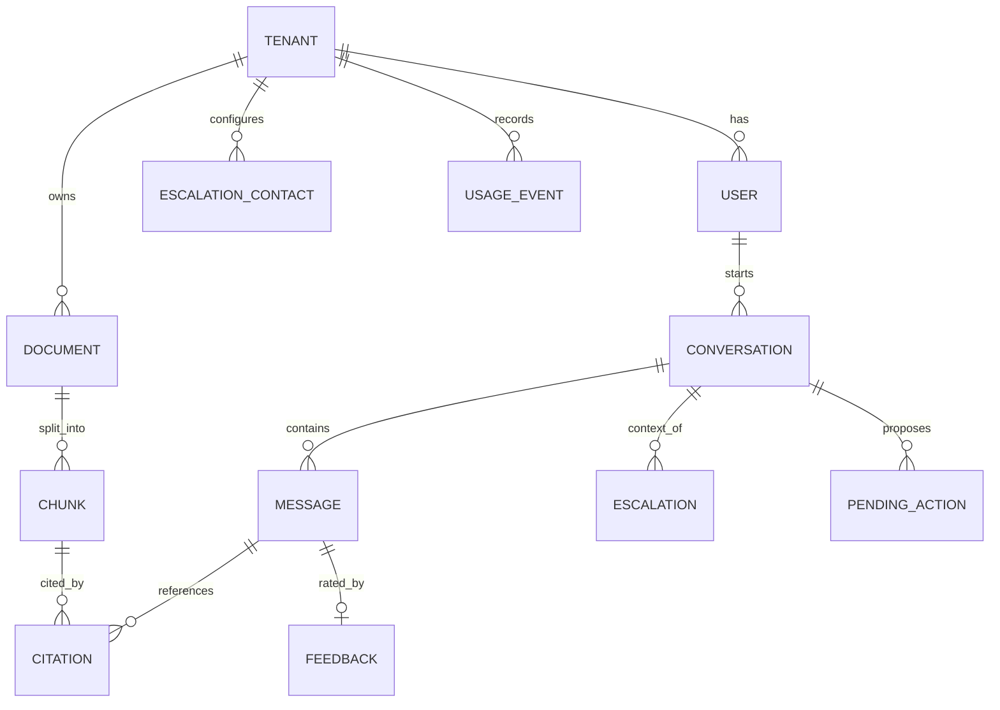

# 07 — Data Model

**Status:** Approved v2 (reference) | **Last updated:** 2026-10-01

## 1. Principles

1. Every tenant-owned table has `tenant_id uuid NOT NULL`.
2. One PostgreSQL database; each **module owns its tables** (see [06](06-architecture.md)). Other modules use the owner's service, not direct queries.
3. UUID primary keys; `created_at` and `updated_at` on every table.
4. Soft delete for documents (`deleted_at`); chunks of deleted documents are removed by a cleanup job.
5. Isolation enforced by Postgres row-level security (RLS), see [10](10-security-and-tenancy.md).
6. Migrations with Alembic; backward compatible (add first, remove later).

## 2. Entity relationships



## 3. Tables by owning module

| Module | Table | Key columns | Notes |
|---|---|---|---|
| identity | `tenants` | id, name, slug, monthly_token_cap, status | Root of isolation |
| identity | `users` | id, tenant_id, email (unique per tenant), password_hash, role (`admin`/`employee`), status | One tenant per user in v1 |
| identity | `refresh_tokens` | id, tenant_id, user_id, token_hash, expires_at, revoked_at, replaced_by | Rotation, reuse detection |
| identity | `invitations` | id, tenant_id, email, role, token_hash, expires_at, accepted_at | |
| documents | `document_categories` | id, tenant_id, name | HR, IT, Finance |
| documents | `documents` | id, tenant_id, title, category_id, source_type, storage_key, source_url, content_hash, status, failure_reason, allowed_roles, deleted_at | `content_hash` prevents duplicates; changing `allowed_roles` also updates chunk roles in the same transaction |
| ingestion | `ingestion_jobs` | id, tenant_id, document_id, status, attempts, error, started_at, finished_at | Job state, retries |
| ingestion | `document_chunks` | id, tenant_id, document_id, ordinal, content, page, section, allowed_roles, embedding, embedding_model, tsv, token_count | Search table |
| chat | `conversations` | id, tenant_id, user_id, title | |
| chat | `messages` | id, tenant_id, conversation_id, role, content, status (`complete`/`failed`/`cancelled`), answered (bool), no_answer_reason, model, input_tokens, output_tokens, latency_ms | One row per turn; `answered=false` rows feed knowledge gaps (FR-051) |
| chat | `citations` | id, tenant_id, message_id, document_id, chunk_id, page, section, score | |
| chat | `feedback` | id, tenant_id, message_id, rating, comment | |
| escalation | `escalation_contacts` | id, tenant_id, category_id, name, email | |
| escalation | `escalations` | id, tenant_id, conversation_id, user_id, contact_id, status, delivery_status | |
| agent | `pending_actions` | id, tenant_id, conversation_id, type, payload jsonb, status, expires_at | `proposed`, `confirmed`, `rejected`, `executed`, `failed`, `expired` |
| usage | `usage_events` | id, tenant_id, user_id, kind, model, input_tokens, output_tokens, cost_usd | Source for dashboard and caps |
| core | `audit_logs` | id, tenant_id, actor_id, action, target, created_at | Who did what |

## 4. Key DDL (reference)

```sql
CREATE TABLE documents (
  id             uuid PRIMARY KEY DEFAULT gen_random_uuid(),
  tenant_id      uuid NOT NULL REFERENCES tenants(id),
  title          text NOT NULL,
  category_id    uuid REFERENCES document_categories(id),
  source_type    text NOT NULL CHECK (source_type IN ('upload','url')),
  storage_key    text,
  source_url     text,
  content_hash   text NOT NULL,
  status         text NOT NULL CHECK (status IN ('uploaded','processing','ready','failed')),
  failure_reason text,
  allowed_roles  text[] NOT NULL DEFAULT '{admin,employee}',
  created_at     timestamptz NOT NULL DEFAULT now(),
  updated_at     timestamptz NOT NULL DEFAULT now(),
  deleted_at     timestamptz,
  UNIQUE (tenant_id, content_hash)
);
CREATE INDEX ON documents (tenant_id, status);

CREATE TABLE document_chunks (
  id              uuid PRIMARY KEY DEFAULT gen_random_uuid(),
  tenant_id       uuid NOT NULL,
  document_id     uuid NOT NULL REFERENCES documents(id) ON DELETE CASCADE,
  ordinal         int  NOT NULL,
  content         text NOT NULL,
  page            int,
  section         text,
  allowed_roles   text[] NOT NULL,
  embedding       vector(1024) NOT NULL,  -- dimension depends on the embedding model
  embedding_model text NOT NULL,
  tsv             tsvector GENERATED ALWAYS AS (to_tsvector('english', content)) STORED,
  token_count     int,
  UNIQUE (document_id, ordinal)
);
CREATE INDEX ON document_chunks USING hnsw (embedding vector_cosine_ops);
CREATE INDEX ON document_chunks USING gin (tsv);
CREATE INDEX ON document_chunks (tenant_id, document_id);

-- Row-level security (repeat for every tenant-owned table)
ALTER TABLE document_chunks ENABLE ROW LEVEL SECURITY;
ALTER TABLE document_chunks FORCE ROW LEVEL SECURITY;
CREATE POLICY tenant_isolation ON document_chunks
  USING (tenant_id = NULLIF(current_setting('app.tenant_id', true), '')::uuid)
  WITH CHECK (tenant_id = NULLIF(current_setting('app.tenant_id', true), '')::uuid);
```

If `app.tenant_id` is not set, the policy compares with NULL and returns **no rows** (fails closed). The application connects with a **non-owner database role**; `FORCE ROW LEVEL SECURITY` also applies the policy to the table owner. Migrations run with a separate privileged role.

Login lookup (find a user by email before the tenant is known) needs a controlled exception: a `SECURITY DEFINER` function or a separate narrowly scoped role. Design this in Phase 1 and test it.

## 5. Query patterns and indexes

| Query | Index |
|---|---|
| Vector search for one tenant, filtered by role | HNSW on `embedding` plus tenant and role filter |
| Keyword search | GIN on `tsv` |
| List documents by status | `(tenant_id, status)` |
| Conversation history | `messages(conversation_id, created_at)` |
| Usage per day | `usage_events(tenant_id, created_at)` |

> Filtered vector search may return fewer relevant rows when the filter removes many candidates. Test recall on the evaluation set in Phase 3.

## 6. Lifecycle and retention

| Data | Rule |
|---|---|
| Document deleted | Mark `deleted_at`, remove chunks, remove file after grace period |
| Conversations | Kept until user or tenant deletes |
| Usage events | Keep 13 months (assumption) |
| Refresh tokens | Delete after expiry |
| Tenant deletion | Delete all rows by `tenant_id` and all files |

## 7. Open decisions (resolved in the named phase)

| Decision | Phase |
|---|---|
| Embedding model and dimension | 2 (experiment) |
| Chunk size and overlap | 3 (experiment) |
| Keyword search language configuration (English first, Bengali later) | 7 |
