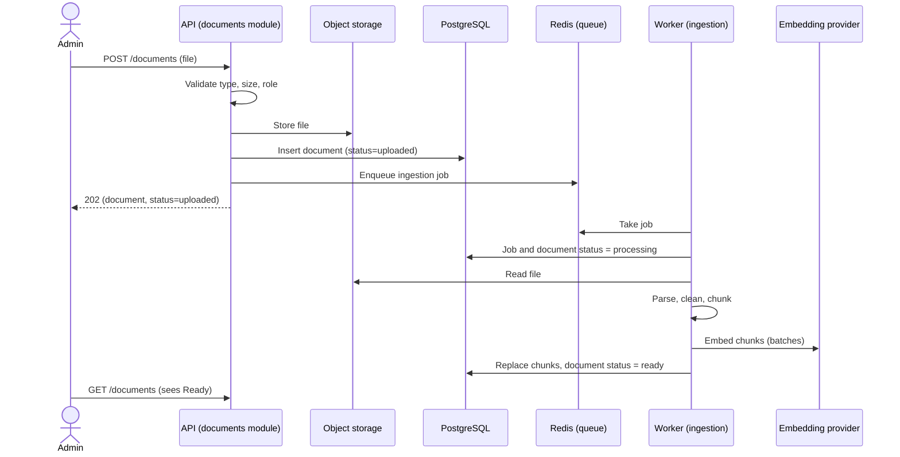
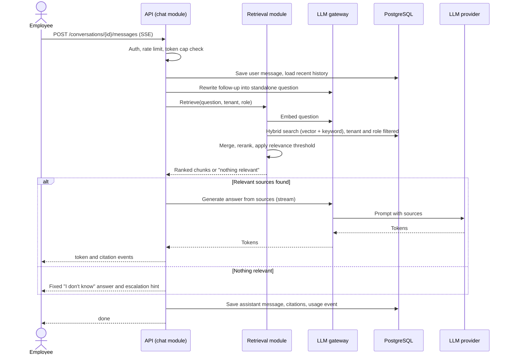
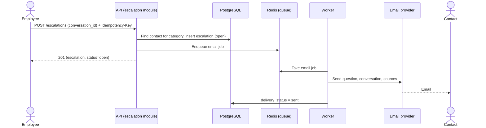
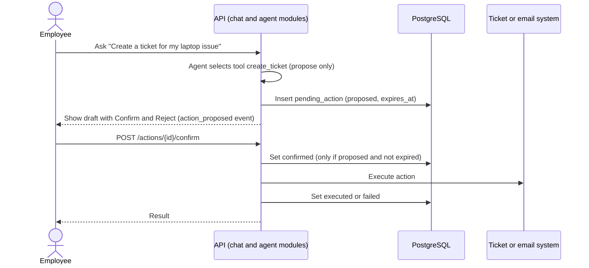

# 09 — Key Flows

**Status:** Approved v2 (reference) | **Last updated:** 2026-10-01

Participants named after modules ("Retrieval", "LLM gateway") are **in-process calls inside the API process**, not network hops.

## Flow 1: Upload and ingest a document (US-020, FR-010, FR-012)

Worker writes status directly to the database (same codebase and database), so no callback is needed.

| Failure | Handling |
|---|---|
| Duplicate upload (same `content_hash`) | `409 Conflict`, return existing document |
| File stored but enqueue fails | Document stays `uploaded`; periodic job re-enqueues stale `uploaded` documents |
| Parse error (corrupt or scanned PDF) | Mark `failed` with readable reason; no retry |
| Embedding provider timeout or `429` | Retry with exponential backoff and jitter (max 3), then `failed` |
| Worker crashes mid-job | Job re-delivered; ingestion is **idempotent** (delete existing chunks for the document, then insert) |
| Document deleted while processing | Worker re-checks status before writing; discards result |
| Poison job (always fails) | Max attempts, then `failed`, alert on failure rate |

## Flow 2: Ask a question (US-001..003, FR-020..023)

| Failure | Handling |
|---|---|
| Tenant over monthly token cap | `429` with clear message before any LLM call |
| Embedding or LLM timeout | One retry, then fallback model, then `error` event |
| LLM fails mid-stream | `error` event; message saved as `failed`; user can retry |
| User closes connection | Cancel generation, save partial as `cancelled` |
| Nothing relevant retrieved | "I don't know" path (never call LLM without sources) |
| Prompt injection in retrieved text | Sources wrapped as data, instructions ignored, output checked (see [10](10-security-and-tenancy.md)) |
| Database down | `503`, readiness probe fails, alert fires |

## Flow 3: Escalate (US-010, FR-030)

| Failure | Handling |
|---|---|
| Duplicate click | Idempotency key returns the same escalation |
| No contact configured | Use tenant default admin; tell the user |
| Email send fails | Retry with backoff; `delivery_status=failed` visible to admin; alert |

## Flow 4: Assistant action with confirmation (FR-040, FR-041)

| Failure | Handling |
|---|---|
| User never confirms | Action expires, nothing executes |
| Confirm clicked twice | Idempotent; same result returned |
| External system fails | Status `failed`, user sees reason, can retry |
| Agent proposes something the user did not ask for | Only a proposal; nothing runs without confirm |

**Design rule:** the agent **never** performs side effects. It only proposes. Execution happens after human confirmation, in code that checks tenant, user, status, and expiry.
