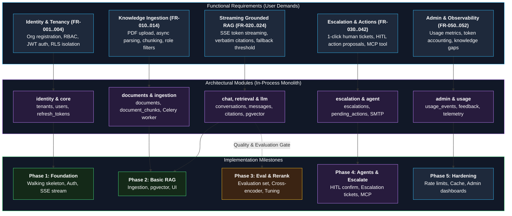
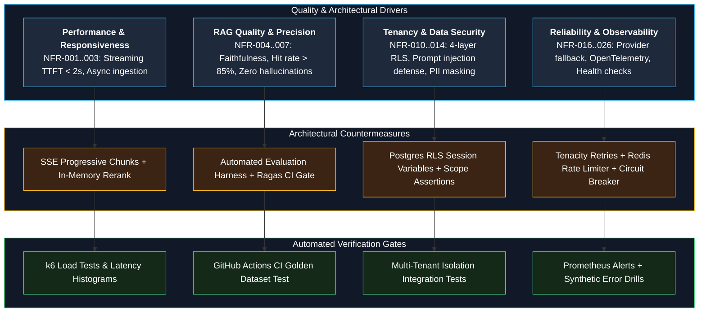
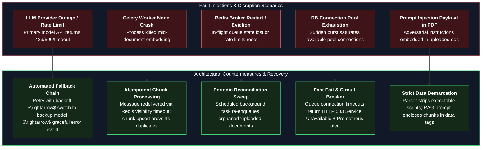

# 12 — Traceability Matrix and Design Review

**Status:** Approved v2 (reference) | **Last updated:** 2026-10-01

Purpose: prove that every requirement is covered by the design and assigned to a phase, and record the review of the design itself.

---

## 1. Functional Requirements Traceability

| FR | Module(s) | Tables | Endpoint(s) | Phase |
|---|---|---|---|---|
| FR-001 | identity | tenants, users | POST /auth/register-organization | 1 |
| FR-002 | identity | users, invitations | POST /users/invitations, POST /auth/accept-invitation, GET /users | 1 |
| FR-003 | identity | users, refresh_tokens | /auth/login, /refresh, /logout | 1 |
| FR-004 | core, identity | all (RLS) | all | 1 |
| FR-010 | documents | documents | POST /documents | 2 |
| FR-011 | documents, ingestion | documents | POST /documents (url) | 5 (Should) |
| FR-012 | documents, ingestion | documents, ingestion_jobs | GET /documents | 2 |
| FR-013 | documents, ingestion | documents, document_chunks | DELETE /documents/{id} | 2 |
| FR-014 | documents, retrieval | documents, document_chunks | PATCH /documents/{id} | 3 |
| FR-020 | chat, retrieval, llm | conversations, messages | POST /conversations/{id}/messages | 2 |
| FR-021 | chat | none | same (SSE) | 1 |
| FR-022 | chat, retrieval | citations | SSE citation events, GET /citations/{id}/source | 2 |
| FR-023 | chat, retrieval | messages | same | 2, tuned in 3 |
| FR-024 | chat | conversations, messages | GET /conversations, GET .../messages | 1 |
| FR-025 | chat | feedback | POST /messages/{id}/feedback | 5 |
| FR-026 | retrieval, llm | none | same as FR-020 | 7 (Could) |
| FR-030 | escalation | escalations | POST /escalations | 4 |
| FR-031 | escalation | escalation_contacts | /admin/escalation-contacts | 4 |
| FR-032 | escalation | escalations | GET, PATCH /escalations | 4 |
| FR-040 | agent | pending_actions | SSE action_proposed | 4 |
| FR-041 | agent | pending_actions | POST /actions/{id}/confirm, /reject | 4 |
| FR-042 | agent | none (read-only role) | SSE | 4 (Could) |
| FR-050 | usage, admin | usage_events | GET /admin/usage | 5 |
| FR-051 | admin, chat | messages | GET /admin/knowledge-gaps | 5 |
| FR-052 | admin, chat | feedback | GET /admin/feedback | 5 |

---

## 2. Non-Functional Requirements Verification

| NFR | Design response | Where | Verified by | Phase |
|---|---|---|---|---|
| NFR-001, 002 | Streaming, latency budget, limited rerank | 06, 09 | Latency histogram, load test | 5-6 |
| NFR-003 | Async worker, batch embeddings | 09 Flow 1 | Ingestion duration metric | 2 |
| NFR-004..006 | Hybrid retrieval, threshold, evaluation set | ADR-0005 | Evaluation harness | 3 |
| NFR-007 | Evaluation in CI with gate | 11 | CI | 3 |
| NFR-008, 009 | Usage events, caps, caching | 07, 08 | Usage dashboard | 1, 5 |
| NFR-010 | 4-layer isolation, RLS | 10, ADR-0002 | Isolation tests | 1 |
| NFR-011 | JWT, rotation, RBAC | 10, ADR-0008 | Security tests | 1 |
| NFR-012 | Data-not-instructions, propose-only agent | 10, ADR-0009 | Attack test set | 4 |
| NFR-013 | Redis rate limiting | 08 | Load test | 5 |
| NFR-014 | Log masking, tenant deletion | 10 | Log review, deletion test | 5 |
| NFR-015 | Image, dependency, secret scans | 11 | CI | 6 |
| NFR-016, 017 | Fallback chain, health checks | 09, ADR-0007 | Failure injection | 5 |
| NFR-018 | Single-server sizing | 06 | k6 / Locust | 5, 7 |
| NFR-019..021 | OpenTelemetry, metrics, alerts | 11 | Dashboards, alert test | 6 |
| NFR-022..026 | CI pipeline, compose, deploy, coverage | 11 | CI | 0, 6 |
| NFR-027, 028 | Thin responsive UI, error format | 08 | Manual test | 2, 5 |

---

## 3. Story Walkthrough (Design Review Step 1)

| Story | Path through design | Gap? |
|---|---|---|
| US-001 Ask | chat > retrieval > llm; SSE | None |
| US-002 Sources | citations table, source endpoint | None |
| US-003 I don't know | retrieval threshold, fixed answer, escalation hint | Threshold tuned in Phase 3 |
| US-004 History | conversations, messages | None |
| US-005 Rate | feedback | None |
| US-010 Escalate | escalation module, email job | Email provider choice open |
| US-020 Upload | documents, queue, worker | None |
| US-021 Delete | documents, chunk cleanup | None |
| US-022 Access control | allowed_roles on documents and chunks, RLS | Role change must update chunks (re-sync on PATCH) |
| US-030 Gaps | admin, messages status | Need an explicit "no answer" flag on messages |
| US-031 Usage | usage_events | None |
| US-040 Setup | identity | Login lookup before tenant known (see 07) |

**Gaps found and fixed in design:**
1. PATCH of allowed roles must update chunk roles in the same transaction.
2. Add `answered boolean` (or reason code) to `messages` so knowledge gaps are queryable.
3. Login lookup exception for RLS.

---

## 4. Failure Scenarios and Resilience Matrix

| Scenario | Result & System Behavior |
|---|---|
| LLM provider down | Retry once, fallback model, then clear error; chat for cached or "I don't know" paths unaffected |
| Worker crashes mid-ingestion | Job re-delivered, idempotent; document chunk cleanup on retry |
| Redis restarts | Queue jobs may be lost; periodic job re-enqueues stale `uploaded` documents; rate limits reset |
| Database connection pool full | Request timeout, `503`, alert; pool size and timeouts configured |
| One tenant floods requests | Per-tenant rate limit and cap in Redis protects shared infrastructure |
| Malicious PDF with instructions | Treated as data inside XML tags; attack test set run in CI |
| Embedding model changed | Re-index job using `embedding_model` version column |
| Object storage unavailable | Upload fails fast with error; existing retrieval answers unaffected |

---

## 5. Open Decisions (Resolved at Named Phase)

| Decision | Phase |
|---|---|
| Primary LLM and embedding provider | 1 and 2 |
| Chunk size and overlap | 3 |
| Email provider | 4 |
| Hosting provider and size | 6 |
| Bengali keyword search approach | 7 |

---

## 6. Review Checklist Result

- [x] Every Must FR maps to a module, table, endpoint, and phase
- [x] Every architecture driver has a design response
- [x] Tenant isolation designed at four layers with tests
- [x] Async operations have status, retry, and failure handling
- [x] Every module has a one-line responsibility
- [x] No box without a reason (services reduced to API process, worker, optional model server)
- [x] Security, logging, and rate limits considered
- [x] Major decisions recorded as ADRs (0002-0009)
- [ ] Spike results (RLS with pooling, hybrid search with filters) recorded, done in Phase 1 and 3
