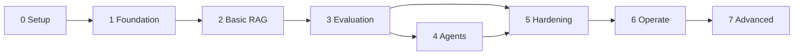

# 13 — Roadmap and Milestones

**Status:** Approved v1 (reference) | **Last updated:** 2026-10-01
**Inputs:** [02 FR](../02-functional-requirements.md), [06 Architecture](../System%20Design/06-architecture.md), [12 Traceability](12-traceability-and-design-review.md)

## 1. Vision and final demo

**Vision:** A company uploads its documents; employees ask questions and get cited answers, and can escalate to a person when the answer is missing.

**Final demo:** live URL with HTTPS, login as admin and employee, upload a policy PDF, ask a question and see citations, see "I don't know" for an out-of-scope question, escalate by email, confirm an agent action, show Grafana dashboards and an evaluation report.

## 2. Planning assumptions

| Assumption | Value | If wrong |
|---|---|---|
| Focused weekly capacity | **10 hours** | Multiply all dates by (10 / your hours) |
| Start | Week 1 begins Sunday 4 Oct 2026 | Shift all dates |
| Estimates include learning time | Yes (1.5–2.0x multiplier already factored into new tech) | Re-calibrate after Phase 0 |
| Contingency | +20% on top of base estimate | Cut scope (section 6), not quality |
| Tools | Python backend (FastAPI), Postgres, Redis, MinIO, Next.js UI | Changes need an ADR |
| Office work | Can reduce capacity at busy times | Use the buffer; never skip the weekly review |

## 3. Schedule

| Phase | Name | Base hours | Planned weeks | Start (week starts) | Demo |
|---|---|---|---|---|---|
| 0 | Setup | 11 | 1-2 | 4 Oct 2026 | `docker compose up` + green CI |
| 1 | Foundation: tenancy, auth, LLM streaming | 31 | 2-5 | 11 Oct | Login, chat streams, isolation test |
| 2 | Basic RAG | 35.5 | 5-10 | 1 Nov | Upload PDF, cited answer, minimal UI |
| 3 | Better RAG and evaluation | 34 | 10-14 | 6 Dec | Score table comparing variants |
| 4 | Agents and escalation | 31 | 14-18 | 3 Jan 2027 | Escalate, propose and confirm action, MCP tool |
| 5 | Production hardening and admin | 33 | 18-22 | 31 Jan | Rate limits, cache, fallback, dashboard, load test |
| 6 | Observability, CI/CD, deployment | 32 | 22-25 | 28 Feb | Live URL, dashboards, alerts |
| 7 | Advanced (stretch) | 37 | 25-30 | 21 Mar | Model server, routing, fine-tune report, write-up |
| | **Total** | **244.5** | | | |

Base total 244.5 h, with 20% contingency about 293 h, about 29 weeks at 10 h/week. **Phases 0-6 (the complete product) finish around week 25 (late March 2027).** Phase 7 is the advanced stretch and can continue into April. Ramadan and Eid (roughly February to March 2027) and office deadlines may slow you down, which is why the buffer exists.

## 4. Phases in detail

### Phase 0: Setup (11 h)
- **Goal:** Working development environment, repository, and CI skeleton.
- **Demo:** One command starts the stack; a pull request runs lint, type check, tests.
- **Exit criteria:** [ ] Repo with docs imported [ ] `docker compose up` healthy [ ] `/health/ready` tested [ ] CI green and blocking [ ] Board and Phase 1 issues created
- **Learning outcomes:** Containers, compose, project structure, CI basics, Fedora specifics (SELinux labels, Docker vs Podman).

### Phase 1: Foundation (31 h)
- **Goal:** Walking skeleton: secure multi-tenant backend that streams an LLM answer.
- **Demo:** Register organization, log in, chat answer streams token by token, usage recorded.
- **Exit criteria:** [ ] Isolation test passes in CI [ ] Refresh rotation tested [ ] RBAC tested [ ] SSE chat saves messages and usage [ ] Token cap works [ ] ADR-0002 updated with spike result
- **Learning outcomes:** async Python, SQLAlchemy and Alembic, RLS, JWT, SSE, LLM API basics, token accounting.
- **Spike:** RLS with connection pooling (P1-03).

### Phase 2: Basic RAG (35.5 h)
- **Goal:** Upload documents and get grounded, cited answers.
- **Demo:** Upload a leave-policy PDF, ask "How many casual leave days?", see answer with citation; ask something unrelated, see "I don't know".
- **Exit criteria:** [ ] Ingestion runs in worker with status and retries [ ] Retrieval filtered by tenant and role [ ] Citations saved and openable [ ] "I don't know" path works on 10 manual questions [ ] Minimal UI works on a phone width [ ] Phase retro written
- **Learning outcomes:** Parsing, chunking, embeddings, pgvector and HNSW, Celery, idempotency, grounded prompting.

### Phase 3: Better RAG and evaluation (34 h)
- **Goal:** Measure quality, then improve it with evidence.
- **Demo:** Table comparing vector only, hybrid, hybrid + rerank on the same question set.
- **Exit criteria:** [ ] 50-question evaluation set (answerable, multi-document, unanswerable, adversarial) [ ] Metrics reported (retrieval hit rate, MRR, faithfulness, citation correctness) [ ] Hybrid and rerank compared [ ] Threshold tuned [ ] pgvector vs Qdrant benchmark recorded in ADR-0006 [ ] Evaluation runs in CI with a gate [ ] Role-based access (FR-014) tested
- **Learning outcomes:** Evaluation design, retrieval metrics, hybrid search and RRF, rerankers, LLM-as-judge limits, benchmarking.

### Phase 4: Agents and escalation (31 h)
- **Goal:** The assistant can propose actions safely and escalate to a person.
- **Demo:** "Create a ticket for my laptop issue" produces a draft, user confirms; "I don't know" answer offers escalation and the contact gets an email.
- **Exit criteria:** [ ] Escalation with idempotency and email retry [ ] Pending actions with confirm, reject, expiry [ ] LangGraph agent with propose-only tools [ ] MCP server with read-only search tool, tested with a client [ ] Prompt injection test set passes [ ] Agent tool-selection evaluation recorded
- **Learning outcomes:** Tool calling, agent graphs, human-in-the-loop, prompt injection, MCP.

### Phase 5: Production hardening and admin (33 h)
- **Goal:** Make it behave under load and failure; give admins visibility.
- **Demo:** Load test report; kill the LLM provider (fake) and see fallback; admin dashboard with usage, gaps, feedback.
- **Exit criteria:** [ ] Rate limiting [ ] Caching with measured hit rate [ ] Fallback and circuit breaker tested [ ] PII masked in logs [ ] Admin APIs and pages [ ] Feedback endpoint [ ] URL ingestion [ ] Idempotency middleware [ ] k6 baseline and one bottleneck fixed
- **Learning outcomes:** Rate limiting algorithms, caching, resilience patterns, load testing.

### Phase 6: Observability, CI/CD, deployment (32 h)
- **Goal:** Operate it like a real service.
- **Demo:** Live URL; Grafana dashboards; a forced error triggers an alert; a merge to main deploys automatically; restore drill done.
- **Exit criteria:** [ ] OpenTelemetry traces across API, queue, worker [ ] Prometheus metrics and four dashboards [ ] Logs in Loki via Grafana Alloy [ ] Langfuse traces [ ] Alerts to Telegram or Discord [ ] Image scan and dependency scan in CI [ ] Auto deploy with smoke test and rollback [ ] Backup and restore tested
- **Learning outcomes:** Observability pillars, metric cardinality, tracing, SLO thinking, deployment, backups.

### Phase 7: Advanced (stretch, 37 h)
- **Goal:** Depth projects that differentiate you.
- **Demo:** Model server extraction with benchmark; routing results; fine-tuning comparison; blog post and demo video.
- **Exit criteria:** [ ] Model server extracted behind the same interface [ ] Routing evaluated on cost and quality [ ] Small fine-tune compared against baseline (check VRAM first) [ ] Bengali experiment documented [ ] Final load test [ ] Write-up, README, demo video
- **Learning outcomes:** Service extraction, model serving, routing, parameter-efficient fine-tuning, multilingual retrieval, technical writing.

## 5. Dependencies between phases

Observability basics (structured logs, request IDs) start in Phase 1, so Phase 6 builds on existing signals.

## 6. If you fall behind: what to cut (in this order)

1. Phase 7 items (all stretch)
2. Semantic cache experiment (keep exact cache)
3. Admin UI polish (keep APIs)
4. URL ingestion (FR-011)
5. Structured data tool (FR-042)
6. Tracing and Langfuse (keep metrics, logs, alerts)
7. Bengali support (FR-026)

**Never cut:** tenant isolation tests, evaluation set, "I don't know" behavior, propose-only agent, CI.

## 7. Re-plan triggers

- Phase takes more than 1.5x its estimate: stop, find out why, update remaining estimates.
- A spike shows a design assumption is wrong: write a new ADR, update affected docs.
- Two weeks without progress: reduce scope of the current phase, do not extend it.

## 8. Phase done checklist (every phase)

- [ ] Demo works and is recorded (2-3 minutes)
- [ ] Exit criteria all checked
- [ ] Docs and ADRs updated
- [ ] Concept check done (`16-learning-checkpoints.md`)
- [ ] Retro written (what worked, what did not, what to change)
- [ ] Git tag created (for example `v0.2.0`)
- [ ] Next phase tasks broken down and estimated
