# 16 — Learning Checkpoints (Concept & Interview Mastery)

**Status:** Approved v1 (reference) | **Last updated:** 2026-10-01

> This document is your proof of genuine engineering depth. At the conclusion of each phase, answer these checkpoint questions **in your own words, in 3–5 concise sentences** in your technical notes (`docs/notes/`).
> **If you struggle to answer a question, revisit that concept immediately.** The passing criteria: **Explain the concept clearly to a peer without looking at references.** These are the exact conceptual questions asked in Staff-level AI & backend engineering interviews.
> **Build Proof:** The verifiable, demoable artifact built during this phase that you can showcase during technical interviews.

---

## Technical Concept Mastery & Interview Readiness Loop

```mermaid
flowchart TD
    subgraph PHASE_KNOWLEDGE ["Phase Concept Mastery Progression"]
        K0["<b>Phase 0:</b> Linux, Containers, SELinux, CI Isolation"]
        K1["<b>Phase 1:</b> PostgreSQL RLS, Connection Pooling, JWT Rotation, Asyncio"]
        K2["<b>Phase 2:</b> Embeddings, HNSW vs IVFFlat, Idempotent Celery, Grounding"]
        K3["<b>Phase 3:</b> Hit Rate & MRR, Hybrid BM25+RRF, Cross-Encoders, Eval Gates"]
        K4["<b>Phase 4:</b> Tool Calling, HITL State Machines, Prompt Injection, MCP"]
        K5["<b>Phase 5:</b> Token Bucket Rate Limits, Distributed Caching, Circuit Breakers"]
        K6["<b>Phase 6:</b> High Cardinality Metrics, W3C Trace Context, SLOs, Auto-Deploy"]
        K7["<b>Phase 7:</b> Dynamic Batching, LoRA PEFT, Quantization, Model Routing"]

        K0 --> K1 --> K2 --> K3 --> K4 --> K5 --> K6 --> K7
    end

    subgraph DRILL_GATE ["Verification Gate & Interview Simulation"]
        NOTE["<b>1. Note Synthesizer:</b> Write 3-5 sentence explanations in docs/notes/"]
        RUBRIC{"<b>2. Peer Explain Test:</b> Can you explain without references?"}
        DEMO["<b>3. Build Proof Showcase:</b> Verify live demoable artifact"]
        INT["<b>4. 10-Minute Technical Interview Simulation:</b> Staff-level defense"]

        K7 --> NOTE --> RUBRIC
        RUBRIC -->|"Hesitant / Unclear"| NOTE
        RUBRIC -->|"Pass"| DEMO --> INT
    end

    style PHASE_KNOWLEDGE fill:#111827,stroke:#38bdf8,stroke-width:1px,color:#ffffff
    style DRILL_GATE fill:#111827,stroke:#4ade80,stroke-width:1px,color:#ffffff

    style K0 fill:#1e293b,stroke:#38bdf8,stroke-width:1px,color:#ffffff
    style K1 fill:#1e293b,stroke:#38bdf8,stroke-width:1px,color:#ffffff
    style K2 fill:#142918,stroke:#4ade80,stroke-width:1px,color:#ffffff
    style K3 fill:#142918,stroke:#4ade80,stroke-width:1px,color:#ffffff
    style K4 fill:#3b2413,stroke:#fbbf24,stroke-width:1px,color:#ffffff
    style K5 fill:#3b2413,stroke:#fbbf24,stroke-width:1px,color:#ffffff
    style K6 fill:#271b3d,stroke:#c084fc,stroke-width:1px,color:#ffffff
    style K7 fill:#271b3d,stroke:#c084fc,stroke-width:1px,color:#ffffff

    style NOTE fill:#1e293b,stroke:#38bdf8,stroke-width:1px,color:#ffffff
    style RUBRIC fill:#3b2413,stroke:#fbbf24,stroke-width:1px,color:#ffffff
    style DEMO fill:#142918,stroke:#4ade80,stroke-width:1px,color:#ffffff
    style INT fill:#271b3d,stroke:#c084fc,stroke-width:1px,color:#ffffff
```

---

## Phase 0: Setup & Development Environment

1. What is the fundamental difference between an image and a container? Why are persistent volumes necessary?
2. What does `docker compose up` orchestrate? What is the functional difference between `depends_on` and a container `healthcheck`?
3. Why do bind mounts often fail under SELinux, and how does the `:z` / `:Z` flag resolve permissions?
4. In a CI pipeline, why are linting, static type checking, and unit testing isolated into distinct stages?
5. Why are branch protection rules and mandatory PR reviews essential, even on a solo engineering project?

**Build Proof:** Green CI pipeline status badge and a one-command stack bootstrap (`docker compose up`).

---

## Phase 1: Foundation (Multi-Tenancy, Security, Streaming)

1. What is PostgreSQL Row-Level Security (RLS)? How does it operate internally, and under what conditions can it be accidentally bypassed (e.g., table owner roles, missing session settings)?
2. What is the difference between transaction-scoped `set_config('app.tenant_id', ..., true)` and session-scoped settings? Why is this distinction critical when using connection poolers like PgBouncer?
3. What claims are encoded in a JWT? Why should access tokens be short-lived while refresh tokens are long-lived? What is refresh token rotation and family-based reuse detection?
4. Why is Argon2id preferred for password hashing over plain SHA-256 or unkeyed hashes?
5. What are the protocol differences between Server-Sent Events (SSE) and WebSockets? Why is SSE optimal for streaming LLM completions?
6. In asynchronous Python (asyncio), what does "blocking the event loop" mean? Provide a concrete code example.
7. What is a token in the context of LLMs, and why do providers price input and output tokens differently?
8. Why are request timeouts, exponential backoff, and full jitter mandatory when communicating with third-party APIs?
9. Why are database migrations (Alembic) necessary instead of directly altering schemas in production?

**Build Proof:** Automated dual-tenant isolation test suite passing in CI, streaming token-by-token chat demo, and [ADR-0002](../adr/0002-tenant-isolation-shared-tables-rls.md) updated with connection pool spike findings.

---

## Phase 2: Basic Grounded RAG & Ingestion

1. What is a text embedding? How is semantic similarity quantified mathematically (e.g., cosine similarity vs. dot product)?
2. What is the purpose of document chunking? What operational failure modes occur when chunk sizes are either excessively large or excessively small?
3. Why is chunk overlap maintained between adjacent chunks?
4. What is HNSW (Hierarchical Navigable Small World)? What are its performance and memory trade-offs compared to IVFFlat?
5. What differentiates RAG from model fine-tuning and simple prompt stuffing?
6. What constitutes an LLM hallucination, and how does grounding prompt architecture reduce it?
7. Why are verifiable citations essential in enterprise search, and how do we ensure citation page/section accuracy?
8. What does idempotency mean in asynchronous task execution? How is idempotency guaranteed in the document ingestion pipeline?
9. When a message broker guarantees at-least-once delivery, how do workers prevent duplicate ingestion side effects?

**Build Proof:** End-to-end document upload producing grounded answers with verifiable citations, supported by an idempotent Celery worker with automated retries.

---

## Phase 3: Advanced RAG, Hybrid Search & Evaluation

1. Why must retrieval quality be measured before attempting optimization?
2. What are Hit Rate and Mean Reciprocal Rank (MRR), and how are they calculated mathematically?
3. What is the difference between retrieval faithfulness (groundedness) and answer relevance?
4. In what query scenarios does sparse keyword search (BM25) outperform dense vector embeddings, and vice versa?
5. How does Reciprocal Rank Fusion (RRF) combine disparate score distributions from keyword and vector retrieval?
6. What is the architectural difference between a bi-encoder and a cross-encoder (reranker)? Why is reranking restricted to the top-K retrieved candidates?
7. What are the known limitations of LLM-as-a-Judge evaluations (e.g., position bias, verbosity bias), and how are they mitigated?
8. How was the relevance score threshold calibrated for the "I don't know" fallback path? What is the precision vs. recall trade-off?
9. Why does post-filtering or pre-filtering in vector databases degrade approximate nearest neighbor (ANN) recall?

**Build Proof:** Comprehensive evaluation benchmark table comparing retrieval variants, [ADR-0006](../adr/) benchmark report, and an automated evaluation regression gate in CI.

---

## Phase 4: Autonomous Agents, Escalation & Tool Safety

1. What is native function calling / tool calling? Does the LLM execute code directly?
2. What is the difference between a linear LLM chain and a graph-based agent (LangGraph)? Why is stateful cyclic execution needed?
3. Why is Human-in-the-Loop (HITL) mandatory for write operations? Where is it implemented in your architecture?
4. What is the difference between direct and indirect prompt injection? What defenses protect your system against malicious document contents?
5. Why are agent tools restricted to "propose-only" for operations with external side effects?
6. What is the Model Context Protocol (MCP)? Why was it created, and what resources/tools does your MCP server expose?
7. How does an idempotency key prevent duplicate human escalation dispatches?
8. How do you evaluate agent trajectory accuracy and tool selection precision?

**Build Proof:** Adversarial prompt injection test harness, propose-and-confirm human-in-the-loop demo, and working Model Context Protocol (MCP) integration.

---

## Phase 5: Production Hardening & Operational Resilience

1. What are the architectural trade-offs between Token Bucket and Fixed Window rate-limiting algorithms?
2. What cache invalidation strategy ensures deleted documents do not persist in semantic or exact chache stores?
3. Why must multi-tenant cache keys always incorporate the `tenant_id`?
4. What is a circuit breaker pattern? When does it transition between Closed, Open, and Half-Open states?
5. Why must exponential backoff always be combined with randomized jitter?
6. In load testing, why is the 95th percentile (p95) latency vastly more important than the average latency?
7. How do you identify backend bottlenecks using continuous profiling and Prometheus metrics?
8. What constitutes Personally Identifiable Information (PII), and at what pipeline stage is log masking applied?

**Build Proof:** Load test execution report (k6 / Locust) before and after optimizations, and automated failure-injection test suite.

---

## Phase 6: Observability, CI/CD & Production Deployment

1. What are the distinct roles of metrics, logs, and distributed traces? What specific operational questions does each signal answer?
2. What is high cardinality in metrics systems? Why is using unbounded values (like raw `tenant_id` or `user_id`) dangerous in Prometheus metric labels?
3. How is W3C distributed trace context propagated across asynchronous boundaries (HTTP API $\rightarrow$ Redis $\rightarrow$ Celery Worker)?
4. What are Service Level Indicators (SLIs) and Service Level Objectives (SLOs)? Define two production SLOs for OpsPilot.
5. What causes alert fatigue, and what criteria ensure an alert is strictly actionable?
6. Compare Rolling, Blue-Green, and Canary deployments. Which strategy was implemented for OpsPilot and why?
7. Why is having automated database backups insufficient without regular, automated restore verification drills?
8. What vulnerabilities do container image scanners detect, and how are runtime secrets secured?

**Build Proof:** Live HTTPS deployment URL, production Grafana dashboards, automated alerting triggers, and disaster recovery restore drill documentation.

---

## Phase 7: Advanced Engineering (Model Serving & Fine-Tuning)

1. What concrete operational trigger justified extracting the local model server? What architectural trade-offs were incurred?
2. How does dynamic request batching work inside an optimized inference server (e.g., vLLM or Triton)?
3. What is Low-Rank Adaptation (LoRA)? Why does it require orders of magnitude less GPU VRAM than full parameter fine-tuning?
4. What is weight quantization (e.g., INT8, INT4)? How do you calculate required GPU VRAM mathematically before deployment?
5. When should an engineering problem be solved via Prompt Engineering vs. RAG vs. Fine-Tuning?
6. How is dynamic model routing (e.g., selecting between small local models and large frontier models) implemented and evaluated?
7. What linguistic and tokenization challenges arise when evaluating multilingual embeddings for non-Latin scripts (e.g., Bengali)?

**Build Proof:** Quantified model server benchmark tables, fine-tuning loss curves, and an architectural trade-off technical paper.

---

## The 10-Minute Technical Interview Simulation

Practice presenting your architecture to an interviewer in 10 uninterrupted minutes:
1. **The Business Problem & User Personas** (Problem statement, pain points, ROI).
2. **High-Level Architecture** (Modular monolith vs. microservices trade-off, container boundaries).
3. **Multi-Tenancy & Data Security** (4-layer defense, PostgreSQL Row-Level Security, prompt injection mitigations).
4. **The End-to-End RAG Pipeline** (Chunking strategy, hybrid search, cross-encoder reranking, evaluation metrics).
5. **Autonomous Agent Safety** (Propose-only tooling, human-in-the-loop state machines).
6. **Observability & Cost Controls** (Prometheus, Grafana, OpenTelemetry, token budget capping).
7. **Retrospective & Lessons Learned** (Key engineering mistakes made, architectural assumptions corrected).

*If you hesitate on any section, revisit that phase's implementation and documentation.*
