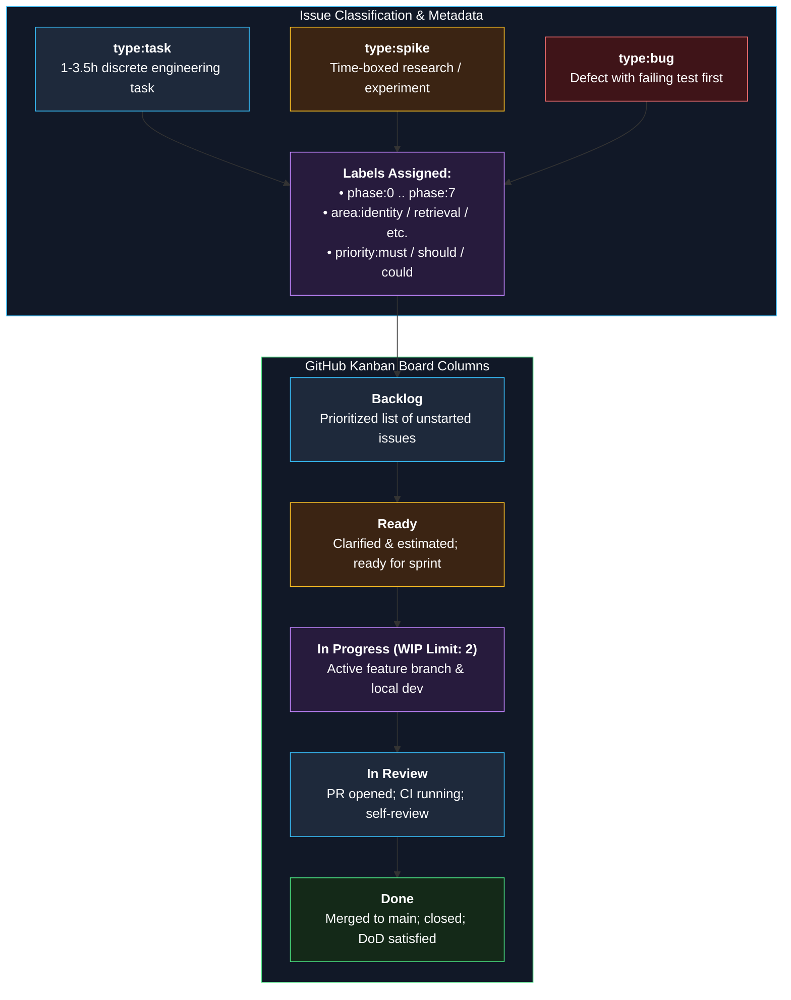

# GitHub Labels and Project Board Setup

**Status:** Approved v1 (reference) | **Last updated:** 2026-10-01

> Standardized taxonomy for organizing, tracking, and prioritizing work in the GitHub Project board and repository issues.

---

## 1. Issue Lifecycle & Board Flow

---

## 2. GitHub Labels Taxonomy

| Label | Meaning | Color Recommendation |
|---|---|---|
| `type:task` | Small discrete piece of work (1-3.5h) | `#0284c7` (Blue) |
| `type:spike` | Time-boxed experiment to answer a design unknown | `#f59e0b` (Amber) |
| `type:bug` | Defect with reproduction test | `#ef4444` (Red) |
| `type:docs` | Documentation, ADR, or notes update | `#10b981` (Emerald) |
| `phase:0` ... `phase:7` | Phase the work belongs to | `#8b5cf6` (Purple) |
| `priority:must` | Critical core path (Non-negotiable) | `#b91c1c` (Dark Red) |
| `priority:should` | Important enhancement (De-scopable if late) | `#d97706` (Orange) |
| `priority:could` | Stretch feature | `#64748b` (Slate) |
| `area:identity` | Authentication, RBAC, tenant context | `#0284c7` (Blue) |
| `area:documents` | Document upload, deduplication, metadata | `#0284c7` (Blue) |
| `area:ingestion` | Parsing, chunking, Celery worker | `#0284c7` (Blue) |
| `area:retrieval` | pgvector, hybrid search, rerank | `#0284c7` (Blue) |
| `area:llm` | LLM gateway, token streaming | `#0284c7` (Blue) |
| `area:chat` | SSE chat, conversations, feedback | `#0284c7` (Blue) |
| `area:agent` | HITL actions, LangGraph tools | `#0284c7` (Blue) |
| `area:escalation` | Human escalation tickets, SMTP | `#0284c7` (Blue) |
| `area:admin` | Admin dashboard, usage, knowledge gaps | `#0284c7` (Blue) |
| `area:infra` | Docker compose, reverse proxy, VPS | `#0284c7` (Blue) |
| `area:observability` | Prometheus, Grafana, Loki, traces | `#0284c7` (Blue) |
| `area:eval` | Ragas benchmark, golden evaluation set | `#0284c7` (Blue) |
| `blocked` | Waiting on an external blocker or spike result | `#000000` (Black) |

---

## 3. Board Columns and WIP Constraints

| Column | Rules & Constraints |
|---|---|
| `Backlog` | Ordered by priority (`must` on top). Contains all planned tasks and stories. |
| `Ready` | Clear acceptance criteria ("Done when"), dependencies resolved, estimated. |
| `In progress` | **Strict WIP limit of 2**. Active feature branches being coded. |
| `In review` | PR opened, CI running, self-review performed. |
| `Done` | Merged to `main`, tests green, docs updated, closed. |

---

## 4. Milestones

Create one GitHub Milestone per phase with the due dates from [13 — Roadmap and Milestones](13-roadmap-and-milestones.md):
- `Phase 0: Setup & Skeleton`
- `Phase 1: Multi-Tenant Foundation`
- `Phase 2: Basic RAG Engine`
- `Phase 3: Better RAG & Evaluation`
- `Phase 4: Agents & Escalation`
- `Phase 5: Production Hardening`
- `Phase 6: Observability & CD`
- `Phase 7: Advanced Depth (Stretch)`

---

## 5. File Locations

- `ISSUE_TEMPLATE/*.md` into `.github/ISSUE_TEMPLATE/`
- `pull_request_template.md` into `.github/`
