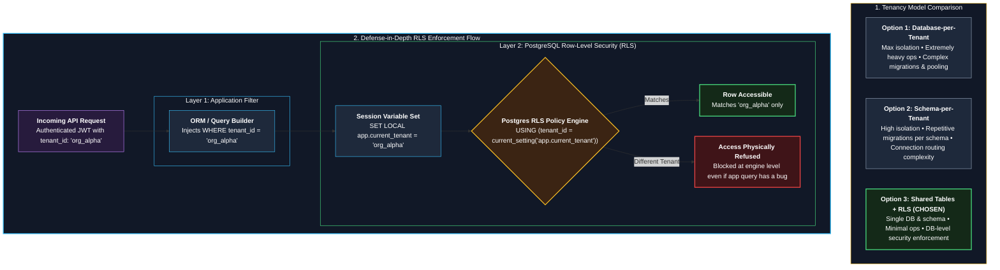

# ADR-0002: Tenant isolation with shared tables and row-level security

- **Status:** Proposed (reference)
- **Date:** 2026-10-01

---

### Tenancy Architecture & RLS Defense-in-Depth

---

## Context
OpsPilot serves many companies. A leak between companies is the worst failure (NFR-010). The team is one person with a small budget, expected load is 10 tenants with up to 10,000 chunks each.

## Options considered
1. **Database per tenant:** strongest isolation, most operations work (migrations, backups, connections).
2. **Schema per tenant:** strong isolation, migrations repeated for every schema.
3. **Shared tables with `tenant_id` and row-level security (RLS).**

## Decision
Use **shared tables with `tenant_id` and Postgres RLS**, plus application filters and automated isolation tests.

## Why
- One migration path, one backup, fits solo operation.
- RLS makes the database refuse cross-tenant reads even if application code has a bug.
- Enough for the v1 load.

## Consequences
- **Good:** simple operations, easy cross-tenant admin reporting for the platform owner.
- **Bad / trade-offs:** a mistake in policy or connection role breaks isolation; noisy neighbour risk; filtered vector search needs recall testing.
- **Follow-up:** isolation test in CI; revisit if an enterprise customer requires a dedicated database.

## Related
NFR-010, FR-004, [10 Security and tenancy](../10-security-and-tenancy.md)
