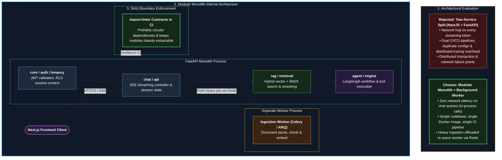

# ADR-0003: Modular monolith with a separate worker, not microservices

- **Status:** Accepted (mentor recommendation). **Supersedes** the earlier two-service proposal (NestJS API service + FastAPI AI service).
- **Date:** 2026-10-01

---

### Monolith vs Microservices Architecture & Boundaries

---

## Context
OpsPilot has business concerns (auth, tenants, history, usage, escalation) and AI concerns (ingestion, retrieval, generation, agent). It is built by one developer whose goal is to learn AI engineering in about six months, with a small budget. Every chat request needs both kinds of concerns at once.

## Options considered
1. **Microservices:** many small services with their own data.
2. **Two services:** NestJS for business, FastAPI for AI.
3. **Modular monolith (FastAPI) + worker process:** one codebase, strict module boundaries, background jobs in a separate process, optional model server later.

## Decision
Use option 3. Enforce module boundaries with `import-linter` contracts in CI. Extract a service only when a measured trigger exists. First planned extraction: model server for embeddings and reranking (Phase 7).

## Why
- Matches the learning goal: effort goes to AI and production practices, not to a second codebase.
- The business/AI boundary is not a real boundary; one request needs both, so a network hop adds only failure points.
- One image, one CI pipeline, one logging and tracing setup.
- Clean modules keep later extraction cheap.

## Consequences
- **Good:** simpler to build, test, debug, and deploy; transactions stay in one database.
- **Bad / trade-offs:** discipline needed to keep modules separate; the whole API scales as one unit; less microservices experience (partly covered by the worker and model server).
- **Follow-up:** revisit when a trigger in [06 section 8](../06-architecture.md) occurs.

## Related
[Explainer](../../01-is-opspilot-microservices.md), [06 Architecture](../06-architecture.md)
