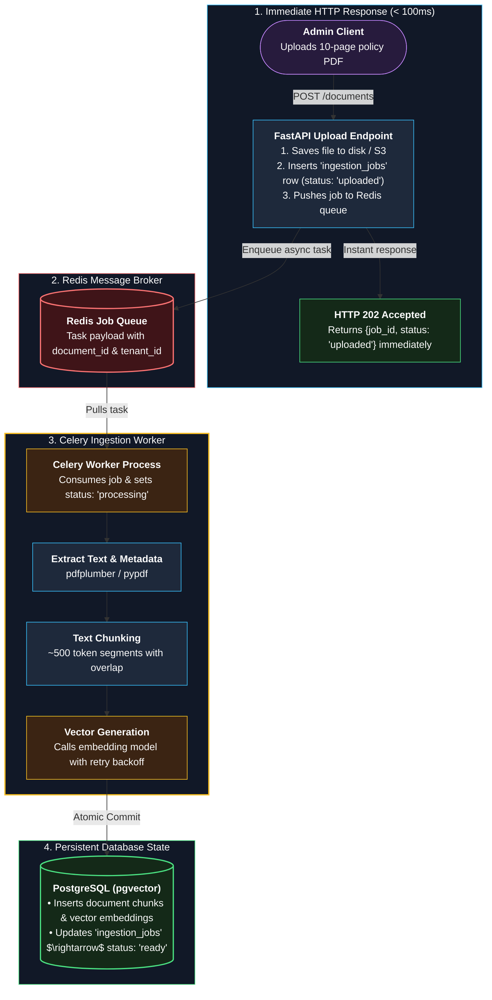

# ADR-0004: Asynchronous document ingestion with Celery and Redis

- **Status:** Accepted (mentor recommendation)
- **Date:** 2026-10-01

---

### Asynchronous Ingestion & Queue Architecture

---

## Context
Parsing, chunking, and embedding a document can take tens of seconds and depends on an external embedding provider. FR-012 requires visible status; NFR-003 targets 60 s for a 10-page PDF. The worker runs from the same codebase as the API.

## Options considered
1. **Synchronous:** process inside the upload request.
2. **Background task inside the API process.**
3. **Queue with separate worker processes, using Celery with a Redis broker.**
4. **Queue with a lighter library (for example ARQ or Dramatiq).**

## Decision
Use **Celery with Redis**. Job state in `ingestion_jobs`, idempotent tasks, retries with backoff and jitter, acknowledge after completion (at-least-once delivery).

## Why
- Upload returns immediately (`202`); no HTTP timeouts.
- Jobs survive API restarts; workers scale independently.
- Celery is the most widely used Python job system, so the skill transfers to jobs and interviews. Ingestion is mostly sequential I/O and CPU work, so Celery's synchronous model fits.
- The worker writes status straight to the shared database, so no callback API is needed.

## Consequences
- **Good:** resilient, observable (queue depth metric), widely documented.
- **Bad / trade-offs:** heavier than lightweight libraries; async code needs care inside tasks; duplicate delivery must be handled.
- **Follow-up:** periodic job re-enqueues stale `uploaded` documents; revisit if worker complexity outweighs benefits.

## Related
FR-012, NFR-003, [09 Flow 1](../09-key-flows.md)
