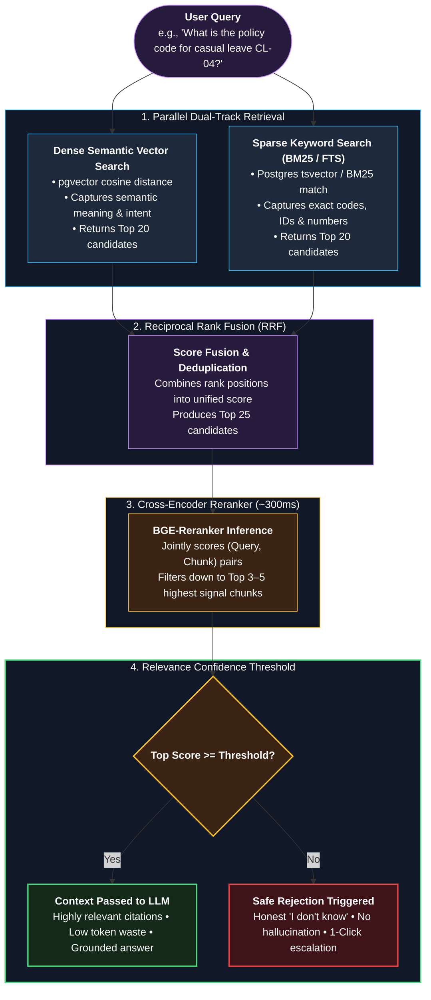

# ADR-0005: Hybrid retrieval (vector + keyword) with reranking

- **Status:** Proposed (reference); validate with the evaluation set in Phase 3
- **Date:** 2026-10-01

---

### Hybrid Retrieval & Reranker Pipeline

---

## Context
Policy documents contain exact terms (policy names, codes, numbers) and paraphrased concepts. Pure vector search misses exact terms; pure keyword search misses meaning. Quality targets: NFR-004..006.

## Options considered
1. **Vector search only.**
2. **Keyword search only.**
3. **Hybrid:** vector and keyword results merged (for example Reciprocal Rank Fusion), then a reranker model on the top candidates.

## Decision
Start with **hybrid retrieval and reranking**, keep a relevance threshold for the "I don't know" path.

## Why
- Covers both exact and semantic matching.
- Reranker improves precision of the few chunks sent to the LLM, reducing tokens and cost.

## Consequences
- **Good:** better citations and fewer wrong answers.
- **Bad / trade-offs:** extra latency (reranking, budget ~300 ms) and complexity.
- **Follow-up:** measure each variant (vector only, hybrid, hybrid + rerank) on the evaluation set; keep the simplest one that meets targets.

## Related
NFR-001, NFR-004, NFR-005, NFR-006, [07 Data model](../07-data-model.md)
